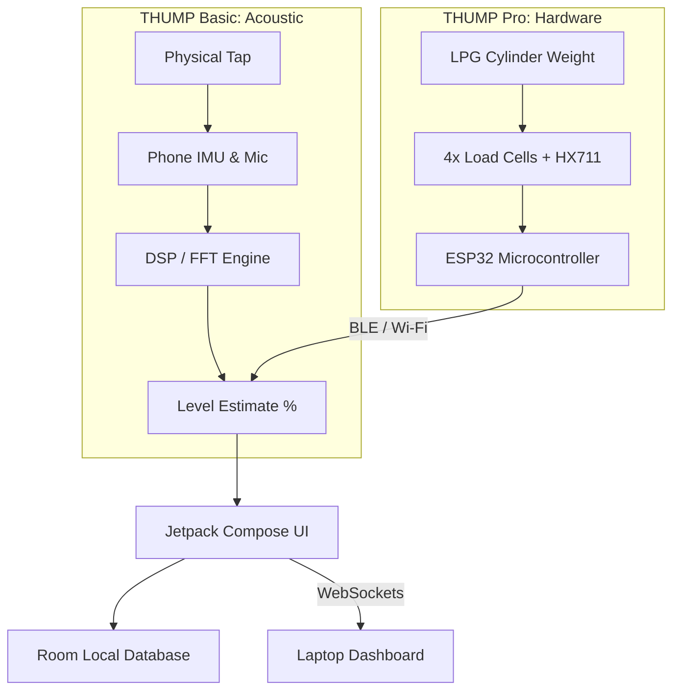

# 🔊 THUMP: The Smart Gas Ecosystem
### Acoustic AI & IoT Hardware for LPG Cylinders

> **"A complete ecosystem: Zero-hardware acoustic scanning for the masses, and precision IoT smart scales for the pros."**

---

## 🔥 The Problem
200 million households and thousands of commercial kitchens rely on opaque LPG cylinders. Nobody knows when they will run out. Current solutions are either expensive hardware (that users don't want to buy) or inaccurate guessing. 

## 💡 The Dual-Tier Solution

THUMP solves this by offering a complete ecosystem tailored to different user needs:

### 📱 Tier 1: THUMP Basic (Zero-Hardware)
*   **How it works:** The user taps the phone against the cylinder. The phone's IMU (accelerometer) triggers the microphone to capture the acoustic ring-down. DSP and ML classify the liquid/gas boundary.
*   **Target:** 200M+ everyday households.
*   **Benefit:** 100% free, no hardware required, instant onboarding.

### ⚖️ Tier 2: THUMP Pro (Smart Hardware)
*   **How it works:** A low-cost IoT base pad (ESP32 + HX711 Load Cells) sits permanently under the cylinder. It streams live weight data to the phone via Bluetooth (BLE) or to the Office Kit via Wi-Fi.
*   **Target:** Premium smart homes, restaurants, and cloud kitchens.
*   **Benefit:** Continuous 24/7 monitoring, zero human intervention, real-time depletion alerts.

---

## 🛠️ Tech Stack

| Domain | Technologies Used |
|---|---|
| **Android App** | Kotlin, Jetpack Compose, Room DB, Kotlin Coroutines |
| **Acoustic AI** | AudioRecord, SensorManager (IMU), Fast Fourier Transform (FFT), TFLite |
| **Hardware (Pro)** | ESP32/NodeMCU, HX711 Amplifier, 4x 50kg Load Cells, C++ |
| **Connectivity** | Bluetooth Low Energy (BLE), WebSockets, MQTT |
| **Dashboard** | HTML5, Canvas API, Python FastAPI (Office Kit) |

---

## 🏗️ Dual Architecture

---

## 🚀 Quick Start
1.  **Hardware setup (Optional):** Flash the `arduino/thump_scale.ino` to the ESP32. Wire the HX711 to pins D2/D3.
2.  **App Build:** Open the Android project in Android Studio. Sync Gradle.
3.  **Run:** Deploy to a physical Android device (emulators cannot capture physical IMU taps).

---

## 📸 UI/UX
The app features a unified dark-themed UI. Whether the data comes from an acoustic tap or the live Bluetooth scale, the user sees a beautiful 3D cylinder filling with animated blue liquid, showing exact percentage and days remaining.
