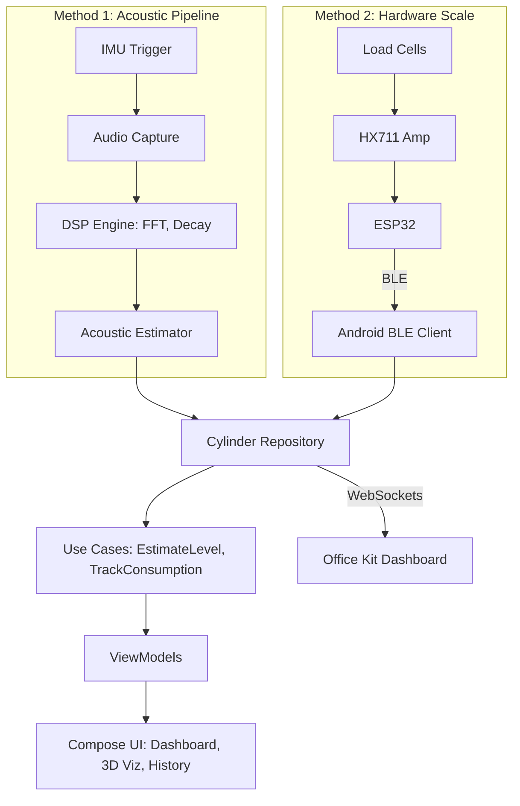

# THUMP: Dual-Method System Architecture

This document details the complete end-to-end architecture for THUMP, integrating both the software-only acoustic pipeline and the hardware IoT scale.

## 1. System Overview

THUMP operates as a unified data aggregator. The presentation layer (Jetpack Compose) remains agnostic to *how* the data was acquired. It simply displays the latest `TapReading` or `ScaleReading` from the Domain Layer.



## 2. Hardware Layer (THUMP Pro)

### Components
*   **Microcontroller:** ESP32 (Chosen for built-in BLE and Wi-Fi).
*   **ADC:** HX711 24-bit Analog-to-Digital Converter.
*   **Sensors:** 4x 50kg half-bridge load cells wired in a Wheatstone bridge configuration.

### Data Transmission (BLE Profile)
The ESP32 acts as a BLE Peripheral.
*   **Service UUID:** `4fafc201-1fb5-459e-8fcc-c5c9c331914b`
*   **Characteristic UUID (Weight):** `beb5483e-36e1-4688-b7f5-ea07361b26a8`
*   **Payload:** Float value representing current weight in kg (e.g., `14.50`).
*   **Rate:** Broadcasts every 5 seconds.

## 3. Acoustic Layer (THUMP Basic)

*(See `02-DSP-PIPELINE.md` for deep mathematical breakdown)*
*   Relies strictly on `SensorManager` (Linear Acceleration) and `AudioRecord` (48kHz Mono).
*   Processes data on-device using a custom FFT pipeline to calculate Spectral Centroid and Exponential Decay Rate.

## 4. The "Ground Truth" Bridge

In the UI, if both methods are available (i.e., a user is testing the acoustic method while the cylinder happens to be sitting on a THUMP Pro scale), the app performs a **Confidence Diff**:

```kotlin
fun compareMethods(acousticPercent: Float, scalePercent: Float): Float {
    val difference = abs(acousticPercent - scalePercent)
    // Logs the difference to DB for continuous background learning/calibration
    return difference
}
```
This is the ultimate hackathon flex: Using our own hardware scale to prove our software math is accurate live on stage.

## 5. Domain Layer & Room DB

The `TapReading` table handles acoustic results, while the `ConsumptionLog` handles continuous BLE scale data. Both feed into the `LevelEstimatorUseCase` to calculate `estimatedDaysRemaining` based on daily usage trends.
