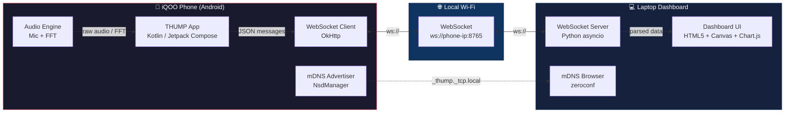
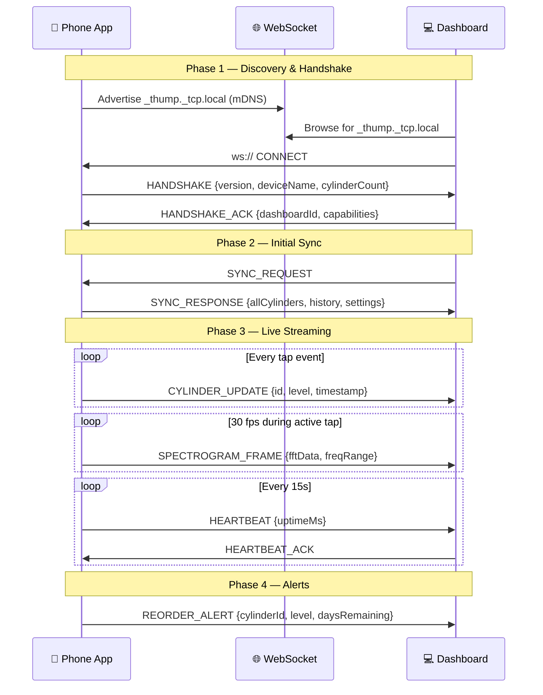
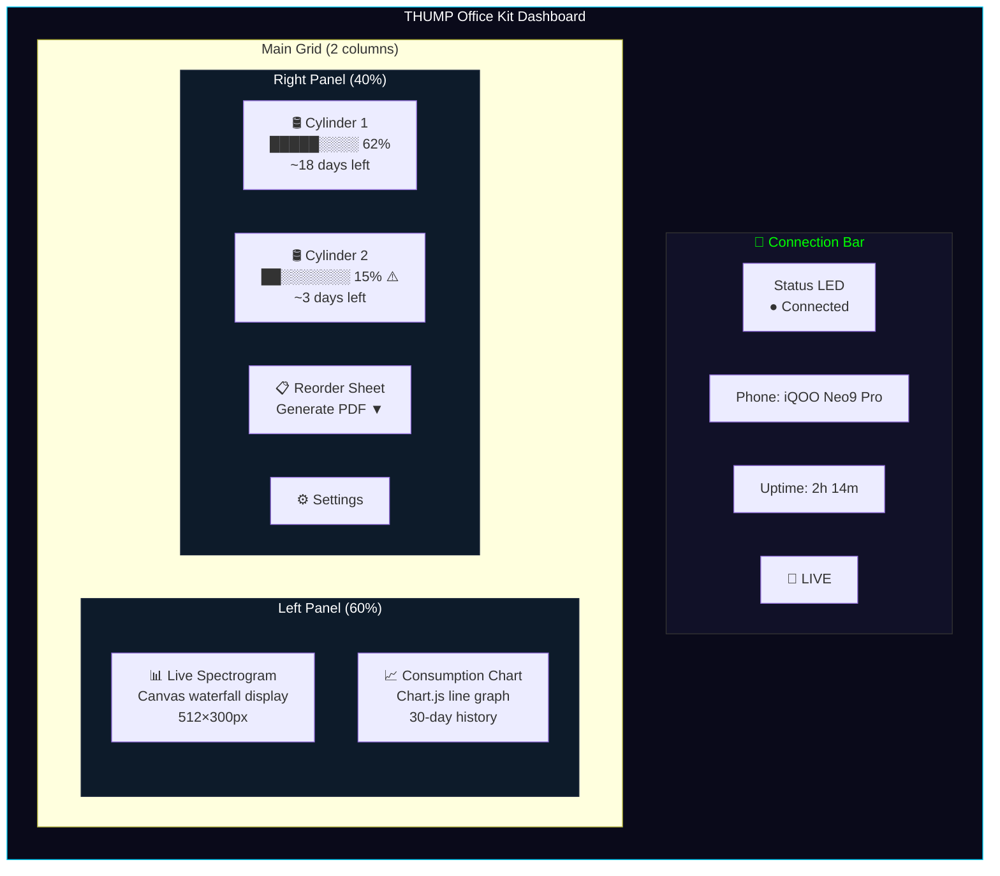
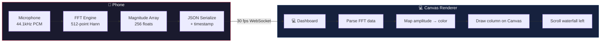
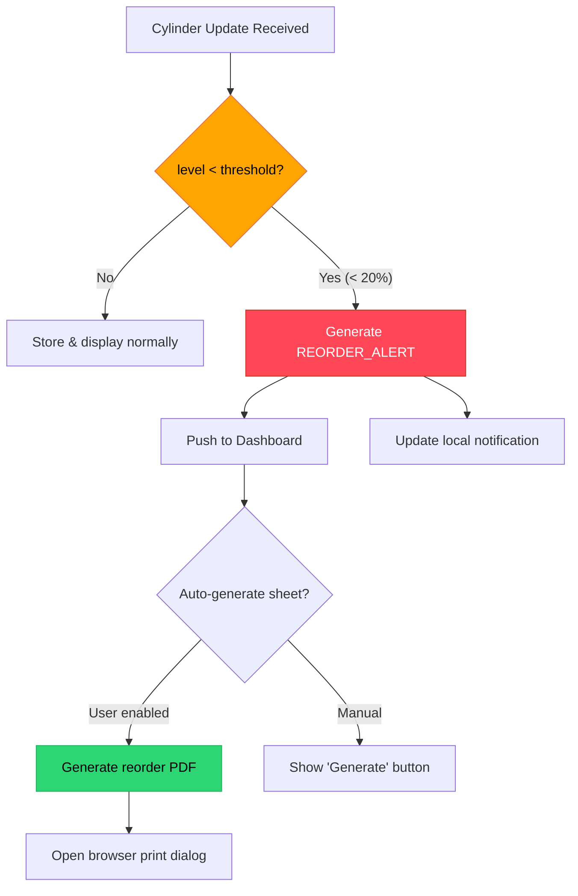
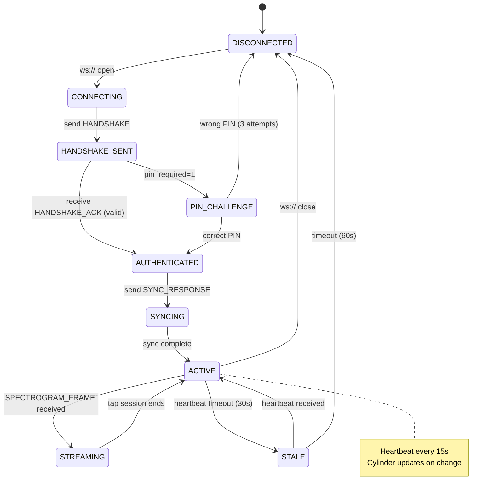
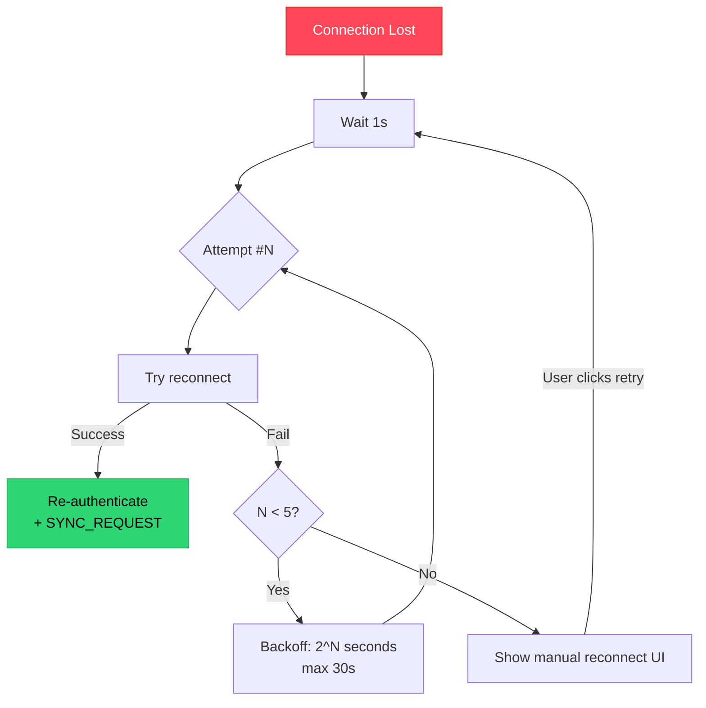
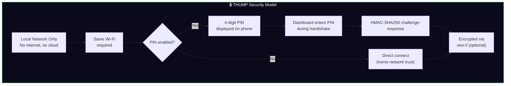
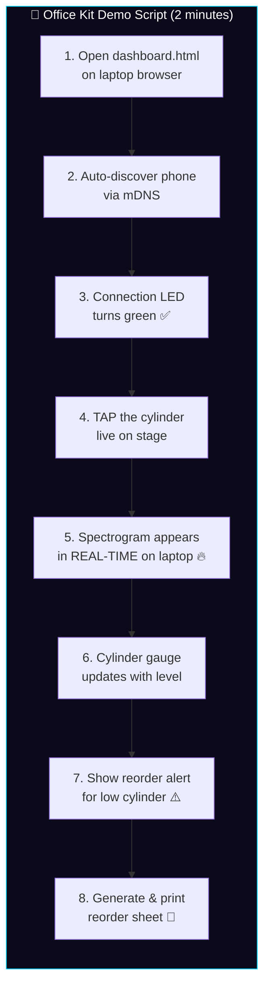

# 📡 THUMP — IoT & Office Kit Integration

> **Track 05 · Smart Living** | iQOO Hackathon 2026
> Zero-hardware acoustic LPG level gauge — Phone-to-Laptop real-time sync

---

## Table of Contents

1. [Office Kit Architecture](#1-office-kit-architecture)
2. [Phone-Side (Android Client)](#2-phone-side-android-client)
3. [Laptop Dashboard (Web App)](#3-laptop-dashboard-web-app)
4. [Live Spectrogram](#4-live-spectrogram)
5. [Reorder Sheet Generation](#5-reorder-sheet-generation)
6. [IoT Protocol Specification](#6-iot-protocol-specification)
7. [Security](#7-security)
8. [Hackathon Scoring Impact](#8-hackathon-scoring-impact)

---

## 1. Office Kit Architecture

The THUMP Office Kit turns any laptop browser into a live LPG monitoring dashboard by connecting to the phone app over the **local Wi-Fi network** — no cloud, no accounts, no internet required.

### 1.1 System Topology



### 1.2 Communication Flow



### 1.3 Local Network Discovery (mDNS / NSD)

The phone advertises a **Network Service Discovery (NSD)** service so the laptop dashboard can auto-discover it without manual IP entry.

| Property | Value |
|---|---|
| **Service Type** | `_thump._tcp.local.` |
| **Service Name** | `THUMP-{deviceId}` |
| **Port** | `8765` |
| **TXT Records** | `version=1.0`, `cylinders=N`, `pin_required=0\|1` |

> [!NOTE]
> On Android, NSD is managed via `NsdManager`. The phone acts as the **WebSocket server** — the laptop connects _to_ it. This avoids requiring any server setup on the laptop; the user simply opens a `.html` file.

**Alternative architecture option:** The phone can also act as the WebSocket _client_ connecting to a lightweight Python server running on the laptop. We use **phone-as-server** as the primary model because it requires zero setup on the laptop side.

---

## 2. Phone-Side (Android Client)

### 2.1 Dependencies

```kotlin
// build.gradle.kts (app)
dependencies {
    // WebSocket
    implementation("com.squareup.okhttp3:okhttp:4.12.0")
    
    // JSON serialization
    implementation("org.jetbrains.kotlinx:kotlinx-serialization-json:1.6.3")
    
    // Background sync
    implementation("androidx.work:work-runtime-ktx:2.9.0")
    
    // NSD is part of Android SDK — no extra dependency
}
```

### 2.2 Message Type Definitions

```kotlin
// src/main/java/com/thump/officekit/protocol/MessageType.kt

import kotlinx.serialization.Serializable
import kotlinx.serialization.json.Json

/**
 * All message types in the THUMP Office Kit protocol.
 * Each message is a JSON envelope: { "type": "...", "ts": epoch_ms, "payload": {...} }
 */
enum class MessageType {
    // Handshake
    HANDSHAKE,
    HANDSHAKE_ACK,

    // Data sync
    SYNC_REQUEST,
    SYNC_RESPONSE,
    CYLINDER_UPDATE,

    // Streaming
    TAP_STREAM,
    SPECTROGRAM_FRAME,

    // Alerts
    REORDER_ALERT,

    // Keep-alive
    HEARTBEAT,
    HEARTBEAT_ACK,

    // Errors
    ERROR
}

@Serializable
data class ThumpMessage(
    val type: String,
    val ts: Long = System.currentTimeMillis(),
    val payload: String = "{}" // nested JSON string
)

@Serializable
data class CylinderPayload(
    val cylinderId: String,
    val levelPercent: Float,       // 0.0 – 100.0
    val frequencyHz: Float,        // dominant resonant frequency
    val confidenceScore: Float,    // ML confidence 0.0 – 1.0
    val weightEstimateKg: Float,   // estimated remaining gas weight
    val timestamp: Long
)

@Serializable
data class SpectrogramPayload(
    val cylinderId: String,
    val fftMagnitudes: List<Float>,   // 512-point FFT magnitudes
    val freqMinHz: Float,
    val freqMaxHz: Float,
    val sampleRateHz: Int,
    val frameIndex: Int
)

@Serializable
data class TapStreamPayload(
    val cylinderId: String,
    val pcmSamples: String,  // Base64-encoded PCM Int16 audio chunk
    val sampleRateHz: Int,
    val chunkDurationMs: Int
)

@Serializable
data class SyncResponsePayload(
    val cylinders: List<CylinderPayload>,
    val consumptionHistory: List<ConsumptionRecord>,
    val settings: AppSettings
)

@Serializable
data class ConsumptionRecord(
    val cylinderId: String,
    val date: String,           // ISO 8601
    val levelPercent: Float,
    val usageRateKgPerDay: Float
)

@Serializable
data class AppSettings(
    val reorderThreshold: Float = 20f,
    val preferredDealer: String = "",
    val householdSize: Int = 4
)

@Serializable
data class ReorderAlertPayload(
    val cylinderId: String,
    val currentLevel: Float,
    val estimatedDaysRemaining: Int,
    val recommendedReorderDate: String,
    val dealerContact: String
)
```

### 2.3 WebSocket Server (Phone-Side)

The phone runs a lightweight WebSocket server using OkHttp's `MockWebServer` pattern — or more practically, a minimal embedded server built on top of the NanoHTTPD-WebSocket library for production use. Below is the OkHttp-client approach for the alternative "phone connects to laptop" model:

```kotlin
// src/main/java/com/thump/officekit/ws/ThumpWebSocketServer.kt

import fi.iki.elonen.NanoHTTPD
import fi.iki.elonen.NanoWSD
import kotlinx.serialization.json.Json
import kotlinx.coroutines.*
import kotlinx.coroutines.flow.*
import java.io.IOException

/**
 * Lightweight WebSocket server embedded in the Android app.
 * Runs on port 8765. The laptop dashboard connects to this server.
 */
class ThumpWebSocketServer(
    private val port: Int = 8765,
    private val messageHandler: OfficeKitMessageHandler
) : NanoWSD(port) {

    private val connectedClients = mutableSetOf<ThumpWebSocket>()
    private val json = Json { ignoreUnknownKeys = true; prettyPrint = false }
    private val scope = CoroutineScope(Dispatchers.IO + SupervisorJob())

    inner class ThumpWebSocket(handshake: NanoHTTPD.IHTTPSession) :
        NanoWSD.WebSocket(handshake) {

        override fun onOpen() {
            connectedClients.add(this)
            // Send handshake message
            val handshakeMsg = ThumpMessage(
                type = MessageType.HANDSHAKE.name,
                payload = json.encodeToString(
                    HandshakePayload.serializer(),
                    HandshakePayload(
                        version = "1.0.0",
                        deviceName = android.os.Build.MODEL,
                        cylinderCount = messageHandler.getCylinderCount()
                    )
                )
            )
            send(json.encodeToString(ThumpMessage.serializer(), handshakeMsg))
        }

        override fun onClose(
            code: NanoWSD.WebSocketFrame.CloseCode?,
            reason: String?,
            initiatedByRemote: Boolean
        ) {
            connectedClients.remove(this)
            messageHandler.onDashboardDisconnected()
        }

        override fun onMessage(message: NanoWSD.WebSocketFrame?) {
            message?.textPayload?.let { raw ->
                scope.launch {
                    val msg = json.decodeFromString(ThumpMessage.serializer(), raw)
                    handleIncomingMessage(this@ThumpWebSocket, msg)
                }
            }
        }

        override fun onPong(pong: NanoWSD.WebSocketFrame?) {}

        override fun onException(exception: IOException?) {
            connectedClients.remove(this)
        }
    }

    override fun openWebSocket(handshake: NanoHTTPD.IHTTPSession): WebSocket {
        return ThumpWebSocket(handshake)
    }

    /**
     * Route incoming messages from the dashboard to handlers.
     */
    private suspend fun handleIncomingMessage(client: ThumpWebSocket, msg: ThumpMessage) {
        when (MessageType.valueOf(msg.type)) {
            MessageType.HANDSHAKE_ACK -> {
                messageHandler.onDashboardConnected()
            }
            MessageType.SYNC_REQUEST -> {
                val syncData = messageHandler.getFullSyncData()
                val response = ThumpMessage(
                    type = MessageType.SYNC_RESPONSE.name,
                    payload = json.encodeToString(
                        SyncResponsePayload.serializer(), syncData
                    )
                )
                client.send(json.encodeToString(ThumpMessage.serializer(), response))
            }
            MessageType.HEARTBEAT_ACK -> {
                messageHandler.onHeartbeatAck()
            }
            else -> { /* ignore unknown */ }
        }
    }

    // ── Broadcast methods ──────────────────────────────────────

    /**
     * Broadcast a cylinder update to all connected dashboards.
     */
    fun broadcastCylinderUpdate(payload: CylinderPayload) {
        val msg = ThumpMessage(
            type = MessageType.CYLINDER_UPDATE.name,
            payload = json.encodeToString(CylinderPayload.serializer(), payload)
        )
        broadcast(json.encodeToString(ThumpMessage.serializer(), msg))
    }

    /**
     * Stream a spectrogram frame to all connected dashboards.
     */
    fun broadcastSpectrogramFrame(payload: SpectrogramPayload) {
        val msg = ThumpMessage(
            type = MessageType.SPECTROGRAM_FRAME.name,
            payload = json.encodeToString(SpectrogramPayload.serializer(), payload)
        )
        broadcast(json.encodeToString(ThumpMessage.serializer(), msg))
    }

    /**
     * Send a reorder alert when cylinder level drops below threshold.
     */
    fun broadcastReorderAlert(payload: ReorderAlertPayload) {
        val msg = ThumpMessage(
            type = MessageType.REORDER_ALERT.name,
            payload = json.encodeToString(ReorderAlertPayload.serializer(), payload)
        )
        broadcast(json.encodeToString(ThumpMessage.serializer(), msg))
    }

    private fun broadcast(jsonString: String) {
        connectedClients.forEach { client ->
            try {
                client.send(jsonString)
            } catch (e: IOException) {
                connectedClients.remove(client)
            }
        }
    }

    fun getConnectedCount(): Int = connectedClients.size

    fun shutdown() {
        scope.cancel()
        stop()
    }
}
```

### 2.4 NSD Service Registration

```kotlin
// src/main/java/com/thump/officekit/discovery/NsdAdvertiser.kt

import android.content.Context
import android.net.nsd.NsdManager
import android.net.nsd.NsdServiceInfo
import android.util.Log

/**
 * Advertises the THUMP WebSocket server via mDNS / NSD
 * so the laptop dashboard can auto-discover the phone on the LAN.
 */
class NsdAdvertiser(private val context: Context) {

    companion object {
        private const val TAG = "NsdAdvertiser"
        private const val SERVICE_TYPE = "_thump._tcp."
        private const val SERVICE_NAME = "THUMP"
        private const val WS_PORT = 8765
    }

    private val nsdManager: NsdManager by lazy {
        context.getSystemService(Context.NSD_SERVICE) as NsdManager
    }

    private var registrationListener: NsdManager.RegistrationListener? = null

    /**
     * Start advertising the THUMP service on the local network.
     */
    fun startAdvertising(cylinderCount: Int, pinRequired: Boolean) {
        val serviceInfo = NsdServiceInfo().apply {
            serviceName = "$SERVICE_NAME-${getShortDeviceId()}"
            serviceType = SERVICE_TYPE
            port = WS_PORT
            setAttribute("version", "1.0")
            setAttribute("cylinders", cylinderCount.toString())
            setAttribute("pin_required", if (pinRequired) "1" else "0")
        }

        registrationListener = object : NsdManager.RegistrationListener {
            override fun onServiceRegistered(info: NsdServiceInfo) {
                Log.i(TAG, "✅ NSD service registered: ${info.serviceName}")
            }
            override fun onRegistrationFailed(info: NsdServiceInfo, errorCode: Int) {
                Log.e(TAG, "❌ NSD registration failed: $errorCode")
            }
            override fun onServiceUnregistered(info: NsdServiceInfo) {
                Log.i(TAG, "🔌 NSD service unregistered")
            }
            override fun onUnregistrationFailed(info: NsdServiceInfo, errorCode: Int) {
                Log.e(TAG, "❌ NSD unregistration failed: $errorCode")
            }
        }

        nsdManager.registerService(
            serviceInfo,
            NsdManager.PROTOCOL_DNS_SD,
            registrationListener
        )
    }

    fun stopAdvertising() {
        registrationListener?.let { listener ->
            try {
                nsdManager.unregisterService(listener)
            } catch (e: Exception) {
                Log.w(TAG, "Failed to unregister NSD: ${e.message}")
            }
        }
    }

    private fun getShortDeviceId(): String {
        return android.os.Build.SERIAL.takeLast(4).uppercase()
    }
}
```

### 2.5 Connection State Management

```kotlin
// src/main/java/com/thump/officekit/state/ConnectionState.kt

import kotlinx.coroutines.flow.MutableStateFlow
import kotlinx.coroutines.flow.StateFlow

/**
 * Reactive connection state for the Office Kit.
 * Observed by the UI to show connection status badges.
 */
enum class OfficeKitStatus {
    IDLE,              // Server not started
    ADVERTISING,       // mDNS active, waiting for connections
    CONNECTED,         // Dashboard connected
    STREAMING,         // Actively streaming live data
    RECONNECTING,      // Connection lost, attempting recovery
    ERROR              // Fatal error state
}

class ConnectionStateManager {
    private val _status = MutableStateFlow(OfficeKitStatus.IDLE)
    val status: StateFlow<OfficeKitStatus> = _status

    private val _connectedDevices = MutableStateFlow(0)
    val connectedDevices: StateFlow<Int> = _connectedDevices

    private val _lastHeartbeat = MutableStateFlow(0L)
    val lastHeartbeat: StateFlow<Long> = _lastHeartbeat

    fun updateStatus(newStatus: OfficeKitStatus) {
        _status.value = newStatus
    }

    fun updateConnectedDevices(count: Int) {
        _connectedDevices.value = count
        _status.value = if (count > 0) OfficeKitStatus.CONNECTED
                         else OfficeKitStatus.ADVERTISING
    }

    fun recordHeartbeat() {
        _lastHeartbeat.value = System.currentTimeMillis()
    }

    fun isStale(thresholdMs: Long = 30_000): Boolean {
        return System.currentTimeMillis() - _lastHeartbeat.value > thresholdMs
    }
}
```

### 2.6 Background Sync Service (WorkManager)

```kotlin
// src/main/java/com/thump/officekit/sync/OfficeKitSyncWorker.kt

import android.content.Context
import androidx.work.*
import java.util.concurrent.TimeUnit

/**
 * Periodic background worker that ensures Office Kit data stays in sync
 * even when the app is backgrounded. Runs every 15 minutes.
 */
class OfficeKitSyncWorker(
    context: Context,
    params: WorkerParameters
) : CoroutineWorker(context, params) {

    override suspend fun doWork(): Result {
        return try {
            val server = OfficeKitServiceLocator.getServer()
            
            if (server.getConnectedCount() > 0) {
                // Push latest cylinder data to all connected dashboards
                val cylinders = OfficeKitServiceLocator.getRepository()
                    .getAllCylinders()
                
                cylinders.forEach { cylinder ->
                    server.broadcastCylinderUpdate(
                        CylinderPayload(
                            cylinderId = cylinder.id,
                            levelPercent = cylinder.currentLevel,
                            frequencyHz = cylinder.lastFrequency,
                            confidenceScore = cylinder.lastConfidence,
                            weightEstimateKg = cylinder.estimatedWeight,
                            timestamp = System.currentTimeMillis()
                        )
                    )
                }

                // Check for reorder alerts
                cylinders
                    .filter { it.currentLevel < 20f }
                    .forEach { cylinder ->
                        server.broadcastReorderAlert(
                            ReorderAlertPayload(
                                cylinderId = cylinder.id,
                                currentLevel = cylinder.currentLevel,
                                estimatedDaysRemaining = cylinder.estimatedDaysRemaining,
                                recommendedReorderDate = cylinder.recommendedReorderDate,
                                dealerContact = cylinder.dealerContact
                            )
                        )
                    }
            }

            Result.success()
        } catch (e: Exception) {
            if (runAttemptCount < 3) Result.retry() else Result.failure()
        }
    }

    companion object {
        private const val WORK_NAME = "thump_office_kit_sync"

        fun schedule(context: Context) {
            val constraints = Constraints.Builder()
                .setRequiredNetworkType(NetworkType.CONNECTED)
                .build()

            val request = PeriodicWorkRequestBuilder<OfficeKitSyncWorker>(
                15, TimeUnit.MINUTES
            )
                .setConstraints(constraints)
                .setBackoffCriteria(
                    BackoffPolicy.EXPONENTIAL,
                    1, TimeUnit.MINUTES
                )
                .build()

            WorkManager.getInstance(context)
                .enqueueUniquePeriodicWork(
                    WORK_NAME,
                    ExistingPeriodicWorkPolicy.KEEP,
                    request
                )
        }

        fun cancel(context: Context) {
            WorkManager.getInstance(context).cancelUniqueWork(WORK_NAME)
        }
    }
}
```

---

## 3. Laptop Dashboard (Web App)

The laptop dashboard is a **single HTML file** — no build tools, no npm install. The user double-clicks `thump-dashboard.html` and connects to their phone.

### 3.1 Dashboard Layout



### 3.2 Dashboard HTML Structure

```html
<!-- thump-dashboard.html -->
<!DOCTYPE html>
<html lang="en">
<head>
    <meta charset="UTF-8">
    <meta name="viewport" content="width=device-width, initial-scale=1.0">
    <title>THUMP Office Kit — LPG Dashboard</title>
    <script src="https://cdn.jsdelivr.net/npm/chart.js@4.4.0"></script>
    <style>
        :root {
            --bg-primary: #0a0a1a;
            --bg-card: #111128;
            --accent: #00d4ff;
            --danger: #ff4757;
            --warning: #ffa502;
            --success: #2ed573;
            --text: #e0e0e0;
        }

        * { margin: 0; padding: 0; box-sizing: border-box; }

        body {
            font-family: 'Segoe UI', system-ui, sans-serif;
            background: var(--bg-primary);
            color: var(--text);
            min-height: 100vh;
        }

        .header {
            display: flex;
            align-items: center;
            justify-content: space-between;
            padding: 12px 24px;
            background: var(--bg-card);
            border-bottom: 1px solid #222;
        }

        .status-led {
            width: 12px; height: 12px;
            border-radius: 50%;
            background: var(--danger);
            animation: pulse 2s infinite;
        }

        .status-led.connected { background: var(--success); }
        .status-led.streaming {
            background: var(--danger);
            animation: pulse-fast 0.5s infinite;
        }

        @keyframes pulse { 0%, 100% { opacity: 1; } 50% { opacity: 0.4; } }
        @keyframes pulse-fast { 0%, 100% { opacity: 1; } 50% { opacity: 0.3; } }

        .main-grid {
            display: grid;
            grid-template-columns: 3fr 2fr;
            gap: 16px;
            padding: 16px;
            height: calc(100vh - 60px);
        }

        .card {
            background: var(--bg-card);
            border: 1px solid #222;
            border-radius: 12px;
            padding: 16px;
        }

        .card h3 {
            font-size: 14px;
            text-transform: uppercase;
            letter-spacing: 1px;
            color: var(--accent);
            margin-bottom: 12px;
        }

        #spectrogram-canvas {
            width: 100%;
            height: 280px;
            background: #000;
            border-radius: 8px;
        }

        .cylinder-gauge {
            margin: 12px 0;
            padding: 12px;
            background: rgba(255,255,255,0.03);
            border-radius: 8px;
        }

        .gauge-bar {
            height: 24px;
            border-radius: 12px;
            background: #1a1a2e;
            overflow: hidden;
            margin-top: 8px;
        }

        .gauge-fill {
            height: 100%;
            border-radius: 12px;
            transition: width 0.8s ease;
        }

        .gauge-fill.high { background: linear-gradient(90deg, var(--success), #7bed9f); }
        .gauge-fill.medium { background: linear-gradient(90deg, var(--warning), #ffbe76); }
        .gauge-fill.low { background: linear-gradient(90deg, var(--danger), #ff6b81); }

        .btn {
            padding: 10px 20px;
            border: none;
            border-radius: 8px;
            cursor: pointer;
            font-weight: 600;
            font-size: 14px;
        }

        .btn-primary { background: var(--accent); color: #000; }
        .btn-danger { background: var(--danger); color: #fff; }

        #connection-modal {
            position: fixed; inset: 0;
            background: rgba(0,0,0,0.8);
            display: flex; align-items: center; justify-content: center;
            z-index: 100;
        }

        .modal-content {
            background: var(--bg-card);
            padding: 32px;
            border-radius: 16px;
            text-align: center;
            max-width: 400px;
        }

        .modal-content input {
            width: 100%;
            padding: 12px;
            margin: 12px 0;
            background: #1a1a2e;
            border: 1px solid #333;
            border-radius: 8px;
            color: #fff;
            font-size: 16px;
        }
    </style>
</head>
<body>
    <!-- Connection Modal -->
    <div id="connection-modal">
        <div class="modal-content">
            <h2>📡 THUMP Office Kit</h2>
            <p style="margin: 12px 0; color: #888;">
                Enter your phone's IP address or use auto-discovery
            </p>
            <input type="text" id="phone-ip" placeholder="e.g. 192.168.1.42">
            <div style="display: flex; gap: 8px; justify-content: center; margin-top: 12px;">
                <button class="btn btn-primary" onclick="connectManual()">Connect</button>
                <button class="btn" style="background:#333;color:#fff" 
                        onclick="autoDiscover()">🔍 Auto-Discover</button>
            </div>
            <p id="discover-status" style="margin-top: 12px; font-size: 12px; color: #666;"></p>
        </div>
    </div>

    <!-- Header -->
    <header class="header">
        <div style="display: flex; align-items: center; gap: 12px;">
            <span style="font-size: 20px; font-weight: 700;">🫧 THUMP</span>
            <span style="color: #666;">Office Kit Dashboard</span>
        </div>
        <div style="display: flex; align-items: center; gap: 16px;">
            <div style="display: flex; align-items: center; gap: 6px;">
                <div class="status-led" id="status-led"></div>
                <span id="status-text" style="font-size: 13px;">Disconnected</span>
            </div>
            <span id="phone-name" style="font-size: 13px; color: #666;"></span>
            <span id="uptime" style="font-size: 13px; color: #666;"></span>
        </div>
    </header>

    <!-- Main Content -->
    <div class="main-grid">
        <!-- Left Column -->
        <div style="display: flex; flex-direction: column; gap: 16px;">
            <div class="card" style="flex: 1;">
                <h3>🔊 Live Spectrogram</h3>
                <canvas id="spectrogram-canvas"></canvas>
            </div>
            <div class="card" style="flex: 1;">
                <h3>📈 Consumption History</h3>
                <canvas id="consumption-chart"></canvas>
            </div>
        </div>

        <!-- Right Column -->
        <div style="display: flex; flex-direction: column; gap: 16px;">
            <div class="card">
                <h3>🛢 Cylinders</h3>
                <div id="cylinders-container"></div>
            </div>
            <div class="card">
                <h3>📋 Reorder Management</h3>
                <div id="reorder-alerts"></div>
                <button class="btn btn-primary" onclick="generateReorderSheet()" 
                        style="width: 100%; margin-top: 12px;">
                    📄 Generate Reorder Sheet
                </button>
            </div>
        </div>
    </div>

    <script>
        // ═══════════════════════════════════════════════════════════
        // THUMP Office Kit — Dashboard Client
        // ═══════════════════════════════════════════════════════════

        let ws = null;
        let heartbeatInterval = null;
        let spectrogramCtx = null;
        let consumptionChart = null;
        let cylinderData = {};
        let connectionStartTime = null;

        // ── WebSocket Connection ─────────────────────────────────

        function connectManual() {
            const ip = document.getElementById('phone-ip').value.trim();
            if (!ip) return;
            connect(`ws://${ip}:8765`);
        }

        function connect(wsUrl) {
            updateStatus('connecting', 'Connecting...');

            ws = new WebSocket(wsUrl);

            ws.onopen = () => {
                document.getElementById('connection-modal').style.display = 'none';
                connectionStartTime = Date.now();
                updateStatus('connected', 'Connected');
                startHeartbeat();

                // Request full sync
                sendMessage('SYNC_REQUEST', {});
            };

            ws.onmessage = (event) => {
                const msg = JSON.parse(event.data);
                handleMessage(msg);
            };

            ws.onclose = () => {
                updateStatus('disconnected', 'Disconnected');
                stopHeartbeat();
                scheduleReconnect(wsUrl);
            };

            ws.onerror = (err) => {
                console.error('WebSocket error:', err);
                updateStatus('error', 'Connection Error');
            };
        }

        function sendMessage(type, payload) {
            if (ws && ws.readyState === WebSocket.OPEN) {
                ws.send(JSON.stringify({
                    type: type,
                    ts: Date.now(),
                    payload: JSON.stringify(payload)
                }));
            }
        }

        // ── Message Router ───────────────────────────────────────

        function handleMessage(msg) {
            const payload = typeof msg.payload === 'string'
                ? JSON.parse(msg.payload) : msg.payload;

            switch (msg.type) {
                case 'HANDSHAKE':
                    document.getElementById('phone-name').textContent =
                        `📱 ${payload.deviceName}`;
                    sendMessage('HANDSHAKE_ACK', { dashboardId: 'web-1' });
                    break;

                case 'SYNC_RESPONSE':
                    handleSyncResponse(payload);
                    break;

                case 'CYLINDER_UPDATE':
                    updateCylinder(payload);
                    break;

                case 'SPECTROGRAM_FRAME':
                    renderSpectrogramFrame(payload);
                    updateStatus('streaming', '● LIVE');
                    break;

                case 'TAP_STREAM':
                    // Audio playback (optional)
                    break;

                case 'REORDER_ALERT':
                    showReorderAlert(payload);
                    break;

                case 'HEARTBEAT':
                    sendMessage('HEARTBEAT_ACK', {});
                    break;
            }
        }

        // Remaining functions defined in subsequent sections...
    </script>
</body>
</html>
```

### 3.3 WebSocket Server (Python — Alternative Architecture)

For the alternative "laptop-as-server" model, here is the Python WebSocket server:

```python
#!/usr/bin/env python3
"""
THUMP Office Kit — WebSocket Bridge Server
Runs on the laptop. The phone app connects to this server.
Install: pip install websockets zeroconf
Run:     python thump_server.py
"""

import asyncio
import json
import logging
from datetime import datetime
from typing import Set
from pathlib import Path

import websockets
from zeroconf import ServiceBrowser, ServiceInfo, Zeroconf

logging.basicConfig(level=logging.INFO, format='%(asctime)s | %(message)s')
log = logging.getLogger("thump-server")

# ── State ─────────────────────────────────────────────────────

connected_phones: Set[websockets.WebSocketServerProtocol] = set()
connected_dashboards: Set[websockets.WebSocketServerProtocol] = set()
cylinder_store: dict = {}
message_log: list = []


# ── WebSocket Handler ─────────────────────────────────────────

async def handler(websocket, path):
    """Route connections based on path: /phone or /dashboard"""
    if path == "/phone":
        await handle_phone(websocket)
    elif path == "/dashboard":
        await handle_dashboard(websocket)
    else:
        await websocket.close(1008, "Invalid path. Use /phone or /dashboard")


async def handle_phone(ws):
    """Handle phone app connections."""
    connected_phones.add(ws)
    log.info(f"📱 Phone connected. Total phones: {len(connected_phones)}")

    try:
        async for raw in ws:
            msg = json.loads(raw)
            msg_type = msg.get("type", "UNKNOWN")
            payload = json.loads(msg.get("payload", "{}"))

            log.info(f"📱 ← {msg_type}")

            # Store cylinder updates
            if msg_type == "CYLINDER_UPDATE":
                cid = payload.get("cylinderId")
                cylinder_store[cid] = payload

            # Forward everything to all connected dashboards
            dashboard_msg = json.dumps(msg)
            await asyncio.gather(*[
                d.send(dashboard_msg)
                for d in connected_dashboards
                if d.open
            ], return_exceptions=True)

            # Log message
            message_log.append({
                "ts": datetime.now().isoformat(),
                "type": msg_type,
                "direction": "phone→dashboard"
            })
    except websockets.ConnectionClosed:
        pass
    finally:
        connected_phones.discard(ws)
        log.info(f"📱 Phone disconnected. Total: {len(connected_phones)}")


async def handle_dashboard(ws):
    """Handle laptop dashboard connections."""
    connected_dashboards.add(ws)
    log.info(f"💻 Dashboard connected. Total: {len(connected_dashboards)}")

    # Send current state
    if cylinder_store:
        await ws.send(json.dumps({
            "type": "SYNC_RESPONSE",
            "ts": int(datetime.now().timestamp() * 1000),
            "payload": json.dumps({
                "cylinders": list(cylinder_store.values()),
                "consumptionHistory": [],
                "settings": {"reorderThreshold": 20}
            })
        }))

    try:
        async for raw in ws:
            msg = json.loads(raw)
            msg_type = msg.get("type", "UNKNOWN")

            log.info(f"💻 ← {msg_type}")

            # Forward requests to phones
            if msg_type in ("SYNC_REQUEST",):
                phone_msg = json.dumps(msg)
                await asyncio.gather(*[
                    p.send(phone_msg)
                    for p in connected_phones
                    if p.open
                ], return_exceptions=True)
    except websockets.ConnectionClosed:
        pass
    finally:
        connected_dashboards.discard(ws)
        log.info(f"💻 Dashboard disconnected. Total: {len(connected_dashboards)}")


# ── mDNS Registration ─────────────────────────────────────────

def register_mdns(port: int):
    """Register the THUMP server on the local network via mDNS."""
    import socket
    zc = Zeroconf()
    info = ServiceInfo(
        "_thump._tcp.local.",
        "THUMP-Dashboard._thump._tcp.local.",
        addresses=[socket.inet_aton(get_local_ip())],
        port=port,
        properties={"version": "1.0", "role": "server"},
    )
    zc.register_service(info)
    log.info(f"📡 mDNS registered: _thump._tcp.local. on port {port}")
    return zc, info


def get_local_ip():
    """Get the machine's LAN IP address."""
    import socket
    s = socket.socket(socket.AF_INET, socket.SOCK_DGRAM)
    try:
        s.connect(("10.255.255.255", 1))
        return s.getsockname()[0]
    except Exception:
        return "127.0.0.1"
    finally:
        s.close()


# ── Main ───────────────────────────────────────────────────────

async def main():
    port = 8765
    zc, info = register_mdns(port)

    log.info(f"🚀 THUMP Office Kit Server starting on ws://{get_local_ip()}:{port}")
    log.info(f"   Phone connects to:     ws://{get_local_ip()}:{port}/phone")
    log.info(f"   Dashboard connects to:  ws://{get_local_ip()}:{port}/dashboard")

    async with websockets.serve(handler, "0.0.0.0", port):
        await asyncio.Future()  # run forever


if __name__ == "__main__":
    asyncio.run(main())
```

---

## 4. Live Spectrogram

The spectrogram is the hero visualization of the Office Kit — it shows judges that real acoustic data flows from phone to laptop in real-time.

### 4.1 Spectrogram Architecture



### 4.2 Color Mapping

| Amplitude (dB) | Color | Hex | Meaning |
|---|---|---|---|
| -80 to -60 | Deep Blue | `#000033` | Background noise |
| -60 to -40 | Blue | `#0000ff` | Low energy |
| -40 to -25 | Cyan | `#00ffff` | Moderate energy |
| -25 to -15 | Green-Yellow | `#80ff00` | Significant resonance |
| -15 to -5 | Orange | `#ff8800` | Strong resonance |
| -5 to 0 | Red-White | `#ff0000` → `#ffffff` | Peak / dominant frequency |

### 4.3 Canvas Rendering Implementation

```javascript
// ── Spectrogram Renderer ─────────────────────────────────────

class SpectrogramRenderer {
    constructor(canvasId) {
        this.canvas = document.getElementById(canvasId);
        this.ctx = this.canvas.getContext('2d');
        this.width = 0;
        this.height = 0;
        this.imageData = null;
        this.frameCount = 0;

        this.resize();
        window.addEventListener('resize', () => this.resize());
    }

    resize() {
        const rect = this.canvas.parentElement.getBoundingClientRect();
        this.canvas.width = rect.width - 32;
        this.canvas.height = 280;
        this.width = this.canvas.width;
        this.height = this.canvas.height;
        this.imageData = this.ctx.createImageData(this.width, this.height);
        this.clear();
    }

    clear() {
        this.ctx.fillStyle = '#000';
        this.ctx.fillRect(0, 0, this.width, this.height);
    }

    /**
     * Render a single spectrogram column from FFT magnitudes.
     * Called ~30 times per second during active tapping.
     *
     * @param {number[]} magnitudes - 256 FFT magnitude values (0.0 – 1.0)
     */
    renderFrame(magnitudes) {
        // 1. Shift existing image 1 pixel to the left (waterfall scroll)
        const existing = this.ctx.getImageData(1, 0, this.width - 1, this.height);
        this.ctx.putImageData(existing, 0, 0);

        // 2. Draw new column on the right edge
        const colX = this.width - 1;
        const numBins = magnitudes.length; // typically 256

        for (let y = 0; y < this.height; y++) {
            // Map y position to frequency bin (low freq at bottom)
            const binIndex = Math.floor(
                ((this.height - 1 - y) / this.height) * numBins
            );
            const magnitude = magnitudes[binIndex] || 0;

            // Convert magnitude to color
            const [r, g, b] = this.amplitudeToColor(magnitude);

            this.ctx.fillStyle = `rgb(${r},${g},${b})`;
            this.ctx.fillRect(colX, y, 1, 1);
        }

        // 3. Draw frequency axis labels (every 100 frames)
        if (++this.frameCount % 100 === 0) {
            this.drawFrequencyAxis();
        }
    }

    /**
     * Map normalized amplitude (0–1) to an RGB color.
     * Uses a perceptually-uniform "inferno" inspired colormap.
     */
    amplitudeToColor(amp) {
        // Clamp
        const v = Math.max(0, Math.min(1, amp));

        if (v < 0.15) return [0, 0, Math.floor(v / 0.15 * 80)];       // black → dark blue
        if (v < 0.30) return [0, 0, 80 + Math.floor((v-0.15)/0.15 * 175)]; // dark → bright blue
        if (v < 0.45) return [0, Math.floor((v-0.30)/0.15 * 255), 255]; // blue → cyan
        if (v < 0.60) {
            const t = (v - 0.45) / 0.15;
            return [Math.floor(t * 128), 255, Math.floor(255 * (1-t))]; // cyan → green-yellow
        }
        if (v < 0.75) {
            const t = (v - 0.60) / 0.15;
            return [128 + Math.floor(t * 127), Math.floor(255*(1-t)), 0]; // yellow → orange
        }
        if (v < 0.90) {
            const t = (v - 0.75) / 0.15;
            return [255, Math.floor(t * 80), Math.floor(t * 80)]; // orange → red-white
        }
        // Peak
        const t = (v - 0.90) / 0.10;
        return [255, 80 + Math.floor(t * 175), 80 + Math.floor(t * 175)]; // red → white
    }

    drawFrequencyAxis() {
        this.ctx.fillStyle = 'rgba(255,255,255,0.6)';
        this.ctx.font = '10px monospace';
        const labels = ['8kHz', '6kHz', '4kHz', '2kHz', '0Hz'];
        labels.forEach((label, i) => {
            const y = (i / (labels.length - 1)) * this.height;
            this.ctx.fillText(label, 4, y + 10);
        });
    }
}

// Usage:
const spectrogram = new SpectrogramRenderer('spectrogram-canvas');

function renderSpectrogramFrame(payload) {
    spectrogram.renderFrame(payload.fftMagnitudes);
}
```

### 4.4 Frame Rate & Buffer Management

| Parameter | Value | Rationale |
|---|---|---|
| **FFT Size** | 512 samples | 512/44100 ≈ 11.6ms per frame — good time resolution |
| **Output Bins** | 256 (N/2) | Nyquist: 0 – 22,050 Hz range |
| **Target FPS** | 30 fps | Smooth visual without overloading WebSocket |
| **Payload Size** | ~2 KB/frame | 256 floats × 4 bytes + JSON overhead |
| **Bandwidth** | ~60 KB/s | Well within Wi-Fi 802.11n capacity |
| **Buffer** | 3-frame jitter buffer | Absorbs Wi-Fi latency spikes |

> [!TIP]
> During the hackathon demo, the waterfall spectrogram is the most visually impressive feature. Ensure the canvas is large and prominently placed. The color shift from blue (empty cylinder) to orange-red (gas resonance) is immediately intuitive for judges.

---

## 5. Reorder Sheet Generation

### 5.1 Reorder Sheet Template

The reorder sheet is a printable A4 document auto-generated when any cylinder drops below the configurable threshold (default: 20%).

```
┌────────────────────────────────────────────────────────┐
│                                                        │
│   🫧 THUMP — LPG REORDER SHEET                        │
│   Generated: 2026-09-08 13:45 IST                     │
│   Household: Balamurugan Residence                     │
│                                                        │
│  ┌──────────────────────────────────────────────────┐  │
│  │  CYLINDER DETAILS                                │  │
│  ├──────────┬───────────┬──────────┬───────────────┤  │
│  │ Cyl. ID  │ Level (%) │ Days Left│ Reorder By    │  │
│  ├──────────┼───────────┼──────────┼───────────────┤  │
│  │ CYL-001  │   15% ⚠️  │    3     │ 2026-09-11    │  │
│  │ CYL-002  │   62%     │   18     │ 2026-09-26    │  │
│  ├──────────┼───────────┼──────────┼───────────────┤  │
│  │ URGENT   │ 1 cylinder(s) below 20%              │  │
│  └──────────┴───────────┴──────────┴───────────────┘  │
│                                                        │
│  DEALER INFORMATION                                    │
│  Name: HP Gas Agency, Anna Nagar                       │
│  Phone: +91 44 2626 XXXX                               │
│  Consumer No.: 310XXXXXXX                              │
│                                                        │
│  CONSUMPTION SUMMARY (Last 30 Days)                    │
│  Average usage: 0.38 kg/day                            │
│  Estimated monthly: 11.4 kg                            │
│  Refill frequency: Every 37 days                       │
│                                                        │
│  ─────────────────────────────────────────              │
│  Signature: ________________  Date: __________         │
│                                                        │
│  [QR Code: THUMP App Download Link]                    │
│                                                        │
└────────────────────────────────────────────────────────┘
```

### 5.2 Auto-Generation Triggers



### 5.3 PDF Generation (Client-Side JavaScript)

```javascript
// ── Reorder Sheet Generator ──────────────────────────────────

function generateReorderSheet() {
    const cylinders = Object.values(cylinderData);
    const urgent = cylinders.filter(c => c.levelPercent < 20);
    const now = new Date();

    const html = `
    <!DOCTYPE html>
    <html>
    <head>
        <title>THUMP Reorder Sheet — ${now.toLocaleDateString()}</title>
        <style>
            @page { size: A4; margin: 20mm; }
            @media print { body { -webkit-print-color-adjust: exact; } }

            body {
                font-family: 'Segoe UI', Arial, sans-serif;
                color: #1a1a2e;
                max-width: 700px;
                margin: 0 auto;
                padding: 24px;
            }

            .header {
                text-align: center;
                border-bottom: 3px solid #e94560;
                padding-bottom: 16px;
                margin-bottom: 24px;
            }

            .header h1 {
                font-size: 28px;
                margin: 0;
                color: #e94560;
            }

            .urgent-banner {
                background: #fff3f3;
                border: 2px solid #e94560;
                border-radius: 8px;
                padding: 12px;
                text-align: center;
                font-weight: 700;
                color: #e94560;
                margin-bottom: 20px;
            }

            table {
                width: 100%;
                border-collapse: collapse;
                margin: 16px 0;
            }

            th {
                background: #1a1a2e;
                color: white;
                padding: 10px 12px;
                text-align: left;
                font-size: 13px;
            }

            td {
                padding: 10px 12px;
                border-bottom: 1px solid #ddd;
                font-size: 14px;
            }

            tr.urgent td {
                background: #fff3f3;
                font-weight: 600;
            }

            .level-bar {
                display: inline-block;
                height: 14px;
                border-radius: 7px;
                background: #eee;
                width: 80px;
                overflow: hidden;
            }

            .level-fill {
                height: 100%;
                border-radius: 7px;
            }

            .section { margin: 24px 0; }
            .section h3 {
                font-size: 16px;
                border-bottom: 1px solid #ccc;
                padding-bottom: 6px;
                color: #0f3460;
            }

            .signature-line {
                margin-top: 48px;
                display: flex;
                justify-content: space-between;
            }

            .signature-line div {
                border-top: 1px solid #333;
                width: 200px;
                text-align: center;
                padding-top: 4px;
                font-size: 12px;
            }

            .footer {
                margin-top: 32px;
                text-align: center;
                font-size: 11px;
                color: #888;
            }

            .no-print { }
            @media print { .no-print { display: none; } }
        </style>
    </head>
    <body>
        <div class="header">
            <h1>🫧 THUMP — LPG Reorder Sheet</h1>
            <p>Generated: ${now.toLocaleString('en-IN', {
                dateStyle: 'full', timeStyle: 'short'
            })}</p>
        </div>

        ${urgent.length > 0 ? `
        <div class="urgent-banner">
            ⚠️ ${urgent.length} cylinder(s) critically low — REORDER NOW
        </div>` : ''}

        <div class="section">
            <h3>Cylinder Status</h3>
            <table>
                <thead>
                    <tr>
                        <th>Cylinder ID</th>
                        <th>Current Level</th>
                        <th>Visual</th>
                        <th>Est. Days Left</th>
                        <th>Reorder By</th>
                    </tr>
                </thead>
                <tbody>
                    ${cylinders.map(c => {
                        const color = c.levelPercent < 20 ? '#e94560' :
                                      c.levelPercent < 50 ? '#ffa502' : '#2ed573';
                        const reorderDate = new Date(
                            Date.now() + (c.estimatedDaysRemaining || 0) * 86400000
                        );
                        return `
                        <tr class="${c.levelPercent < 20 ? 'urgent' : ''}">
                            <td>${c.cylinderId}</td>
                            <td>${c.levelPercent.toFixed(1)}%</td>
                            <td>
                                <div class="level-bar">
                                    <div class="level-fill"
                                         style="width:${c.levelPercent}%;
                                                background:${color}">
                                    </div>
                                </div>
                            </td>
                            <td>${c.estimatedDaysRemaining || '—'}</td>
                            <td>${reorderDate.toLocaleDateString('en-IN')}</td>
                        </tr>`;
                    }).join('')}
                </tbody>
            </table>
        </div>

        <div class="section">
            <h3>Dealer Information</h3>
            <p><strong>Agency:</strong> ${settings.preferredDealer || 'Not configured'}</p>
            <p><strong>Consumer No.:</strong> ${settings.consumerNumber || '—'}</p>
        </div>

        <div class="signature-line">
            <div>Signature</div>
            <div>Date</div>
        </div>

        <div class="footer">
            Generated by THUMP — Zero-Hardware Acoustic LPG Level Gauge<br/>
            iQOO Hackathon 2026 · Track 05: Smart Living
        </div>

        <button class="no-print" onclick="window.print()"
                style="position:fixed;bottom:20px;right:20px;padding:12px 24px;
                       background:#e94560;color:#fff;border:none;border-radius:8px;
                       font-size:16px;cursor:pointer;">
            🖨️ Print / Save PDF
        </button>
    </body>
    </html>`;

    // Open in new window for printing
    const printWindow = window.open('', '_blank');
    printWindow.document.write(html);
    printWindow.document.close();
}
```

---

## 6. IoT Protocol Specification

### 6.1 Message Envelope

Every message follows this envelope format:

```json
{
    "type": "MESSAGE_TYPE",
    "ts": 1725785232000,
    "seq": 42,
    "payload": { }
}
```

| Field | Type | Description |
|---|---|---|
| `type` | `string` | One of the defined message types |
| `ts` | `int64` | Unix timestamp in milliseconds |
| `seq` | `int32` | Monotonically increasing sequence number |
| `payload` | `object` | Type-specific payload data |

### 6.2 Message Schemas

#### HANDSHAKE (Phone → Dashboard)

```json
{
    "type": "HANDSHAKE",
    "ts": 1725785232000,
    "seq": 0,
    "payload": {
        "protocolVersion": "1.0",
        "appVersion": "2.1.0",
        "deviceName": "iQOO Neo9 Pro",
        "deviceId": "a1b2c3d4",
        "cylinderCount": 2,
        "capabilities": ["spectrogram", "tap_stream", "reorder_alerts"],
        "pinChallenge": "base64_nonce_if_pin_enabled"
    }
}
```

#### HANDSHAKE_ACK (Dashboard → Phone)

```json
{
    "type": "HANDSHAKE_ACK",
    "ts": 1725785232100,
    "seq": 1,
    "payload": {
        "dashboardId": "web-client-1",
        "clientType": "browser",
        "acceptedCapabilities": ["spectrogram", "reorder_alerts"],
        "pinResponse": "base64_hmac_if_pin_enabled"
    }
}
```

#### CYLINDER_UPDATE (Phone → Dashboard)

```json
{
    "type": "CYLINDER_UPDATE",
    "ts": 1725785240000,
    "seq": 15,
    "payload": {
        "cylinderId": "CYL-001",
        "levelPercent": 62.4,
        "frequencyHz": 1847.3,
        "confidenceScore": 0.94,
        "weightEstimateKg": 8.9,
        "tapPosition": "mid",
        "ambientTempC": 28.5,
        "timestamp": 1725785239500
    }
}
```

#### TAP_STREAM (Phone → Dashboard)

```json
{
    "type": "TAP_STREAM",
    "ts": 1725785241000,
    "seq": 16,
    "payload": {
        "cylinderId": "CYL-001",
        "pcmSamples": "base64_encoded_pcm_int16...",
        "sampleRateHz": 44100,
        "chunkDurationMs": 50,
        "chunkIndex": 0,
        "totalChunks": -1
    }
}
```

#### SPECTROGRAM_FRAME (Phone → Dashboard)

```json
{
    "type": "SPECTROGRAM_FRAME",
    "ts": 1725785241033,
    "seq": 17,
    "payload": {
        "cylinderId": "CYL-001",
        "fftMagnitudes": [0.01, 0.02, 0.05, 0.12, "...256 values"],
        "freqMinHz": 0,
        "freqMaxHz": 22050,
        "sampleRateHz": 44100,
        "windowFunction": "hann",
        "fftSize": 512,
        "frameIndex": 142
    }
}
```

#### SYNC_REQUEST (Dashboard → Phone)

```json
{
    "type": "SYNC_REQUEST",
    "ts": 1725785232200,
    "seq": 2,
    "payload": {
        "since": 0,
        "includeHistory": true,
        "includeSettings": true
    }
}
```

#### SYNC_RESPONSE (Phone → Dashboard)

```json
{
    "type": "SYNC_RESPONSE",
    "ts": 1725785232500,
    "seq": 3,
    "payload": {
        "cylinders": [
            {
                "cylinderId": "CYL-001",
                "levelPercent": 62.4,
                "frequencyHz": 1847.3,
                "confidenceScore": 0.94,
                "weightEstimateKg": 8.9,
                "lastMeasured": 1725785000000,
                "status": "normal"
            },
            {
                "cylinderId": "CYL-002",
                "levelPercent": 15.1,
                "frequencyHz": 2341.7,
                "confidenceScore": 0.91,
                "weightEstimateKg": 2.2,
                "lastMeasured": 1725780000000,
                "status": "low"
            }
        ],
        "consumptionHistory": [
            {
                "cylinderId": "CYL-001",
                "date": "2026-09-07",
                "levelPercent": 65.2,
                "usageRateKgPerDay": 0.38
            }
        ],
        "settings": {
            "reorderThreshold": 20.0,
            "preferredDealer": "HP Gas Agency, Anna Nagar",
            "householdSize": 4,
            "consumerNumber": "310XXXXXXX"
        }
    }
}
```

#### REORDER_ALERT (Phone → Dashboard)

```json
{
    "type": "REORDER_ALERT",
    "ts": 1725786000000,
    "seq": 50,
    "payload": {
        "cylinderId": "CYL-002",
        "currentLevel": 15.1,
        "estimatedDaysRemaining": 3,
        "recommendedReorderDate": "2026-09-11",
        "urgency": "high",
        "dealerContact": "+91 44 2626 XXXX",
        "autoGenerateSheet": true
    }
}
```

#### HEARTBEAT / HEARTBEAT_ACK

```json
{
    "type": "HEARTBEAT",
    "ts": 1725786015000,
    "seq": 100,
    "payload": {
        "uptimeMs": 782000,
        "connectedClients": 1,
        "batteryPercent": 72,
        "wifiSignalDbm": -45
    }
}
```

#### ERROR

```json
{
    "type": "ERROR",
    "ts": 1725786020000,
    "seq": 101,
    "payload": {
        "code": "AUTH_FAILED",
        "message": "Invalid PIN response",
        "severity": "fatal",
        "originalMessageSeq": 1
    }
}
```

### 6.3 Handshake Protocol



### 6.4 Heartbeat / Keep-Alive

| Parameter | Value |
|---|---|
| **Heartbeat Interval** | 15 seconds |
| **Stale Threshold** | 30 seconds (2 missed heartbeats) |
| **Disconnect Threshold** | 60 seconds (4 missed heartbeats) |
| **Heartbeat Payload** | uptime, battery, Wi-Fi signal, connected clients |

### 6.5 Reconnection Strategy



| Attempt | Delay | Cumulative |
|---|---|---|
| 1 | 1s | 1s |
| 2 | 2s | 3s |
| 3 | 4s | 7s |
| 4 | 8s | 15s |
| 5 | 16s | 31s |
| 6+ | 30s (cap) | Manual retry |

### 6.6 Error Handling

| Error Code | Severity | Handling |
|---|---|---|
| `AUTH_FAILED` | `fatal` | Close connection, show PIN prompt |
| `VERSION_MISMATCH` | `fatal` | Show upgrade notice |
| `PARSE_ERROR` | `warning` | Log and skip message |
| `RATE_LIMIT` | `warning` | Reduce stream FPS |
| `INTERNAL_ERROR` | `error` | Log, attempt recovery |
| `SYNC_CONFLICT` | `warning` | Phone data wins (authoritative) |

---

## 7. Security

### 7.1 Security Model



### 7.2 Threat Model & Mitigations

| Threat | Risk Level | Mitigation |
|---|---|---|
| **Eavesdropping on Wi-Fi** | Low | LPG level data is non-sensitive; optional WSS |
| **Unauthorized dashboard connection** | Medium | Optional 4-digit PIN pairing |
| **Message tampering** | Low | HMAC message integrity (when PIN enabled) |
| **Replay attacks** | Low | Sequence numbers + timestamp validation |
| **DoS via message flood** | Low | Rate limiting (max 60 msg/s per client) |
| **Data at rest** | Low | SQLite with Android Keystore encryption |

### 7.3 PIN-Based Pairing Flow

```kotlin
// Simplified PIN pairing flow on the Android side

object PinPairing {
    private const val PIN_LENGTH = 4

    /**
     * Generate a random 4-digit PIN, displayed on the phone screen.
     * The user reads this PIN and enters it on the laptop dashboard.
     */
    fun generatePin(): String {
        return (1000..9999).random().toString()
    }

    /**
     * Challenge-response verification.
     * Phone sends a random nonce in HANDSHAKE.
     * Dashboard must respond with HMAC-SHA256(nonce, PIN).
     */
    fun createChallenge(): Pair<String, ByteArray> {
        val nonce = ByteArray(16).also { java.security.SecureRandom().nextBytes(it) }
        val nonceB64 = android.util.Base64.encodeToString(nonce, android.util.Base64.NO_WRAP)
        return Pair(nonceB64, nonce)
    }

    fun verifyResponse(nonce: ByteArray, pin: String, responseB64: String): Boolean {
        val expectedMac = javax.crypto.Mac.getInstance("HmacSHA256").apply {
            init(javax.crypto.spec.SecretKeySpec(pin.toByteArray(), "HmacSHA256"))
        }.doFinal(nonce)

        val responseMac = android.util.Base64.decode(responseB64, android.util.Base64.NO_WRAP)
        return expectedMac.contentEquals(responseMac)
    }
}
```

### 7.4 Message Integrity

When PIN-based pairing is active, each message includes an HMAC field:

```json
{
    "type": "CYLINDER_UPDATE",
    "ts": 1725785240000,
    "seq": 15,
    "payload": { "..." : "..." },
    "hmac": "base64_hmac_sha256_of_payload_using_session_key"
}
```

The session key is derived from the PIN during the handshake:

```
session_key = SHA256(PIN + nonce + "THUMP-SESSION-v1")
```

---

## 8. Hackathon Scoring Impact

### 8.1 Rubric Alignment

The iQOO hackathon allocates **10% of the total score** to "Office Kit Usage." This section maximizes that score.

| Rubric Criterion | Weight | How THUMP Scores |
|---|---|---|
| **IoT Integration** | 10% | Full phone-to-laptop real-time sync via WebSocket |
| **Dashboard Functionality** | Part of 10% | Live spectrogram, cylinder gauges, consumption charts, reorder sheets |
| **Data Sync** | Part of 10% | Bidirectional JSON protocol, background WorkManager sync |
| **Practical Utility** | Bonus | Reorder sheet solves real LPG management pain point |

### 8.2 Key Demo Moments for Judges



> [!IMPORTANT]
> **The live spectrogram streaming from phone to laptop is the "wow moment."** Judges see acoustic data flowing in real-time across devices — this demonstrates genuine IoT integration, not just a static data dump. Practice the demo so the tap → spectrogram → level update pipeline takes under 3 seconds end-to-end.

### 8.3 Scoring Maximization Checklist

- [x] **Real-time bidirectional communication** — WebSocket, not REST polling
- [x] **Auto-discovery** — mDNS/NSD, no manual IP entry needed
- [x] **Live visualization** — Spectrogram waterfall is visually stunning
- [x] **Multiple data types** — Audio stream, FFT data, cylinder levels, alerts
- [x] **Background sync** — WorkManager keeps data fresh even when app is backgrounded
- [x] **Actionable output** — Reorder sheet is a tangible, printable deliverable
- [x] **Zero extra hardware** — Uses existing phone + laptop, true to THUMP's philosophy
- [x] **Clean protocol spec** — JSON schemas, handshake, heartbeat — production-grade design
- [x] **Security considered** — PIN pairing, local-only, HMAC integrity
- [x] **Reconnection handling** — Exponential backoff, graceful degradation

### 8.4 Fallback Strategy

If Wi-Fi issues occur during the demo:

| Issue | Fallback |
|---|---|
| **mDNS fails** | Manual IP entry (shown in dashboard UI) |
| **Wi-Fi drops** | Phone hotspot mode — laptop connects to phone's AP |
| **WebSocket lag** | Pre-recorded demo data loaded from JSON file |
| **Firewall blocks port** | USB tethering creates direct network link |

> [!TIP]
> **Always test on the venue Wi-Fi before the demo.** Corporate/venue networks often block WebSocket or mDNS traffic. Have the USB tethering fallback ready as a 30-second pivot.

---

## Appendix A: File Structure

```
thump-office-kit/
├── android/                          # Phone-side code
│   └── com/thump/officekit/
│       ├── protocol/
│       │   └── MessageType.kt        # Message types & data classes
│       ├── ws/
│       │   └── ThumpWebSocketServer.kt  # Embedded WebSocket server
│       ├── discovery/
│       │   └── NsdAdvertiser.kt       # mDNS service registration
│       ├── state/
│       │   └── ConnectionState.kt     # Reactive connection state
│       └── sync/
│           └── OfficeKitSyncWorker.kt # Background sync (WorkManager)
│
├── dashboard/                        # Laptop-side code
│   ├── thump-dashboard.html          # Single-file dashboard (open in browser)
│   └── thump-server.py              # Optional Python WebSocket bridge
│
└── docs/
    └── 05-IOT-OFFICE-KIT.md         # This document
```

## Appendix B: Quick Start

### For the Hackathon Demo

```bash
# Step 1: Ensure phone and laptop are on the same Wi-Fi

# Step 2: Launch THUMP app on iQOO phone
#         → Go to Settings → Enable Office Kit
#         → Note the displayed IP address

# Step 3: On laptop, open thump-dashboard.html in Chrome
#         → Click "Auto-Discover" or enter IP manually
#         → Connection LED turns green ✅

# Step 4: Tap a cylinder on the phone
#         → Watch the spectrogram appear live on the laptop 🔥
#         → Cylinder gauge updates in real-time

# Step 5: For low cylinders, click "Generate Reorder Sheet"
#         → Ctrl+P to save as PDF or print
```

### Python Server (Alternative)

```bash
# Install dependencies
pip install websockets zeroconf

# Run the bridge server
python thump-server.py

# Output:
# 🚀 THUMP Office Kit Server starting on ws://192.168.1.100:8765
# 📡 mDNS registered: _thump._tcp.local. on port 8765
```

---

> **Document Version:** 1.0.0
> **Last Updated:** 2026-09-08
> **Author:** THUMP Team — iQOO Hackathon 2026
> **Track:** 05 · Smart Living
