# THUMP: Implementation Plan (24-Hour Hackathon)

This plan maps out the execution strategy to build the THUMP prototype in a standard 24-hour hackathon environment.

## Critical Path & Gantt Chart

```mermaid
gantt
    title THUMP 24h Execution Plan
    dateFormat  HH:mm
    axisFormat  %H:%M
    
    section Foundation
    Project Setup & UI Scaffolding :00:00, 2h
    Room DB & Models :02:00, 2h
    
    section Sensor & DSP (The Hard Part)
    IMU Tap Detection :04:00, 3h
    Audio Capture Gating :07:00, 3h
    DSP Feature Extraction :10:00, 4h
    
    section Intelligence
    Boundary Detection Logic :14:00, 2h
    TFLite Integration (Optional) :16:00, 2h
    
    section Polish & IoT
    3D Cylinder UI Polish :18:00, 3h
    Office Kit Dashboard :18:00, 3h
    
    section Demo
    Pitch Deck & Dry Runs :21:00, 3h
```

## Phase 0: Setup (Hour 0-2)
*   **Android Studio:** Kotlin, Jetpack Compose, Min SDK 26.
*   **Dependencies:** `build.gradle.kts` setup (Compose, Room, CameraX, OkHttp, TFLite).
*   **Architecture:** Define `FeatureVector`, `Cylinder`, and `TapReading` data classes.

## Phase 1: Core Sensor Pipeline (Hour 2-7)
*   **TapDetector.kt:** Implement `SensorManager.registerListener`. Set threshold to ~3g. Debounce (ignore taps within 200ms of each other).
*   **AudioCapture.kt:** Implement `AudioRecord`. Create a circular buffer. When `TapDetector` fires, grab the last 50ms and record the next 450ms. Save as raw PCM.

## Phase 2: DSP Engine (Hour 7-12)
*   **FFT:** Use `JTransforms` or a simple custom Cooley-Tukey implementation.
*   **Extraction:** Write the functions for Spectral Centroid, RMS, and Decay Rate.
*   **Calibration:** Implement the logic to store "Top Tap" and "Bottom Tap" signatures.

## Phase 3: UI & UX (Hour 12-16)
*   **Canvas UI:** Build the `CylinderVisualization` composable. Use a sine wave function for the liquid line.
*   **Wizard:** Build the Calibration sequence (Step 1: Top, Step 2: Bottom).
*   **TTS:** Add `TextToSpeech` so the app speaks "45 percent remaining".

## Phase 4: Office Kit & ML (Hour 16-20)
*   **WebSocket:** Add OkHttp client in Android.
*   **Python Server:** 50 lines of FastAPI/WebSockets.
*   **ML (If time permits):** Train a tiny 3-layer dense network on laptop using synthetic data, export to `.tflite`, load via `Interpreter`.

## Phase 5: Demo Prep (Hour 20-24)
*   **Testing:** Fill a real (or proxy) cylinder with varying amounts of water. Test the calibration curve.
*   **Video:** Record a backup video of the app working perfectly.
*   **Pitch:** Rehearse the script.

## Risk Mitigation & MVP
*   **If DSP fails:** Fall back to a simple RMS threshold (loud = empty, quiet = full).
*   **If ML fails:** Cut it entirely. The DSP (Tier 1) is enough to win.
*   **If Office Kit fails:** Show the local Room DB history screen instead.
