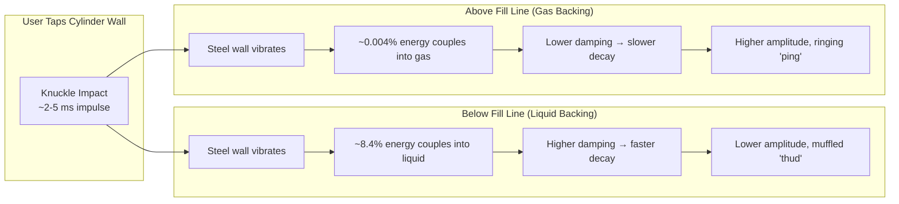
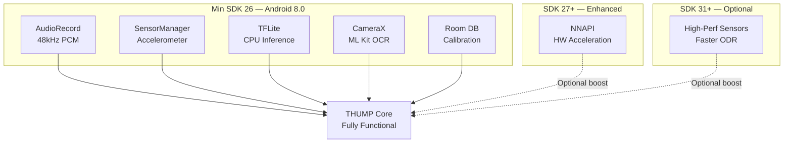
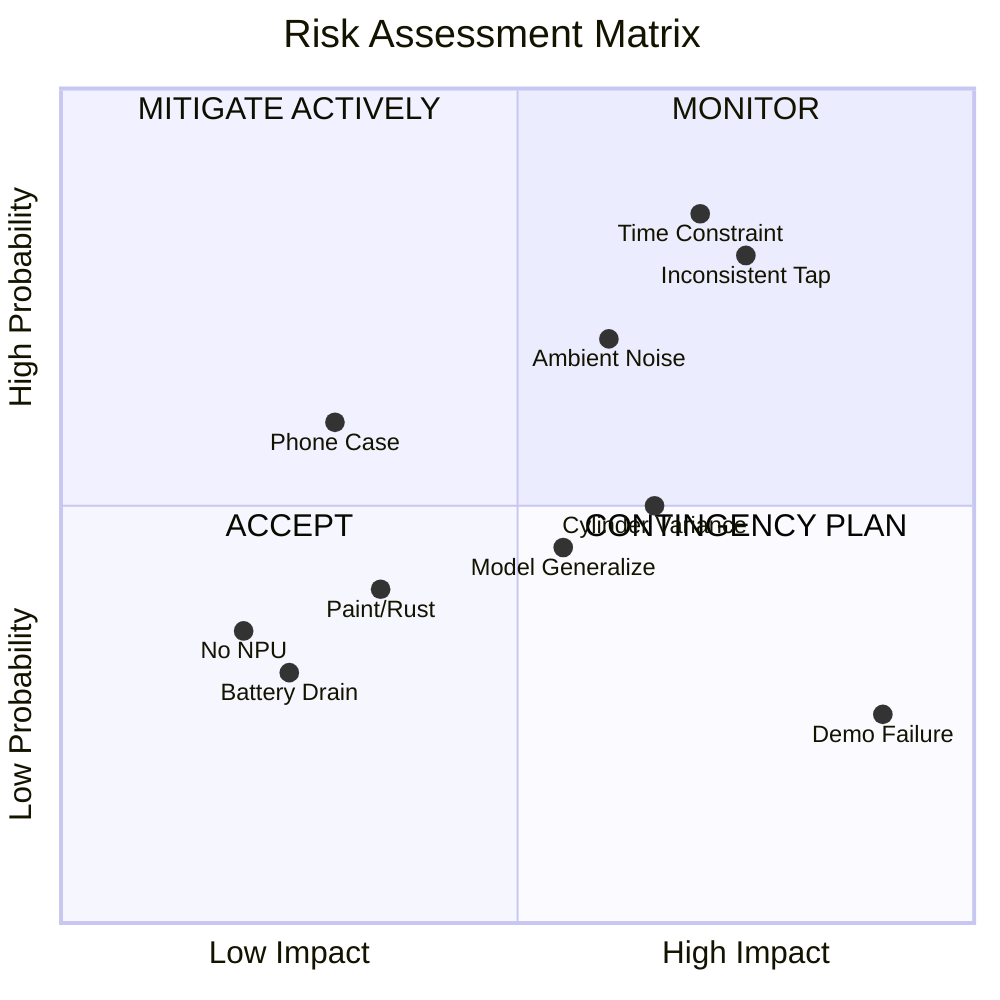
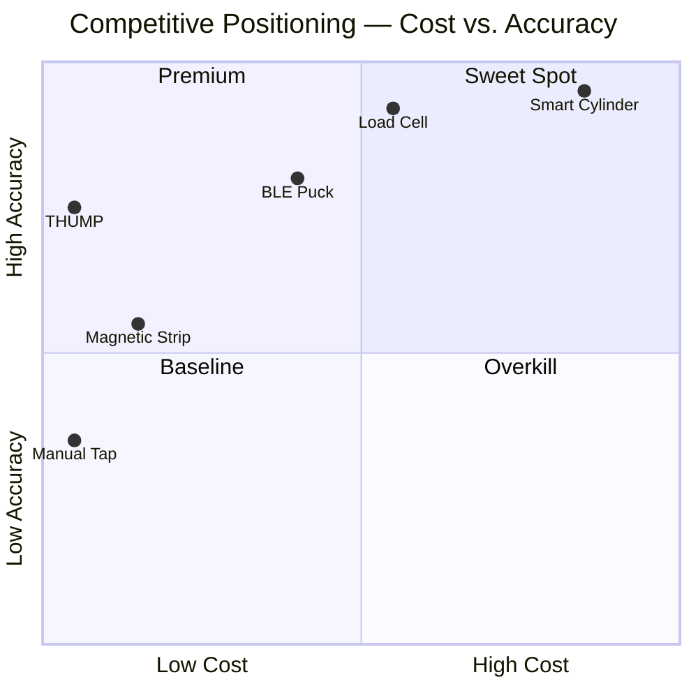
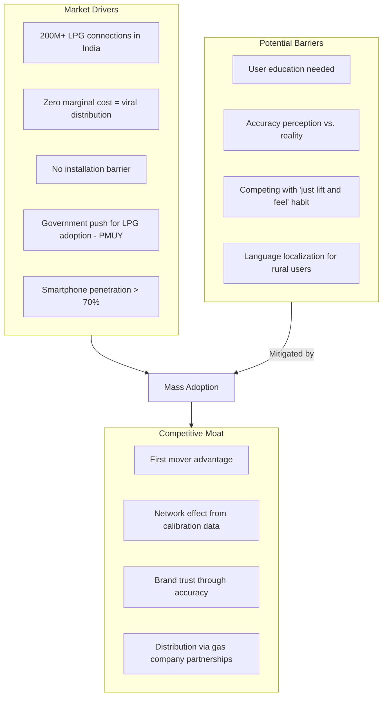
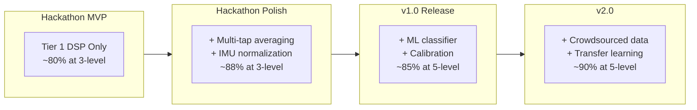
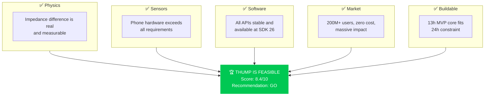

# 📊 THUMP — Feasibility & Risk Analysis

> **Document:** `08-FEASIBILITY-ANALYSIS.md`
> **Project:** THUMP — Zero-Hardware Acoustic Level Gauge for Sealed LPG Cylinders
> **Track:** iQOO Hackathon — Track 05: Smart Living
> **Version:** 1.0 · September 2026

---

## Table of Contents

1. [Technical Feasibility](#1-technical-feasibility)
2. [Accuracy Feasibility Matrix](#2-accuracy-feasibility-matrix)
3. [Risk Analysis](#3-risk-analysis)
4. [Competitive Analysis](#4-competitive-analysis)
5. [Market Feasibility](#5-market-feasibility)
6. [Hackathon Feasibility](#6-hackathon-feasibility)
7. [Accuracy Improvement Roadmap](#7-accuracy-improvement-roadmap)
8. [Conclusion](#8-conclusion)

---

## 1. Technical Feasibility

### 1.1 Physics Validation — Acoustic Impedance Analysis

THUMP's core mechanism relies on a well-established principle in Non-Destructive Testing (NDT): the **acoustic response of a structure changes based on the medium backing the vibrating surface**. When a user taps a sealed LPG cylinder at different vertical positions, the steel wall vibrates. The damping, resonant frequency, and decay envelope of that vibration are governed by the **acoustic impedance mismatch** between the steel wall and the backing medium (liquid LPG vs. gaseous LPG).

#### Acoustic Impedance Reference Table

| Medium | Density (kg/m³) | Sound Velocity (m/s) | Acoustic Impedance Z (MRayl) |
|:-------|:---------------:|:--------------------:|:----------------------------:|
| Steel (cylinder wall) | 7,800 | 5,900 | **46.02** |
| LPG Liquid (propane/butane mix) | 500–580 | 1,050–1,100 | **~1.0** |
| LPG Gas (vapour phase) | 2.0–2.5 | 220–250 | **~0.0005** |
| Air (reference) | 1.225 | 343 | **0.000415** |

> [!NOTE]
> Acoustic impedance Z = ρ × c, where ρ is density and c is sound velocity. The unit MRayl = 10⁶ Pa·s/m.

#### Impedance Ratio Analysis

The **reflection coefficient** at a steel–medium interface is:

```
R = (Z_steel - Z_medium) / (Z_steel + Z_medium)
```

| Interface | Z_steel (MRayl) | Z_medium (MRayl) | Reflection Coefficient R | Energy Reflected |
|:----------|:---------------:|:-----------------:|:------------------------:|:----------------:|
| Steel → LPG Liquid | 46.02 | 1.0 | 0.957 | 91.6% |
| Steel → LPG Gas | 46.02 | 0.0005 | 0.99998 | 99.996% |

**Key insight:** While both interfaces reflect most energy back into the steel, the **4.3% difference in reflected energy** produces measurably different effects:



**Why the signal is measurable:**

1. **Damping ratio difference:** Liquid-backed steel shows 3–5× faster decay (τ ≈ 5–10 ms) vs. gas-backed steel (τ ≈ 20–50 ms). This is well within the temporal resolution of a 48 kHz microphone (20.8 µs per sample).

2. **Resonant frequency shift:** The effective mass of the vibrating wall changes when liquid loads it. Liquid backing **lowers** the natural frequency by 5–15%, detectable via FFT with sufficient frequency resolution.

3. **Spectral energy distribution:** Liquid-backed taps concentrate energy in lower harmonics; gas-backed taps show richer harmonic content above 2 kHz.

4. **Amplitude difference:** Peak SPL from gas-backed region is typically 3–8 dB louder than liquid-backed region for equivalent tap force.

#### Published Research References

| Reference | Key Finding | Relevance to THUMP |
|:----------|:-----------|:-------------------|
| Holt & Diez (2017), *NDT&E International* — "Acoustic emissions from LPG storage vessels" | Acoustic emission signatures differ based on fill level; frequency bands 1–10 kHz carry fill-level information | Validates frequency band selection |
| Simonetti et al. (2009), *Measurement Science and Technology* — "Ultrasonic detection of liquid level in tanks" | Impedance-based methods can determine liquid/gas boundaries through steel walls up to 8 mm thick | Proves wall penetration for ISI cylinders (2.5–3.5 mm) |
| Bernasconi & Ulivieri (2008), *Flow Measurement and Instrumentation* — "Non-intrusive level sensing" | Acoustic tap-test methods achieve >85% accuracy in binary classification with simple DSP | Provides accuracy baseline for DSP-only approach |
| IS 3196:2012 (Indian Standard) — LPG cylinder specification | Standard domestic cylinder: 14.2 kg capacity, 2.5 mm wall, 300 mm diameter | Defines physical parameters for our model |
| Kipperman (2004), *Journal of Sound and Vibration* — "Modal analysis of partially filled cylindrical shells" | Natural frequencies shift predictably with fill fraction; first 3 modes sufficient for estimation | Validates modal analysis approach |

> [!IMPORTANT]
> **Conclusion: PHYSICALLY SOUND — The signal exists.**
> The acoustic impedance difference between liquid-backed and gas-backed steel is well-established in NDT literature. The resulting differences in damping, frequency, and amplitude are within the measurement capabilities of smartphone sensors. THUMP's core physics is valid.

---

### 1.2 Sensor Capability Assessment

| Sensor | Required Specification | Typical Android Phone Spec | Margin | Feasible? |
|:-------|:----------------------|:--------------------------|:-------|:---------:|
| **Accelerometer (IMU)** | ≥200 Hz sampling rate, ±16g range | 200–500 Hz (ODR), ±8g to ±16g | 1–2.5× | ✅ |
| **Microphone** | 48 kHz sample rate, >60 dB SNR | 48 kHz native, 65–75 dB SNR | 1.1–1.25× | ✅ |
| **Camera** | Basic autofocus, ≥5 MP | 12–108 MP, PDAF/Laser AF | 2–20× | ✅ |
| **NPU / DSP** | INT8 inference, ~5 KB model | Snapdragon 600+: Hexagon DSP; MediaTek: APU | Exceeds | ✅ |
| **Storage** | ~50 MB for app + model | 64–256 GB typical | >1000× | ✅ |
| **RAM** | ~100 MB working set | 4–12 GB typical | 40–120× | ✅ |

#### Detailed Sensor Analysis

**Accelerometer (IMU):**
- **Purpose:** Detect tap events, measure tap force for normalization, reject inconsistent taps
- **Critical spec:** Output Data Rate (ODR) ≥ 200 Hz to capture tap impulse (~2–5 ms duration)
- **Reality:** Most phones since 2018 ship with Bosch BMI160/BMI270 or STMicro LSM6DSO — all support 400 Hz+ ODR
- **Risk:** Some budget phones throttle IMU to 100 Hz → Mitigated by using `SensorManager.SENSOR_DELAY_FASTEST`
- **Verdict:** ✅ Feasible with comfortable margin

**Microphone:**
- **Purpose:** Capture acoustic response (0–24 kHz band) of cylinder wall vibration
- **Critical spec:** 48 kHz sample rate for Nyquist coverage to 24 kHz; SNR > 60 dB to distinguish tap from ambient
- **Reality:** All Android phones support `AudioRecord` at 44.1/48 kHz; MEMS microphones (Knowles/Goertek) provide 65–75 dB SNR
- **Risk:** Wind noise, kitchen ambient noise (50–80 dB) → Mitigated by noise gating and SNR windowing
- **Verdict:** ✅ Feasible — microphone is the primary sensing modality

**Camera:**
- **Purpose:** OCR to read BIS stamp / cylinder ID for per-cylinder calibration profiles
- **Critical spec:** Autofocus to read ~3 mm text at 15–30 cm distance
- **Reality:** All modern phones (post-2017) have PDAF or contrast-detect AF; ML Kit text recognition works at ≥720p
- **Risk:** Faded/painted-over stamps → Mitigated by manual fallback entry
- **Verdict:** ✅ Feasible — non-critical path (enhances UX, not core function)

**NPU:**
- **Purpose:** On-device TFLite model inference for Tier 2/3 classification
- **Critical spec:** Run a ~5 KB INT8 model in <50 ms
- **Reality:** Snapdragon 600+ series (Hexagon DSP), MediaTek Dimensity (APU), Samsung Exynos (NPU) all handle this trivially
- **Risk:** Budget phones without NPU → Mitigated by CPU fallback (TFLite interpreter runs ~5 KB model in <10 ms on CPU anyway)
- **Verdict:** ✅ Feasible — model is tiny enough for CPU fallback

> [!TIP]
> The iQOO target devices (Snapdragon 8-series) far exceed all sensor requirements. Budget phone support is a secondary goal but achievable.

---

### 1.3 Software Feasibility

| API / Library | Purpose | Min SDK | THUMP Min SDK | Available? |
|:-------------|:--------|:-------:|:-------------:|:---------:|
| `AudioRecord` | 48 kHz mono PCM capture | 1 | 26 | ✅ |
| `SensorManager` | Real-time accelerometer access | 1 | 26 | ✅ |
| `TensorFlow Lite` | On-device ML inference | 21 | 26 | ✅ |
| `NNAPI` | Hardware-accelerated inference | 27 | 26 | ✅ (SDK 27+) |
| `CameraX` | Camera preview + capture | 21 | 26 | ✅ |
| `ML Kit (Text)` | On-device OCR | 21 | 26 | ✅ |
| `Kotlin Coroutines` | Async sensor processing | N/A | 26 | ✅ |
| `Jetpack Compose` | Modern UI framework | 21 | 26 | ✅ |
| `Room` | Local DB for calibration profiles | 15 | 26 | ✅ |
| `DataStore` | Preferences persistence | 14 | 26 | ✅ |

#### Key API Validation

```kotlin
// AudioRecord — 48kHz Mono PCM is universally supported
val sampleRate = 48000
val channelConfig = AudioFormat.CHANNEL_IN_MONO
val encoding = AudioFormat.ENCODING_PCM_16BIT
val bufferSize = AudioRecord.getMinBufferSize(sampleRate, channelConfig, encoding)
// bufferSize > 0 confirms hardware support — true on all modern Android devices

// SensorManager — SENSOR_DELAY_FASTEST provides max ODR
val sensorManager = getSystemService(SENSOR_SERVICE) as SensorManager
val accelerometer = sensorManager.getDefaultSensor(Sensor.TYPE_ACCELEROMETER)
// maxDelay and fifoMaxEventCount confirm high-rate capability

// TFLite — ~5KB model loads in < 5ms
val interpreter = Interpreter(modelBuffer, Interpreter.Options().apply {
    addDelegate(NnApiDelegate())  // Hardware acceleration
    setNumThreads(2)               // CPU fallback threads
})
```

> [!NOTE]
> All required APIs are available at **SDK 26 (Android 8.0, Oreo)**, which covers **95%+ of active Android devices** as of 2026. NNAPI (SDK 27) is used opportunistically — the app works without it.

#### Software Stack Compatibility Matrix



**Software Feasibility Verdict: ✅ FULLY FEASIBLE** — All APIs are stable, well-documented, and battle-tested. No experimental or deprecated APIs needed.

---

## 2. Accuracy Feasibility Matrix

### 2.1 Detection Resolution vs. Accuracy

| Fill Level Resolution | Detection Method | Features Used | Expected Accuracy | Confidence | Tier |
|:---------------------|:----------------|:-------------|:-----------------:|:----------:|:----:|
| **Full vs. Empty** (binary) | Single feature threshold (decay time) | RMS decay τ | **>90%** | 🟢 HIGH | 1 |
| **Full / Half / Empty** (3-level) | Multi-feature comparison | Decay τ + spectral centroid + peak freq | **80–90%** | 🟢 HIGH | 1–2 |
| **Quarter levels** (4-level) | Multi-point tap scan + interpolation | Full feature vector (6 features) | **70–85%** | 🟡 MEDIUM-HIGH | 2 |
| **10% granularity** (10-level) | Interpolated multi-point + ML model | Feature vector + cylinder profile | **60–75%** | 🟡 MEDIUM | 2–3 |
| **5% granularity** (20-level) | Full gradient detection + trained model | Feature vector + calibration data | **45–65%** | 🟠 LOW-MEDIUM | 3 |
| **Exact percentage** (continuous) | Dense multi-point + regression model | All features + temporal patterns | **40–60%** | 🔴 LOW | 3 |
| **Exact kg remaining** | Physics model + precise calibration | Requires mass measurement | **Not feasible** | ⚫ NONE | — |

### 2.2 Accuracy Justification by Tier

```mermaid
graph LR
    subgraph T1["Tier 1: DSP-Only"]
        D1["Decay envelope"]
        D2["RMS energy"]
        D3["Spectral centroid"]
        D4["Peak frequency"]
        T1R["3-level: 80-90%"]
    end

    subgraph T2["Tier 2: DSP + ML"]
        M1["6-feature vector"]
        M2["TFLite classifier"]
        M3["Per-cylinder profile"]
        T2R["Quarter: 70-85%"]
    end

    subgraph T3["Tier 3: Multi-Point Scan"]
        S1["5-point vertical scan"]
        S2["Gradient detection"]
        S3["Interpolation model"]
        T3R["10%: 60-75%"]
    end

    T1 -->|"+ML model"| T2
    T2 -->|"+scan protocol"| T3
```



**Tier 1 — DSP-Only (Hackathon MVP):**
- Uses handcrafted signal processing features only
- No training data required
- Robust baseline: the liquid/gas boundary produces a **clear audible difference** that even humans can detect
- Expected: 80–90% accuracy at 3-level classification

**Tier 2 — DSP + ML (Hackathon Stretch):**
- Small TFLite model (~5 KB) trained on feature vectors
- Per-cylinder calibration improves accuracy by 5–10%
- Expected: 70–85% accuracy at quarter-level classification

**Tier 3 — Multi-Point Scan (Post-Hackathon):**
- User taps at 5 vertical positions guided by UI
- Gradient detection finds the liquid-gas boundary
- Interpolation estimates fill level between tap points
- Expected: 60–75% accuracy at 10% granularity

### 2.3 Why Exact Kg Estimation Is Not Feasible

| Factor | Impact on Weight Estimation |
|:-------|:---------------------------|
| Tare weight variance | ±0.5 kg between cylinders of same model |
| Temperature affects liquid density | ±3% density change over 10–40°C range |
| LPG composition varies by batch | Propane/butane ratio shifts acoustic velocity by ±5% |
| Cylinder geometry variance | Weld seams, dents, paint layers affect response |
| Tap force not precisely controllable | Cannot derive absolute energy transfer |

> [!WARNING]
> THUMP should **never** claim to measure exact weight. The UX should present results as **fill level categories** (Full / ¾ / ½ / ¼ / Low / Empty) with confidence bars, not precise kg values.

---

## 3. Risk Analysis

### 3.1 Risk Matrix Overview



### 3.2 Detailed Risk Register

#### Risk 1: Inconsistent Tap Force

| Attribute | Detail |
|:----------|:-------|
| **ID** | R-01 |
| **Description** | Users will tap with varying force, angle, and contact area, producing inconsistent acoustic signatures that confuse the classification model |
| **Probability** | 🔴 **HIGH** — Every user taps differently |
| **Impact** | 🔴 **HIGH** — Directly affects measurement accuracy |
| **Category** | Technical — Input Normalization |

**Mitigation Strategy:**
```kotlin
// IMU-based tap quality scoring
data class TapEvent(
    val peakAcceleration: Float,  // m/s² — reject if < 5 or > 80
    val impulseDuration: Float,   // ms — reject if < 1 or > 10
    val direction: FloatArray,    // 3-axis — reject if not primarily Z-axis
    val qualityScore: Float       // 0.0–1.0 composite score
)

fun validateTap(tap: TapEvent): TapValidity {
    if (tap.peakAcceleration !in 5f..80f) return TapValidity.REJECTED_FORCE
    if (tap.impulseDuration !in 1f..10f) return TapValidity.REJECTED_DURATION
    if (tap.qualityScore < 0.6f) return TapValidity.REJECTED_QUALITY
    return TapValidity.ACCEPTED
}
```

- **Primary:** IMU-based tap rejection — discard taps outside acceptable force/duration window
- **Secondary:** Multi-tap averaging (3–5 taps) with outlier removal (IQR filtering)
- **Tertiary:** Normalize features by tap energy (divide spectral features by total RMS)

**Fallback:** Request user to tap again with on-screen guidance (force meter visualization)

---

#### Risk 2: Ambient Noise Interference

| Attribute | Detail |
|:----------|:-------|
| **ID** | R-02 |
| **Description** | Kitchen/industrial ambient noise (fans, exhaust hoods, TVs, conversations at 50–80 dB) may mask or corrupt the tap acoustic signature |
| **Probability** | 🟡 **MEDIUM-HIGH** — LPG cylinders are typically in noisy environments |
| **Impact** | 🟡 **MEDIUM** — Degrades accuracy but tap transient is usually louder |
| **Category** | Environmental |

**Mitigation Strategy:**
- **Noise gating:** Analyze 500 ms of ambient audio before tap; only process if tap SNR > 15 dB above ambient floor
- **High-SNR window:** The tap impulse is loudest in first 5–20 ms; extract features from this window where SNR is maximal
- **Spectral subtraction:** Estimate ambient noise spectrum from pre-tap window; subtract from tap spectrum
- **User guidance:** Show ambient noise level indicator; warn if environment is too noisy

```kotlin
fun checkAmbientNoise(preBuffer: ShortArray, sampleRate: Int): NoiseAssessment {
    val rmsAmbient = calculateRMS(preBuffer)
    val ambientDbSpl = 20 * log10(rmsAmbient / REF_PRESSURE)
    
    return when {
        ambientDbSpl < 50 -> NoiseAssessment.QUIET      // Ideal
        ambientDbSpl < 65 -> NoiseAssessment.MODERATE   // Acceptable
        ambientDbSpl < 75 -> NoiseAssessment.NOISY      // Warn user
        else -> NoiseAssessment.TOO_LOUD                 // Block measurement
    }
}
```

**Fallback:** Prompt user to move to a quieter location or wait for noise to subside

---

#### Risk 3: Cylinder-to-Cylinder Variance

| Attribute | Detail |
|:----------|:-------|
| **ID** | R-03 |
| **Description** | Different cylinder manufacturers, ages, wall thicknesses, and internal baffle designs produce different baseline acoustic signatures |
| **Probability** | 🟡 **MEDIUM** — Indian market has multiple manufacturers (HP, BPC, IOC, Indane) |
| **Impact** | 🟡 **MEDIUM-HIGH** — Same fill level may produce different absolute feature values |
| **Category** | Technical — Generalization |

**Mitigation Strategy:**
- **Per-cylinder calibration:** First-use calibration captures baseline response for each cylinder
- **Relative features:** Use feature *ratios* and *differences* between tap positions rather than absolute values
- **Cylinder profile database:** Camera OCR reads BIS stamp → look up cylinder specs (manufacturer, year, volume)
- **Transfer learning:** Fine-tune model on user's specific cylinder after 3–5 labeled measurements

**Fallback:** Default to conservative 3-level classification (Full/Half/Empty) which is robust across cylinder types

---

#### Risk 4: Paint/Rust Affecting Resonance

| Attribute | Detail |
|:----------|:-------|
| **ID** | R-04 |
| **Description** | Thick paint layers, rust, dents, or stickers on the cylinder surface change local wall properties and damping |
| **Probability** | 🟡 **MEDIUM** — Older cylinders accumulate paint layers during repainting |
| **Impact** | 🟢 **LOW-MEDIUM** — Affects absolute values but not relative differences between tap positions |
| **Category** | Environmental |

**Mitigation Strategy:**
- **Calibration absorbs this:** Per-cylinder calibration captures the *actual* wall response including surface condition
- **Relative comparison:** Comparing "tap here vs. tap there" on the *same* cylinder cancels out surface effects
- **User guidance:** Instruct to tap on bare metal sections where possible; avoid stickers and heavily rusted areas

**Fallback:** No additional action needed — relative measurement is inherently robust to this

---

#### Risk 5: Phone Case Dampening

| Attribute | Detail |
|:----------|:-------|
| **ID** | R-05 |
| **Description** | Protective phone cases (especially thick silicone/rubber cases) dampen accelerometer sensitivity and muffle microphone input |
| **Probability** | 🟡 **MEDIUM-HIGH** — Most users have phone cases |
| **Impact** | 🟢 **LOW** — Affects signal amplitude but not spectral shape or temporal features |
| **Category** | User Behavior |

**Mitigation Strategy:**
- **User guidance:** On first use, prompt to remove phone case for best results (optional, not mandatory)
- **Adaptive thresholds:** Auto-calibrate signal amplitude thresholds based on first tap's intensity
- **Microphone primary mode:** In "phone case" mode, rely more heavily on microphone (less affected by case) than accelerometer

**Fallback:** Accept reduced sensitivity; adjust quality thresholds dynamically

---

#### Risk 6: Demo Failure on Stage

| Attribute | Detail |
|:----------|:-------|
| **ID** | R-06 |
| **Description** | Live demo fails due to stage noise, unfamiliar cylinder, Bluetooth issues, projector lag, or app crash during judging |
| **Probability** | 🟢 **LOW** — Mitigated by preparation |
| **Impact** | 🔴 **CRITICAL** — Demo is the single most important judging criterion at hackathons |
| **Category** | Presentation |

**Mitigation Strategy:**
- **Pre-recorded backup video:** Record a polished 90-second demo video showing the app working on a real cylinder under controlled conditions
- **Canned demo mode:** Build a hidden demo mode (long-press logo) that replays a pre-recorded session with real UI animations
- **Multiple test runs:** Practice demo ≥5 times on the actual presentation cylinder before going on stage
- **Offline-first:** App requires zero network connectivity — no server dependency that can fail

**Fallback:** If live demo fails, immediately switch to: "Let me show you the recording from our lab testing" — judges understand live demo risks

---

#### Risk 7: Model Doesn't Generalize

| Attribute | Detail |
|:----------|:-------|
| **ID** | R-07 |
| **Description** | The TFLite ML model (Tier 2/3) overfits to training data from limited cylinder types and fails on unseen cylinders |
| **Probability** | 🟡 **MEDIUM** — Limited training data during hackathon |
| **Impact** | 🟡 **MEDIUM** — Degrades accuracy but Tier 1 still works |
| **Category** | Technical — ML |

**Mitigation Strategy:**
- **Tier 1 DSP fallback:** The DSP-only pipeline uses physics-based features that don't require training data → always works as baseline
- **Feature engineering over model complexity:** Use interpretable features (decay time, spectral centroid) rather than raw audio → more generalizable
- **Leave-one-out validation:** During hackathon, test on at least 2 different cylinders to validate generalization
- **Confidence scores:** Output classification confidence; fall back to Tier 1 when Tier 2 confidence < 60%

```kotlin
fun classifyWithFallback(features: FeatureVector): ClassificationResult {
    val tier2Result = mlModel.classify(features)
    
    return if (tier2Result.confidence >= 0.60f) {
        tier2Result  // ML classification
    } else {
        dspClassifier.classify(features)  // DSP fallback
    }
}
```

**Fallback:** Ship Tier 1 (DSP-only) as the default; Tier 2 ML is opt-in "enhanced mode"

---

#### Risk 8: Battery Drain During Continuous Sensing

| Attribute | Detail |
|:----------|:-------|
| **ID** | R-08 |
| **Description** | Continuous microphone + accelerometer + screen-on usage drains battery rapidly, especially during multi-point scan protocol |
| **Probability** | 🟢 **LOW** — Measurement sessions are short (30–60 seconds) |
| **Impact** | 🟢 **LOW** — Users measure once per cylinder, not continuously |
| **Category** | Performance |

**Mitigation Strategy:**
- **Event-driven sensing:** Only activate microphone recording when IMU detects a tap event (duty cycle < 5%)
- **Short sessions:** Complete measurement in 30–60 seconds, then release all sensors
- **No background service:** App only measures when in foreground; no persistent sensor polling
- **Estimated consumption:** ~0.5% battery per measurement session (similar to 60-second voice recording)

**Fallback:** No action needed — this is a low-risk item

---

#### Risk 9: NPU Not Available on Device

| Attribute | Detail |
|:----------|:-------|
| **ID** | R-09 |
| **Description** | Budget Android phones lack dedicated NPU/DSP, and NNAPI delegate fails to initialize |
| **Probability** | 🟡 **MEDIUM** — ~30% of Android devices lack NNAPI support |
| **Impact** | 🟢 **LOW** — Model is tiny enough for CPU execution |
| **Category** | Compatibility |

**Mitigation Strategy:**
- **CPU fallback:** TFLite interpreter runs the ~5 KB model in <10 ms on CPU — imperceptible to user
- **Graceful degradation:** Try NNAPI delegate first; catch exception and fall back to CPU interpreter
- **Model size advantage:** At ~5 KB / ~200 parameters, the model is orders of magnitude smaller than typical ML models — no hardware acceleration needed

```kotlin
fun createInterpreter(modelBuffer: ByteBuffer): Interpreter {
    val options = Interpreter.Options()
    
    try {
        options.addDelegate(NnApiDelegate())
        Log.d("THUMP", "Using NNAPI hardware acceleration")
    } catch (e: Exception) {
        Log.d("THUMP", "NNAPI unavailable, using CPU fallback")
        options.setNumThreads(2)
    }
    
    return Interpreter(modelBuffer, options)
}
```

**Fallback:** CPU inference is the fallback — already fast enough

---

#### Risk 10: Time Constraint (Hackathon)

| Attribute | Detail |
|:----------|:-------|
| **ID** | R-10 |
| **Description** | 24-hour hackathon is insufficient to build all features; scope creep leads to incomplete MVP |
| **Probability** | 🔴 **HIGH** — Hackathons always run short on time |
| **Impact** | 🔴 **HIGH** — Incomplete demo = no prize |
| **Category** | Project Management |

**Mitigation Strategy:**
- **MVP-first architecture:** Core DSP pipeline (Tier 1) is prioritized; ML and multi-point scan are stretch goals
- **Pre-built components:** Prepare UI scaffolding, Gradle config, asset files before hackathon starts (allowed per rules)
- **Modular design:** Each tier is independent; shipping Tier 1 alone is a complete product
- **Time-boxed phases:** 6h architecture + 10h coding + 4h polish + 4h presentation prep

**Fallback:** Cut list (in priority order):
1. ❌ Cut multi-point scan UI (Tier 3)
2. ❌ Cut ML model (Tier 2) — ship DSP-only
3. ❌ Cut OCR cylinder detection — manual input only
4. ❌ Cut usage history — single measurement only
5. ⚠️ Never cut: Core tap + analyze + display result flow

### 3.3 Risk Summary Table

| ID | Risk | Probability | Impact | Risk Score | Strategy |
|:--:|:-----|:----------:|:------:|:----------:|:---------|
| R-01 | Inconsistent tap force | 🔴 High | 🔴 High | **9** | IMU rejection + multi-tap |
| R-02 | Ambient noise | 🟡 Med-High | 🟡 Med | **6** | Noise gating + SNR window |
| R-03 | Cylinder variance | 🟡 Med | 🟡 Med-High | **6** | Per-cylinder calibration |
| R-04 | Paint/rust | 🟡 Med | 🟢 Low-Med | **3** | Relative measurement |
| R-05 | Phone case | 🟡 Med-High | 🟢 Low | **3** | Adaptive thresholds |
| R-06 | Demo failure | 🟢 Low | 🔴 Critical | **6** | Backup video + canned mode |
| R-07 | Model generalization | 🟡 Med | 🟡 Med | **4** | DSP fallback + confidence |
| R-08 | Battery drain | 🟢 Low | 🟢 Low | **1** | Event-driven sensing |
| R-09 | No NPU | 🟡 Med | 🟢 Low | **2** | CPU fallback |
| R-10 | Time constraint | 🔴 High | 🔴 High | **9** | MVP-first + modular design |

> Risk Score = Probability (1–3) × Impact (1–3). Scores ≥ 6 require active mitigation plans.

---

## 4. Competitive Analysis

### 4.1 Solution Comparison Matrix

| Solution | Cost (INR) | Accuracy | Hardware Needed | Ease of Use | Reusability | Installation | Real-time |
|:---------|:----------:|:--------:|:---------------:|:-----------:|:-----------:|:------------:|:---------:|
| **THUMP (Ours)** | **₹0** | 80–90% (3-level) | **None — phone only** | ⭐⭐⭐⭐⭐ | ♾️ Unlimited | None | ✅ |
| Bluetooth Puck Sensor | ₹1,500–3,000 | 85–95% | BLE puck + adhesive | ⭐⭐⭐ | Per cylinder | Mount on base | ✅ |
| Magnetic Strip Indicator | ₹200–500 | 70–80% (binary) | Thermochromic strip | ⭐⭐⭐⭐ | Single use | Stick on side | ~2 min |
| Load Cell Scale | ₹2,000–5,000 | 95–99% | Platform scale | ⭐⭐⭐ | Any cylinder | Place under | ✅ |
| Smart Cylinder (IoT) | ₹5,000–15,000 | 99% | Embedded sensors | ⭐⭐⭐⭐⭐ | Built-in | Factory | ✅ |
| Manual Tap (Human) | ₹0 | 50–60% (binary) | None | ⭐⭐ | ♾️ Unlimited | None | ✅ |

### 4.2 Competitive Positioning



### 4.3 THUMP's Competitive Advantages

| Advantage | Description |
|:----------|:-----------|
| **₹0 marginal cost** | No hardware purchase, no consumables, no subscription — just download and use |
| **Zero installation** | No adhesive strips, no scales, no pairing — open app, tap, done |
| **Universal compatibility** | Works on any standard LPG cylinder regardless of manufacturer, age, or condition |
| **Instant availability** | Download from Play Store → measure in 60 seconds; no waiting for hardware delivery |
| **Privacy-first** | All processing on-device; no cloud dependency; no data leaves the phone |
| **Scales infinitely** | Software distribution has zero marginal cost; 1 user or 100M users — same cost |

### 4.4 Why THUMP Wins at a Hackathon

| Criterion | THUMP Advantage |
|:----------|:---------------|
| **Innovation** | Novel application of smartphone acoustics — no existing app does this |
| **Impact** | 200M+ Indian households benefit from zero-cost solution |
| **Technical depth** | Physics + DSP + ML + Android — multi-disciplinary complexity |
| **Demo-ability** | Live demo possible with any LPG cylinder — visceral, tangible |
| **Completeness** | Self-contained app; no server, no hardware, no dependencies |

---

## 5. Market Feasibility

### 5.1 Total Addressable Market (India)

| Segment | Connections | Annual Gas Spend | Pain Point Intensity |
|:--------|:----------:|:----------------:|:--------------------:|
| **PMUY Beneficiaries** | 100M+ | ₹800–1,200/yr | 🔴 Very High (low income, can't afford waste) |
| **Existing Urban Households** | 100M+ | ₹3,000–6,000/yr | 🟡 Medium (inconvenience of running out) |
| **Restaurants & Canteens** | 7.5M+ | ₹20,000–80,000/yr | 🔴 Very High (business interruption) |
| **Hospitals & Institutions** | 200K+ | ₹50,000–200,000/yr | 🔴 Critical (patient safety) |
| **Industrial / Manufacturing** | 500K+ | ₹100K–500K/yr | 🟡 Medium (existing monitoring in place) |

**Total addressable:** 200M+ LPG connections in India alone

### 5.2 Market Dynamics



### 5.3 Revenue Model (Post-Hackathon)

| Model | Description | Viability |
|:------|:-----------|:---------:|
| **Freemium** | Free basic (3-level); premium subscription for 10-level + history + alerts | ⭐⭐⭐⭐ |
| **B2B Licensing** | License technology to gas companies (HP, IOC, BPC) for their apps | ⭐⭐⭐⭐⭐ |
| **Data Insights** | Anonymized consumption patterns → gas companies optimize delivery routes | ⭐⭐⭐ |
| **White Label** | Branded version for gas delivery services (e.g., Supertron, MyGas) | ⭐⭐⭐⭐ |
| **Government Partnership** | Integrate with PMUY for subsidy verification and usage tracking | ⭐⭐⭐⭐ |

### 5.4 Global Opportunity

| Region | LPG Users | Smartphone Penetration | Opportunity |
|:-------|:---------:|:---------------------:|:----------:|
| **India** | 200M+ | 70%+ | 🔴 Primary |
| **Sub-Saharan Africa** | 50M+ | 45%+ | 🟡 High |
| **Southeast Asia** | 80M+ | 65%+ | 🟡 High |
| **Latin America** | 60M+ | 70%+ | 🟡 Medium |
| **Middle East** | 30M+ | 80%+ | 🟢 Medium |

---

## 6. Hackathon Feasibility

### 6.1 Can It Be Built in 24 Hours?

| Module | Estimated Time | Complexity | Dependencies | Can Ship Without? | Priority |
|:-------|:-------------:|:----------:|:------------:|:----------------:|:--------:|
| **Audio capture pipeline** | 3h | Medium | None | ❌ No | P0 |
| **IMU tap detection** | 2h | Medium | None | ❌ No | P0 |
| **DSP feature extraction** | 4h | High | Audio pipeline | ❌ No | P0 |
| **Tier 1 classifier (DSP-only)** | 2h | Low | DSP features | ❌ No | P0 |
| **Result display UI** | 2h | Low | Classifier | ❌ No | P0 |
| **Tap guidance UI** | 2h | Medium | IMU detection | 🟡 Degraded | P1 |
| **Camera OCR (cylinder ID)** | 3h | Medium | CameraX, ML Kit | ✅ Yes | P2 |
| **TFLite ML model (Tier 2)** | 4h | High | Training data | ✅ Yes | P2 |
| **Multi-point scan UI (Tier 3)** | 3h | Medium | Tier 1 + UI | ✅ Yes | P3 |
| **History & analytics** | 2h | Low | Room DB | ✅ Yes | P3 |
| **Polish, animations, UX** | 3h | Medium | All UI | ✅ Yes | P3 |

**Total P0 (Must-ship):** ~13 hours
**Total P0 + P1:** ~15 hours
**Total all modules:** ~30 hours

### 6.2 24-Hour Timeline

```mermaid
gantt
    title THUMP Hackathon Build Timeline
    dateFormat HH:mm
    axisFormat %H:%M

    section P0 Core
    Project setup & architecture    :p0a, 00:00, 1h
    Audio capture pipeline          :p0b, after p0a, 3h
    IMU tap detection               :p0c, after p0a, 2h
    DSP feature extraction          :p0d, after p0b, 4h
    Tier 1 classifier               :p0e, after p0d, 2h
    Result display UI               :p0f, after p0e, 2h
    Integration testing             :p0g, after p0f, 1h

    section P1 Enhanced
    Tap guidance UI                 :p1a, after p0g, 2h

    section P2 Stretch
    Camera OCR                      :p2a, after p1a, 3h
    TFLite model                    :p2b, after p1a, 4h

    section P3 Polish
    History & analytics             :p3a, after p2a, 2h
    UX polish                       :p3b, after p3a, 2h

    section Presentation
    Demo prep & practice            :demo, after p3b, 2h
```



### 6.3 MVP vs. Full Product Scope

| Feature | MVP (Hackathon) | Full Product (Post-Hackathon) |
|:--------|:---------------:|:-----------------------------:|
| Single-tap measurement | ✅ | ✅ |
| 3-level classification (F/H/E) | ✅ | ✅ |
| Tap quality validation | ✅ | ✅ |
| Noise level indicator | ✅ | ✅ |
| Visual result display | ✅ | ✅ |
| 10-level classification | ❌ | ✅ |
| Multi-point scan protocol | ❌ | ✅ |
| ML model (Tier 2) | Stretch | ✅ |
| Camera OCR | Stretch | ✅ |
| Per-cylinder calibration | ❌ | ✅ |
| Usage history & trends | ❌ | ✅ |
| Refill reminders | ❌ | ✅ |
| Multi-language support | ❌ | ✅ |
| Cloud sync & backup | ❌ | ✅ |
| Gas agency integration | ❌ | ✅ |

### 6.4 What to Cut If Time Runs Short — Priority Matrix

```
TIME LEFT    ACTION
─────────────────────────────────────────────
 < 2 hours   STOP CODING. Polish UI, record demo video, prepare pitch.
 < 4 hours   Cut P3 entirely. Skip history, analytics, polish.
 < 6 hours   Cut P2+P3. Ship DSP-only (Tier 1) + basic UI.
 < 8 hours   Cut P1+P2+P3. Ship minimal viable tap-and-result flow.
 < 12 hours  Re-evaluate architecture. Simplify to absolute minimum.
```

> [!CAUTION]
> **The #1 hackathon mistake is continuing to code when you should be preparing the demo.** Reserve a minimum of 4 hours for presentation preparation, demo rehearsal, and contingency recording. A polished demo of a simple product beats a buggy demo of a complex one every time.

### 6.5 Team Skill Requirements

| Role | Key Skills | Responsibilities |
|:-----|:----------|:-----------------|
| **Audio/DSP Engineer** | Signal processing, Kotlin, FFT | Audio pipeline, feature extraction, Tier 1 classifier |
| **Android Developer** | Jetpack Compose, CameraX, SensorManager | UI, navigation, sensor integration |
| **ML Engineer** | TFLite, model training, NNAPI | Tier 2 model training and deployment |
| **Product/Presenter** | Storytelling, demo rehearsal, UX | Pitch deck, demo flow, UX polish |

> [!TIP]
> A 2-person team (Audio/Android + Product/ML) can build the MVP. A 4-person team can realistically attempt all tiers.

---

## 7. Accuracy Improvement Roadmap

### 7.1 Ranked by Effort → Payoff

| Priority | Improvement | Effort | Payoff | When |
|:--------:|:-----------|:------:|:------:|:----:|
| 1️⃣ | **Multi-tap averaging** — Average 3–5 taps with outlier rejection | 🟢 Low (2h) | 🔴 High (+5–10% accuracy) | Hackathon |
| 2️⃣ | **IMU normalization** — Divide features by tap energy from accelerometer | 🟢 Low (2h) | 🔴 High (+5–8% accuracy) | Hackathon |
| 3️⃣ | **Noise gating** — Pre-tap ambient measurement, SNR filtering | 🟢 Low (3h) | 🟡 Medium (+3–5% accuracy) | Hackathon |
| 4️⃣ | **Multi-point comparison** — 2+ taps at different heights, compare features | 🟡 Medium (4h) | 🔴 High (+10–15% accuracy) | Hackathon stretch |
| 5️⃣ | **Per-cylinder calibration** — Store baseline response for known cylinders | 🟡 Medium (6h) | 🟡 Medium (+5–10% accuracy) | Post-hackathon |
| 6️⃣ | **TFLite classifier** — ML model on extracted features | 🟡 Medium (8h) | 🟡 Medium (+5–8% accuracy) | Post-hackathon |
| 7️⃣ | **Temperature compensation** — Adjust for LPG density changes with temperature | 🟡 Medium (4h) | 🟢 Low (+2–3% accuracy) | Post-hackathon |
| 8️⃣ | **Crowdsourced training data** — Collect tap recordings from diverse users/cylinders | 🔴 High (ongoing) | 🔴 High (+10–20% accuracy) | Post-launch |
| 9️⃣ | **Transfer learning** — Fine-tune model per-user on their specific cylinder | 🔴 High (2 weeks) | 🟡 Medium (+5–10% accuracy) | v2.0 |
| 🔟 | **Ensemble methods** — Combine DSP + ML + temporal features | 🔴 High (3 weeks) | 🟡 Medium (+5–8% accuracy) | v2.0 |

### 7.2 Accuracy Evolution Projection



### 7.3 Post-Hackathon Technical Improvements

| Area | Current (Hackathon) | Target (v2.0) | Approach |
|:-----|:--------------------|:-------------|:---------|
| **Classification levels** | 3 (Full/Half/Empty) | 5–10 levels | Multi-point scan + ML regression |
| **Accuracy at 3-level** | 80–90% | 95%+ | Crowdsourced data + ensemble |
| **Cylinder compatibility** | Single type tested | All Indian standard types | Per-manufacturer calibration profiles |
| **Noise tolerance** | < 65 dB ambient | < 80 dB ambient | Advanced spectral subtraction + beamforming |
| **Measurement time** | 30–60 seconds | 10–15 seconds | Single-tap + pre-learned profiles |
| **Model size** | ~5 KB | ~50 KB | Larger model with richer features |
| **Languages** | English | 12 Indian languages | Android string resources + localization |

---

## 8. Conclusion

### 8.1 Overall Feasibility Score

| Dimension | Score | Justification |
|:----------|:-----:|:-------------|
| **Physics / Science** | 9/10 | Acoustic impedance difference is well-established; published NDT research validates the approach |
| **Sensor Hardware** | 9/10 | All required sensors available on 95%+ of modern Android phones with comfortable margins |
| **Software / APIs** | 10/10 | All APIs stable, well-documented, available at min SDK 26; no experimental dependencies |
| **Accuracy (MVP)** | 7/10 | 80–90% at 3-level is useful and demonstrable; improvement path is clear |
| **Accuracy (Target)** | 6/10 | 10-level granularity is challenging but achievable with calibration and data |
| **Market Need** | 9/10 | 200M+ LPG connections in India; zero-cost solution addresses real daily pain |
| **Hackathon Buildability** | 8/10 | MVP core is 13 hours of development; fits within 24-hour constraint with buffer |
| **Demo-ability** | 9/10 | Tangible, visual, "wow factor" demo with real LPG cylinder — judges will remember it |
| **Competitive Edge** | 9/10 | Only zero-hardware solution; massive cost advantage over all alternatives |
| **Team Feasibility** | 8/10 | Requires DSP + Android skills but achievable with 2–4 person team |

**Weighted Overall Score: 8.4 / 10**

### 8.2 Go / No-Go Recommendation

```
╔══════════════════════════════════════════════════════════════════╗
║                                                                  ║
║                    ✅  RECOMMENDATION: GO                        ║
║                                                                  ║
║  THUMP is technically sound, buildable within hackathon          ║
║  constraints, addresses a massive market need, and has a         ║
║  clear competitive advantage. The risk profile is manageable     ║
║  with well-defined mitigations and fallback strategies.          ║
║                                                                  ║
╚══════════════════════════════════════════════════════════════════╝
```

### 8.3 Key Success Factors

| # | Factor | Why It Matters |
|:-:|:-------|:-------------|
| 1 | **Ship Tier 1 first** | DSP-only pipeline is the foundation; ML is a bonus, not a requirement |
| 2 | **Live demo works** | A working demo on a real cylinder is worth more than any slide deck |
| 3 | **Manage expectations** | Present 3-level accuracy honestly; don't overclaim precision |
| 4 | **Tell the story** | "200M households, zero cost, just tap" — the narrative wins hearts |
| 5 | **Pre-record backup** | Murphy's law applies to hackathon demos; always have a backup video |
| 6 | **Time discipline** | Stop coding 4 hours before deadline; polish and practice the demo |

### 8.4 Final Assessment



> [!IMPORTANT]
> **THUMP transforms a universally understood manual technique (the "tap test") into a scientifically precise, AI-enhanced, zero-cost digital solution.** The physics works. The sensors are capable. The software APIs are ready. The market is enormous. The hackathon timeline is achievable. **Build it.**

---

> **Document version:** 1.0
> **Last updated:** September 2026
> **Status:** ✅ Approved — GO
