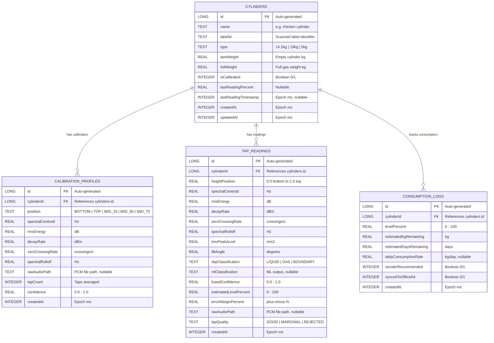
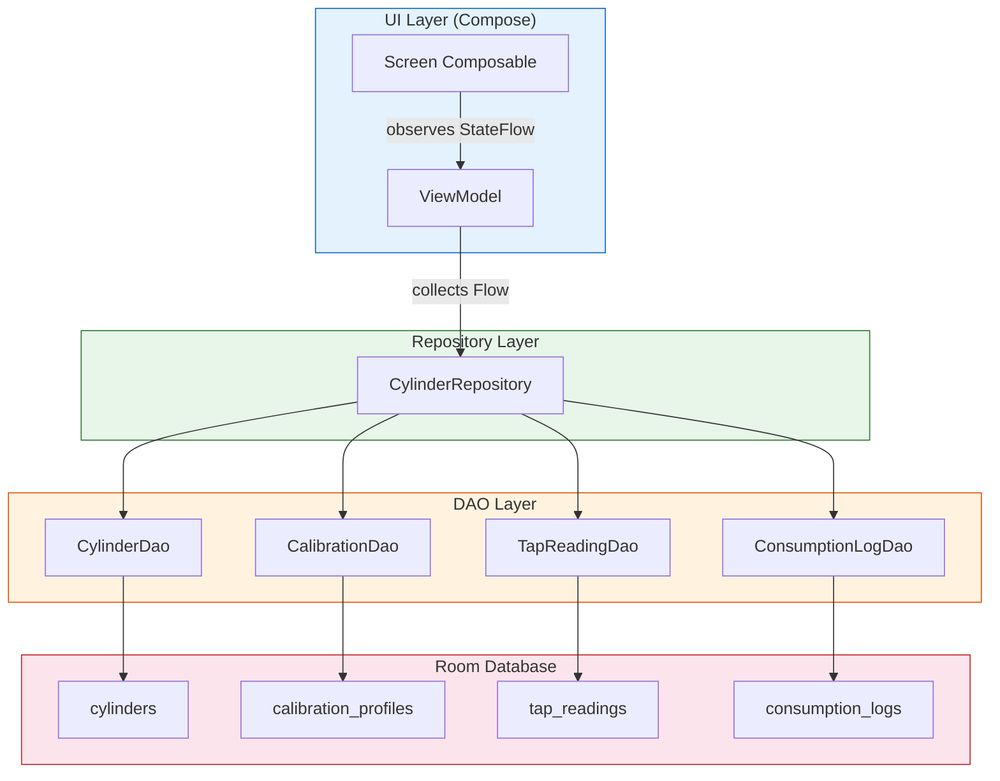
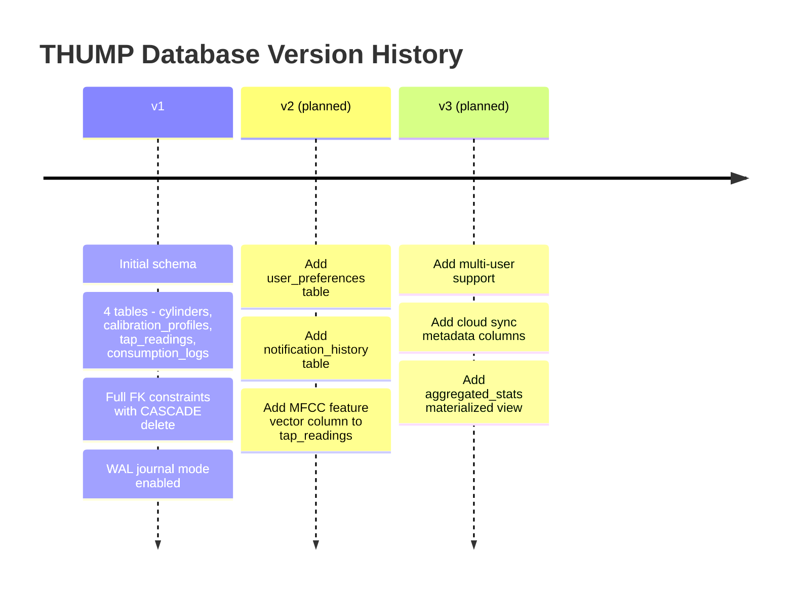

# 📦 09 — Database Schema & Data Model

> **THUMP — Zero-Hardware Acoustic Level Gauge**
> Native Android · Kotlin · Room Persistence Library
> Track 05: Smart Living — iQOO Hackathon

---

## Table of Contents

- [1. Entity-Relationship Diagram](#1-entity-relationship-diagram)
- [2. Entities (Room)](#2-entities-room)
  - [2.1 Cylinder](#21-cylinder)
  - [2.2 CalibrationProfile](#22-calibrationprofile)
  - [2.3 TapReading](#23-tapreading)
  - [2.4 ConsumptionLog](#24-consumptionlog)
- [3. DAOs](#3-daos)
  - [3.1 CylinderDao](#31-cylinderdao)
  - [3.2 CalibrationDao](#32-calibrationdao)
  - [3.3 TapReadingDao](#33-tapreadingdao)
  - [3.4 ConsumptionLogDao](#34-consumptionlogdao)
- [4. Database Class](#4-database-class)
- [5. TypeConverters](#5-typeconverters)
- [6. Repository Layer](#6-repository-layer)
  - [6.1 CylinderRepository](#61-cylinderrepository)
- [7. Data Migration Strategy](#7-data-migration-strategy)

---

## 1. Entity-Relationship Diagram



> [!NOTE]
> All foreign keys use `ON DELETE CASCADE` — deleting a cylinder removes all associated calibration profiles, tap readings, and consumption logs automatically.

---

## 2. Entities (Room)

### 2.1 Cylinder

The central entity representing a physical LPG cylinder registered in the app.

```kotlin
package com.thump.app.data.local.entity

import androidx.room.ColumnInfo
import androidx.room.Entity
import androidx.room.Index
import androidx.room.PrimaryKey

/**
 * Represents a physical LPG cylinder registered in THUMP.
 *
 * Each cylinder has a type (weight class), tare weight, full gas weight,
 * and tracks its latest reading for quick dashboard display.
 *
 * @property name           User-friendly label, e.g. "Kitchen cylinder"
 * @property labelId        Optional scanned barcode / QR identifier
 * @property type           Weight class: "14.2kg", "19kg", "5kg"
 * @property tareWeight     Empty cylinder weight in kilograms
 * @property fullWeight     Net gas weight when full in kilograms
 * @property isCalibrated   True after a valid calibration profile exists
 * @property lastReadingPercent    Cached last reading for fast dashboard access
 * @property lastReadingTimestamp  Epoch millis of last reading
 */
@Entity(
    tableName = "cylinders",
    indices = [
        Index(value = ["labelId"], unique = true),
        Index(value = ["name"])
    ]
)
data class Cylinder(
    @PrimaryKey(autoGenerate = true)
    val id: Long = 0,

    @ColumnInfo(name = "name")
    val name: String,

    @ColumnInfo(name = "labelId")
    val labelId: String? = null,

    @ColumnInfo(name = "type")
    val type: String,

    @ColumnInfo(name = "tareWeight")
    val tareWeight: Float,

    @ColumnInfo(name = "fullWeight")
    val fullWeight: Float,

    @ColumnInfo(name = "isCalibrated")
    val isCalibrated: Boolean = false,

    @ColumnInfo(name = "lastReadingPercent")
    val lastReadingPercent: Float? = null,

    @ColumnInfo(name = "lastReadingTimestamp")
    val lastReadingTimestamp: Long? = null,

    @ColumnInfo(name = "createdAt")
    val createdAt: Long = System.currentTimeMillis(),

    @ColumnInfo(name = "updatedAt")
    val updatedAt: Long = System.currentTimeMillis()
)
```

| Column | SQLite Type | Nullable | Default | Notes |
|---|---|---|---|---|
| `id` | INTEGER | No | Auto | Primary key |
| `name` | TEXT | No | — | User-visible label |
| `labelId` | TEXT | Yes | NULL | Unique index for barcode lookup |
| `type` | TEXT | No | — | Enum-like: `"14.2kg"`, `"19kg"`, `"5kg"` |
| `tareWeight` | REAL | No | — | Empty cylinder weight (kg) |
| `fullWeight` | REAL | No | — | Net gas content when full (kg) |
| `isCalibrated` | INTEGER | No | 0 | Boolean stored as 0/1 |
| `lastReadingPercent` | REAL | Yes | NULL | Cached for dashboard |
| `lastReadingTimestamp` | INTEGER | Yes | NULL | Epoch milliseconds |
| `createdAt` | INTEGER | No | now | Epoch milliseconds |
| `updatedAt` | INTEGER | No | now | Epoch milliseconds |

---

### 2.2 CalibrationProfile

Stores the acoustic fingerprint captured during cylinder calibration at a known fill level.

```kotlin
package com.thump.app.data.local.entity

import androidx.room.ColumnInfo
import androidx.room.Entity
import androidx.room.ForeignKey
import androidx.room.Index
import androidx.room.PrimaryKey

/**
 * Acoustic fingerprint captured during calibration at a known fill position.
 *
 * Multiple profiles per cylinder create a multi-point calibration curve.
 * Each profile averages [tapCount] individual taps for noise reduction.
 *
 * @property position           Calibration point: BOTTOM, TOP, MID_25, MID_50, MID_75
 * @property spectralCentroid   Weighted mean frequency of the tap spectrum (Hz)
 * @property rmsEnergy          Root-mean-square energy of the tap signal (dB)
 * @property decayRate          Exponential decay rate of tap ring-down (dB/s)
 * @property zeroCrossingRate   Rate of zero crossings in the time domain (crossings/s)
 * @property spectralRolloff    Frequency below which 85% of spectral energy lies (Hz)
 * @property rawAudioPath       Optional path to saved PCM file for re-analysis
 * @property tapCount           Number of taps averaged into this profile
 * @property confidence         Confidence score of the calibration (0.0–1.0)
 */
@Entity(
    tableName = "calibration_profiles",
    foreignKeys = [
        ForeignKey(
            entity = Cylinder::class,
            parentColumns = ["id"],
            childColumns = ["cylinderId"],
            onDelete = ForeignKey.CASCADE
        )
    ],
    indices = [
        Index(value = ["cylinderId"]),
        Index(value = ["cylinderId", "position"], unique = true)
    ]
)
data class CalibrationProfile(
    @PrimaryKey(autoGenerate = true)
    val id: Long = 0,

    @ColumnInfo(name = "cylinderId")
    val cylinderId: Long,

    @ColumnInfo(name = "position")
    val position: String,

    @ColumnInfo(name = "spectralCentroid")
    val spectralCentroid: Float,

    @ColumnInfo(name = "rmsEnergy")
    val rmsEnergy: Float,

    @ColumnInfo(name = "decayRate")
    val decayRate: Float,

    @ColumnInfo(name = "zeroCrossingRate")
    val zeroCrossingRate: Float,

    @ColumnInfo(name = "spectralRolloff")
    val spectralRolloff: Float,

    @ColumnInfo(name = "rawAudioPath")
    val rawAudioPath: String? = null,

    @ColumnInfo(name = "tapCount")
    val tapCount: Int,

    @ColumnInfo(name = "confidence")
    val confidence: Float,

    @ColumnInfo(name = "createdAt")
    val createdAt: Long = System.currentTimeMillis()
)
```

| Column | SQLite Type | Nullable | Constraint | Notes |
|---|---|---|---|---|
| `id` | INTEGER | No | PK Auto | — |
| `cylinderId` | INTEGER | No | FK → cylinders.id | CASCADE delete |
| `position` | TEXT | No | Unique(cylinderId, position) | Calibration point |
| `spectralCentroid` | REAL | No | — | Hz |
| `rmsEnergy` | REAL | No | — | dB |
| `decayRate` | REAL | No | — | dB/s |
| `zeroCrossingRate` | REAL | No | — | crossings/s |
| `spectralRolloff` | REAL | No | — | Hz |
| `rawAudioPath` | TEXT | Yes | — | File path |
| `tapCount` | INTEGER | No | — | Averaged tap count |
| `confidence` | REAL | No | — | 0.0–1.0 |
| `createdAt` | INTEGER | No | — | Epoch ms |

> [!IMPORTANT]
> The composite unique index on `(cylinderId, position)` ensures only one calibration profile per position per cylinder. Re-calibrating the same position replaces the previous profile via `REPLACE` conflict strategy.

---

### 2.3 TapReading

Captures a single tap measurement including all DSP features, IMU data, and classification results.

```kotlin
package com.thump.app.data.local.entity

import androidx.room.ColumnInfo
import androidx.room.Entity
import androidx.room.ForeignKey
import androidx.room.Index
import androidx.room.PrimaryKey

/**
 * A single tap-test reading with full acoustic feature vector,
 * IMU context, and fused classification output.
 *
 * @property heightPosition        Normalized position on cylinder: 0.0 (bottom) → 1.0 (top)
 * @property spectralCentroid      Weighted mean frequency (Hz)
 * @property rmsEnergy             Root-mean-square energy (dB)
 * @property decayRate             Ring-down decay rate (dB/s)
 * @property zeroCrossingRate      Zero-crossing rate (crossings/s)
 * @property spectralRolloff       85th percentile spectral energy frequency (Hz)
 * @property imuPeakAccel          Peak accelerometer reading during tap (m/s²)
 * @property tiltAngle             Device tilt angle at capture (degrees)
 * @property dspClassification     DSP-based classification: LIQUID, GAS, BOUNDARY
 * @property mlClassification      Optional ML model classification
 * @property fusedConfidence       Combined confidence from DSP + ML (0.0–1.0)
 * @property estimatedLevelPercent Estimated gas level percentage (0–100)
 * @property errorMarginPercent    Error margin (±%)
 * @property rawAudioPath          Optional path to raw PCM audio
 * @property tapQuality            Quality gate result: GOOD, MARGINAL, REJECTED
 */
@Entity(
    tableName = "tap_readings",
    foreignKeys = [
        ForeignKey(
            entity = Cylinder::class,
            parentColumns = ["id"],
            childColumns = ["cylinderId"],
            onDelete = ForeignKey.CASCADE
        )
    ],
    indices = [
        Index(value = ["cylinderId"]),
        Index(value = ["cylinderId", "createdAt"]),
        Index(value = ["tapQuality"])
    ]
)
data class TapReading(
    @PrimaryKey(autoGenerate = true)
    val id: Long = 0,

    @ColumnInfo(name = "cylinderId")
    val cylinderId: Long,

    @ColumnInfo(name = "heightPosition")
    val heightPosition: Float,

    @ColumnInfo(name = "spectralCentroid")
    val spectralCentroid: Float,

    @ColumnInfo(name = "rmsEnergy")
    val rmsEnergy: Float,

    @ColumnInfo(name = "decayRate")
    val decayRate: Float,

    @ColumnInfo(name = "zeroCrossingRate")
    val zeroCrossingRate: Float,

    @ColumnInfo(name = "spectralRolloff")
    val spectralRolloff: Float,

    @ColumnInfo(name = "imuPeakAccel")
    val imuPeakAccel: Float,

    @ColumnInfo(name = "tiltAngle")
    val tiltAngle: Float,

    @ColumnInfo(name = "dspClassification")
    val dspClassification: String,

    @ColumnInfo(name = "mlClassification")
    val mlClassification: String? = null,

    @ColumnInfo(name = "fusedConfidence")
    val fusedConfidence: Float,

    @ColumnInfo(name = "estimatedLevelPercent")
    val estimatedLevelPercent: Float,

    @ColumnInfo(name = "errorMarginPercent")
    val errorMarginPercent: Float,

    @ColumnInfo(name = "rawAudioPath")
    val rawAudioPath: String? = null,

    @ColumnInfo(name = "tapQuality")
    val tapQuality: String,

    @ColumnInfo(name = "createdAt")
    val createdAt: Long = System.currentTimeMillis()
)
```

| Column | SQLite Type | Nullable | Notes |
|---|---|---|---|
| `id` | INTEGER | No | PK Auto |
| `cylinderId` | INTEGER | No | FK → cylinders.id |
| `heightPosition` | REAL | No | 0.0–1.0 normalized |
| `spectralCentroid` | REAL | No | Hz |
| `rmsEnergy` | REAL | No | dB |
| `decayRate` | REAL | No | dB/s |
| `zeroCrossingRate` | REAL | No | crossings/s |
| `spectralRolloff` | REAL | No | Hz |
| `imuPeakAccel` | REAL | No | m/s² |
| `tiltAngle` | REAL | No | degrees |
| `dspClassification` | TEXT | No | LIQUID / GAS / BOUNDARY |
| `mlClassification` | TEXT | Yes | ML model output |
| `fusedConfidence` | REAL | No | 0.0–1.0 |
| `estimatedLevelPercent` | REAL | No | 0–100 |
| `errorMarginPercent` | REAL | No | ±% |
| `rawAudioPath` | TEXT | Yes | PCM file path |
| `tapQuality` | TEXT | No | GOOD / MARGINAL / REJECTED |
| `createdAt` | INTEGER | No | Epoch ms |

---

### 2.4 ConsumptionLog

Tracks consumption over time, enabling trend analysis and reorder predictions.

```kotlin
package com.thump.app.data.local.entity

import androidx.room.ColumnInfo
import androidx.room.Entity
import androidx.room.ForeignKey
import androidx.room.Index
import androidx.room.PrimaryKey

/**
 * Periodic consumption snapshot derived from tap readings.
 *
 * Generated after each successful measurement session. Powers the
 * trend chart, days-remaining estimate, and reorder alerts.
 *
 * @property levelPercent          Current gas level (0–100)
 * @property estimatedKgRemaining  Remaining gas in kilograms
 * @property estimatedDaysRemaining Projected days until empty
 * @property dailyConsumptionRate  Rolling average daily usage (kg/day)
 * @property reorderRecommended   True when level drops below threshold
 * @property syncedToOfficeKit    True after synced via OfficeKit widget
 */
@Entity(
    tableName = "consumption_logs",
    foreignKeys = [
        ForeignKey(
            entity = Cylinder::class,
            parentColumns = ["id"],
            childColumns = ["cylinderId"],
            onDelete = ForeignKey.CASCADE
        )
    ],
    indices = [
        Index(value = ["cylinderId"]),
        Index(value = ["cylinderId", "createdAt"]),
        Index(value = ["reorderRecommended"])
    ]
)
data class ConsumptionLog(
    @PrimaryKey(autoGenerate = true)
    val id: Long = 0,

    @ColumnInfo(name = "cylinderId")
    val cylinderId: Long,

    @ColumnInfo(name = "levelPercent")
    val levelPercent: Float,

    @ColumnInfo(name = "estimatedKgRemaining")
    val estimatedKgRemaining: Float,

    @ColumnInfo(name = "estimatedDaysRemaining")
    val estimatedDaysRemaining: Float,

    @ColumnInfo(name = "dailyConsumptionRate")
    val dailyConsumptionRate: Float? = null,

    @ColumnInfo(name = "reorderRecommended")
    val reorderRecommended: Boolean = false,

    @ColumnInfo(name = "syncedToOfficeKit")
    val syncedToOfficeKit: Boolean = false,

    @ColumnInfo(name = "createdAt")
    val createdAt: Long = System.currentTimeMillis()
)
```

| Column | SQLite Type | Nullable | Notes |
|---|---|---|---|
| `id` | INTEGER | No | PK Auto |
| `cylinderId` | INTEGER | No | FK → cylinders.id |
| `levelPercent` | REAL | No | 0–100 |
| `estimatedKgRemaining` | REAL | No | kg |
| `estimatedDaysRemaining` | REAL | No | days |
| `dailyConsumptionRate` | REAL | Yes | kg/day, null if insufficient data |
| `reorderRecommended` | INTEGER | No | Boolean 0/1 |
| `syncedToOfficeKit` | INTEGER | No | Boolean 0/1 |
| `createdAt` | INTEGER | No | Epoch ms |

---

## 3. DAOs

### 3.1 CylinderDao

```kotlin
package com.thump.app.data.local.dao

import androidx.room.*
import com.thump.app.data.local.entity.Cylinder
import kotlinx.coroutines.flow.Flow

/**
 * Data Access Object for [Cylinder] entity.
 *
 * Provides reactive [Flow]-based queries for UI observation
 * and suspend functions for write operations.
 */
@Dao
interface CylinderDao {

    // ── Queries ─────────────────────────────────────────────

    /** Observe all cylinders ordered by last update (most recent first). */
    @Query("SELECT * FROM cylinders ORDER BY updatedAt DESC")
    fun observeAll(): Flow<List<Cylinder>>

    /** Observe a single cylinder by ID. */
    @Query("SELECT * FROM cylinders WHERE id = :id")
    fun observeById(id: Long): Flow<Cylinder?>

    /** Get a single cylinder by ID (one-shot). */
    @Query("SELECT * FROM cylinders WHERE id = :id")
    suspend fun getById(id: Long): Cylinder?

    /** Find a cylinder by its scanned label identifier. */
    @Query("SELECT * FROM cylinders WHERE labelId = :labelId LIMIT 1")
    suspend fun getByLabelId(labelId: String): Cylinder?

    /** Get all calibrated cylinders. */
    @Query("SELECT * FROM cylinders WHERE isCalibrated = 1 ORDER BY name ASC")
    fun observeCalibrated(): Flow<List<Cylinder>>

    /** Get cylinders with low gas level (below threshold). */
    @Query("""
        SELECT * FROM cylinders 
        WHERE lastReadingPercent IS NOT NULL 
          AND lastReadingPercent <= :thresholdPercent
        ORDER BY lastReadingPercent ASC
    """)
    fun observeLowLevel(thresholdPercent: Float = 20.0f): Flow<List<Cylinder>>

    /** Count total registered cylinders. */
    @Query("SELECT COUNT(*) FROM cylinders")
    suspend fun count(): Int

    /** Search cylinders by name (case-insensitive). */
    @Query("SELECT * FROM cylinders WHERE name LIKE '%' || :query || '%' ORDER BY name ASC")
    fun search(query: String): Flow<List<Cylinder>>

    // ── Writes ──────────────────────────────────────────────

    /** Insert a new cylinder. Returns the auto-generated row ID. */
    @Insert(onConflict = OnConflictStrategy.ABORT)
    suspend fun insert(cylinder: Cylinder): Long

    /** Update an existing cylinder. */
    @Update
    suspend fun update(cylinder: Cylinder)

    /** Delete a cylinder (cascades to all child tables). */
    @Delete
    suspend fun delete(cylinder: Cylinder)

    /** Delete a cylinder by ID. */
    @Query("DELETE FROM cylinders WHERE id = :id")
    suspend fun deleteById(id: Long)

    /** Update the cached last reading on the cylinder for fast dashboard display. */
    @Query("""
        UPDATE cylinders 
        SET lastReadingPercent = :percent,
            lastReadingTimestamp = :timestamp,
            updatedAt = :timestamp
        WHERE id = :cylinderId
    """)
    suspend fun updateLastReading(cylinderId: Long, percent: Float, timestamp: Long)

    /** Mark a cylinder as calibrated. */
    @Query("""
        UPDATE cylinders 
        SET isCalibrated = :calibrated,
            updatedAt = :timestamp
        WHERE id = :cylinderId
    """)
    suspend fun updateCalibrationStatus(
        cylinderId: Long,
        calibrated: Boolean,
        timestamp: Long = System.currentTimeMillis()
    )
}
```

---

### 3.2 CalibrationDao

```kotlin
package com.thump.app.data.local.dao

import androidx.room.*
import com.thump.app.data.local.entity.CalibrationProfile
import kotlinx.coroutines.flow.Flow

/**
 * Data Access Object for [CalibrationProfile] entity.
 */
@Dao
interface CalibrationDao {

    // ── Queries ─────────────────────────────────────────────

    /** Observe all calibration profiles for a cylinder, ordered by position. */
    @Query("""
        SELECT * FROM calibration_profiles 
        WHERE cylinderId = :cylinderId 
        ORDER BY 
            CASE position
                WHEN 'BOTTOM' THEN 0
                WHEN 'MID_25' THEN 1
                WHEN 'MID_50' THEN 2
                WHEN 'MID_75' THEN 3
                WHEN 'TOP'    THEN 4
                ELSE 5
            END
    """)
    fun observeByCylinderId(cylinderId: Long): Flow<List<CalibrationProfile>>

    /** Get all calibration profiles for a cylinder (one-shot). */
    @Query("SELECT * FROM calibration_profiles WHERE cylinderId = :cylinderId")
    suspend fun getByCylinderId(cylinderId: Long): List<CalibrationProfile>

    /** Get a specific calibration profile by cylinder and position. */
    @Query("""
        SELECT * FROM calibration_profiles 
        WHERE cylinderId = :cylinderId AND position = :position 
        LIMIT 1
    """)
    suspend fun getByPosition(cylinderId: Long, position: String): CalibrationProfile?

    /** Count calibration points for a cylinder. */
    @Query("SELECT COUNT(*) FROM calibration_profiles WHERE cylinderId = :cylinderId")
    suspend fun countByCylinderId(cylinderId: Long): Int

    /** Get average confidence across all profiles for a cylinder. */
    @Query("""
        SELECT AVG(confidence) FROM calibration_profiles 
        WHERE cylinderId = :cylinderId
    """)
    suspend fun averageConfidence(cylinderId: Long): Float?

    // ── Writes ──────────────────────────────────────────────

    /**
     * Insert or replace a calibration profile.
     * Uses REPLACE to handle the unique(cylinderId, position) constraint —
     * re-calibrating a position overwrites the old profile.
     */
    @Insert(onConflict = OnConflictStrategy.REPLACE)
    suspend fun insertOrReplace(profile: CalibrationProfile): Long

    /** Insert multiple profiles (bulk calibration import). */
    @Insert(onConflict = OnConflictStrategy.REPLACE)
    suspend fun insertAll(profiles: List<CalibrationProfile>)

    /** Delete a specific profile. */
    @Delete
    suspend fun delete(profile: CalibrationProfile)

    /** Delete all profiles for a cylinder (re-calibration reset). */
    @Query("DELETE FROM calibration_profiles WHERE cylinderId = :cylinderId")
    suspend fun deleteAllForCylinder(cylinderId: Long)
}
```

---

### 3.3 TapReadingDao

```kotlin
package com.thump.app.data.local.dao

import androidx.room.*
import com.thump.app.data.local.entity.TapReading
import kotlinx.coroutines.flow.Flow

/**
 * Data Access Object for [TapReading] entity.
 *
 * Includes complex queries for consumption trend analysis,
 * quality filtering, and historical feature-vector retrieval.
 */
@Dao
interface TapReadingDao {

    // ── Queries ─────────────────────────────────────────────

    /** Observe all readings for a cylinder, most recent first. */
    @Query("""
        SELECT * FROM tap_readings 
        WHERE cylinderId = :cylinderId 
        ORDER BY createdAt DESC
    """)
    fun observeByCylinderId(cylinderId: Long): Flow<List<TapReading>>

    /** Get the most recent good-quality reading for a cylinder. */
    @Query("""
        SELECT * FROM tap_readings 
        WHERE cylinderId = :cylinderId AND tapQuality = 'GOOD'
        ORDER BY createdAt DESC 
        LIMIT 1
    """)
    suspend fun getLatestGoodReading(cylinderId: Long): TapReading?

    /** Get the N most recent readings for a cylinder (any quality). */
    @Query("""
        SELECT * FROM tap_readings 
        WHERE cylinderId = :cylinderId 
        ORDER BY createdAt DESC 
        LIMIT :limit
    """)
    suspend fun getRecentReadings(cylinderId: Long, limit: Int = 10): List<TapReading>

    /** Get readings within a time range for trend analysis. */
    @Query("""
        SELECT * FROM tap_readings 
        WHERE cylinderId = :cylinderId 
          AND createdAt BETWEEN :startTime AND :endTime
          AND tapQuality != 'REJECTED'
        ORDER BY createdAt ASC
    """)
    fun observeInTimeRange(
        cylinderId: Long,
        startTime: Long,
        endTime: Long
    ): Flow<List<TapReading>>

    /**
     * Consumption trend: average estimated level per day over the last N days.
     * Groups readings by calendar day and computes the daily mean level.
     */
    @Query("""
        SELECT 
            (createdAt / 86400000) AS dayEpoch,
            AVG(estimatedLevelPercent) AS avgLevel,
            COUNT(*) AS readingCount
        FROM tap_readings
        WHERE cylinderId = :cylinderId
          AND tapQuality = 'GOOD'
          AND createdAt >= :sinceTimestamp
        GROUP BY (createdAt / 86400000)
        ORDER BY dayEpoch ASC
    """)
    suspend fun getDailyLevelTrend(
        cylinderId: Long,
        sinceTimestamp: Long
    ): List<DailyLevelTrend>

    /**
     * Average daily usage: computes average level drop per day.
     * Uses the difference between first and last readings over a period.
     */
    @Query("""
        SELECT 
            MAX(estimatedLevelPercent) - MIN(estimatedLevelPercent) AS totalDrop,
            (MAX(createdAt) - MIN(createdAt)) / 86400000.0 AS totalDays
        FROM tap_readings
        WHERE cylinderId = :cylinderId
          AND tapQuality = 'GOOD'
          AND createdAt >= :sinceTimestamp
    """)
    suspend fun getUsageOverPeriod(
        cylinderId: Long,
        sinceTimestamp: Long
    ): UsageOverPeriod?

    /** Count readings by quality for analytics. */
    @Query("""
        SELECT tapQuality, COUNT(*) AS count 
        FROM tap_readings 
        WHERE cylinderId = :cylinderId 
        GROUP BY tapQuality
    """)
    suspend fun getQualityDistribution(cylinderId: Long): List<QualityCount>

    /** Get all readings for ML training data export. */
    @Query("""
        SELECT * FROM tap_readings 
        WHERE tapQuality = 'GOOD' 
        ORDER BY createdAt ASC
    """)
    suspend fun getAllGoodReadingsForExport(): List<TapReading>

    // ── Writes ──────────────────────────────────────────────

    /** Insert a new tap reading. Returns the auto-generated row ID. */
    @Insert(onConflict = OnConflictStrategy.ABORT)
    suspend fun insert(reading: TapReading): Long

    /** Insert multiple readings (batch import). */
    @Insert(onConflict = OnConflictStrategy.ABORT)
    suspend fun insertAll(readings: List<TapReading>)

    /** Delete a specific reading. */
    @Delete
    suspend fun delete(reading: TapReading)

    /** Delete all readings for a cylinder. */
    @Query("DELETE FROM tap_readings WHERE cylinderId = :cylinderId")
    suspend fun deleteAllForCylinder(cylinderId: Long)

    /** Purge old rejected readings to save storage. */
    @Query("""
        DELETE FROM tap_readings 
        WHERE tapQuality = 'REJECTED' 
          AND createdAt < :beforeTimestamp
    """)
    suspend fun purgeOldRejected(beforeTimestamp: Long): Int
}

// ── Projection data classes for complex queries ─────────

/** Daily average level for trend charts. */
data class DailyLevelTrend(
    val dayEpoch: Long,
    val avgLevel: Float,
    val readingCount: Int
)

/** Total level drop and period for daily usage calculation. */
data class UsageOverPeriod(
    val totalDrop: Float?,
    val totalDays: Float?
)

/** Reading count by quality category. */
data class QualityCount(
    val tapQuality: String,
    val count: Int
)
```

> [!TIP]
> The `getDailyLevelTrend` query divides `createdAt` by 86,400,000 (ms in a day) to group readings by calendar day. This avoids needing SQLite date functions and works efficiently with epoch timestamps.

---

### 3.4 ConsumptionLogDao

```kotlin
package com.thump.app.data.local.dao

import androidx.room.*
import com.thump.app.data.local.entity.ConsumptionLog
import kotlinx.coroutines.flow.Flow

/**
 * Data Access Object for [ConsumptionLog] entity.
 *
 * Powers the consumption dashboard, reorder alerts,
 * and OfficeKit sync status tracking.
 */
@Dao
interface ConsumptionLogDao {

    // ── Queries ─────────────────────────────────────────────

    /** Observe all logs for a cylinder, most recent first. */
    @Query("""
        SELECT * FROM consumption_logs 
        WHERE cylinderId = :cylinderId 
        ORDER BY createdAt DESC
    """)
    fun observeByCylinderId(cylinderId: Long): Flow<List<ConsumptionLog>>

    /** Get the latest consumption log for a cylinder. */
    @Query("""
        SELECT * FROM consumption_logs 
        WHERE cylinderId = :cylinderId 
        ORDER BY createdAt DESC 
        LIMIT 1
    """)
    suspend fun getLatest(cylinderId: Long): ConsumptionLog?

    /** Observe the latest consumption log reactively. */
    @Query("""
        SELECT * FROM consumption_logs 
        WHERE cylinderId = :cylinderId 
        ORDER BY createdAt DESC 
        LIMIT 1
    """)
    fun observeLatest(cylinderId: Long): Flow<ConsumptionLog?>

    /**
     * Get all cylinders that need reorder.
     * Joins with cylinders table to provide cylinder metadata.
     */
    @Query("""
        SELECT cl.* FROM consumption_logs cl
        INNER JOIN (
            SELECT cylinderId, MAX(createdAt) AS maxCreated
            FROM consumption_logs
            GROUP BY cylinderId
        ) latest ON cl.cylinderId = latest.cylinderId 
               AND cl.createdAt = latest.maxCreated
        WHERE cl.reorderRecommended = 1
        ORDER BY cl.estimatedDaysRemaining ASC
    """)
    fun observeReorderCandidates(): Flow<List<ConsumptionLog>>

    /**
     * Average daily consumption rate over the last N days.
     * Returns null if insufficient data.
     */
    @Query("""
        SELECT AVG(dailyConsumptionRate) 
        FROM consumption_logs
        WHERE cylinderId = :cylinderId
          AND dailyConsumptionRate IS NOT NULL
          AND createdAt >= :sinceTimestamp
    """)
    suspend fun getAverageDailyUsage(
        cylinderId: Long,
        sinceTimestamp: Long
    ): Float?

    /** Get logs not yet synced to OfficeKit. */
    @Query("""
        SELECT * FROM consumption_logs 
        WHERE syncedToOfficeKit = 0 
        ORDER BY createdAt ASC
    """)
    suspend fun getUnsyncedLogs(): List<ConsumptionLog>

    /** Consumption history within a date range. */
    @Query("""
        SELECT * FROM consumption_logs
        WHERE cylinderId = :cylinderId
          AND createdAt BETWEEN :startTime AND :endTime
        ORDER BY createdAt ASC
    """)
    fun observeInTimeRange(
        cylinderId: Long,
        startTime: Long,
        endTime: Long
    ): Flow<List<ConsumptionLog>>

    // ── Writes ──────────────────────────────────────────────

    /** Insert a new consumption log. */
    @Insert(onConflict = OnConflictStrategy.ABORT)
    suspend fun insert(log: ConsumptionLog): Long

    /** Mark logs as synced to OfficeKit. */
    @Query("""
        UPDATE consumption_logs 
        SET syncedToOfficeKit = 1 
        WHERE id IN (:logIds)
    """)
    suspend fun markSynced(logIds: List<Long>)

    /** Delete all logs for a cylinder. */
    @Query("DELETE FROM consumption_logs WHERE cylinderId = :cylinderId")
    suspend fun deleteAllForCylinder(cylinderId: Long)

    /** Purge old logs beyond retention period. */
    @Query("""
        DELETE FROM consumption_logs 
        WHERE createdAt < :beforeTimestamp
    """)
    suspend fun purgeOldLogs(beforeTimestamp: Long): Int
}
```

---

## 4. Database Class

```kotlin
package com.thump.app.data.local

import android.content.Context
import androidx.room.Database
import androidx.room.Room
import androidx.room.RoomDatabase
import androidx.room.TypeConverters
import com.thump.app.data.local.converter.Converters
import com.thump.app.data.local.dao.CalibrationDao
import com.thump.app.data.local.dao.ConsumptionLogDao
import com.thump.app.data.local.dao.CylinderDao
import com.thump.app.data.local.dao.TapReadingDao
import com.thump.app.data.local.entity.CalibrationProfile
import com.thump.app.data.local.entity.ConsumptionLog
import com.thump.app.data.local.entity.Cylinder
import com.thump.app.data.local.entity.TapReading

/**
 * THUMP Room database — single source of truth for all local data.
 *
 * Version history:
 * - v1: Initial schema (cylinders, calibration_profiles, tap_readings, consumption_logs)
 */
@Database(
    entities = [
        Cylinder::class,
        CalibrationProfile::class,
        TapReading::class,
        ConsumptionLog::class
    ],
    version = 1,
    exportSchema = true
)
@TypeConverters(Converters::class)
abstract class AppDatabase : RoomDatabase() {

    abstract fun cylinderDao(): CylinderDao
    abstract fun calibrationDao(): CalibrationDao
    abstract fun tapReadingDao(): TapReadingDao
    abstract fun consumptionLogDao(): ConsumptionLogDao

    companion object {
        private const val DATABASE_NAME = "thump_database"

        @Volatile
        private var INSTANCE: AppDatabase? = null

        /**
         * Get the singleton database instance.
         *
         * Thread-safe via double-checked locking pattern.
         * For production, prefer Hilt/Dagger injection instead.
         */
        fun getInstance(context: Context): AppDatabase {
            return INSTANCE ?: synchronized(this) {
                INSTANCE ?: buildDatabase(context).also { INSTANCE = it }
            }
        }

        private fun buildDatabase(context: Context): AppDatabase {
            return Room.databaseBuilder(
                context.applicationContext,
                AppDatabase::class.java,
                DATABASE_NAME
            )
                // Enable WAL (Write-Ahead Logging) for better concurrent read performance
                .setJournalMode(JournalMode.WRITE_AHEAD_LOGGING)
                // Export schema for migration testing
                // Configure in build.gradle: room { schemaDirectory("$projectDir/schemas") }
                .build()
        }
    }
}
```

> [!NOTE]
> In the production app, `AppDatabase` is provided via **Hilt dependency injection** rather than the singleton pattern above. The companion object serves as a fallback for testing and migration scripts.

### Hilt Database Module

```kotlin
package com.thump.app.di

import android.content.Context
import androidx.room.Room
import com.thump.app.data.local.AppDatabase
import com.thump.app.data.local.dao.CalibrationDao
import com.thump.app.data.local.dao.ConsumptionLogDao
import com.thump.app.data.local.dao.CylinderDao
import com.thump.app.data.local.dao.TapReadingDao
import dagger.Module
import dagger.Provides
import dagger.hilt.InstallIn
import dagger.hilt.android.qualifiers.ApplicationContext
import dagger.hilt.components.SingletonComponent
import javax.inject.Singleton

@Module
@InstallIn(SingletonComponent::class)
object DatabaseModule {

    @Provides
    @Singleton
    fun provideDatabase(@ApplicationContext context: Context): AppDatabase {
        return Room.databaseBuilder(
            context,
            AppDatabase::class.java,
            "thump_database"
        )
            .setJournalMode(RoomDatabase.JournalMode.WRITE_AHEAD_LOGGING)
            .build()
    }

    @Provides
    fun provideCylinderDao(db: AppDatabase): CylinderDao = db.cylinderDao()

    @Provides
    fun provideCalibrationDao(db: AppDatabase): CalibrationDao = db.calibrationDao()

    @Provides
    fun provideTapReadingDao(db: AppDatabase): TapReadingDao = db.tapReadingDao()

    @Provides
    fun provideConsumptionLogDao(db: AppDatabase): ConsumptionLogDao = db.consumptionLogDao()
}
```

---

## 5. TypeConverters

```kotlin
package com.thump.app.data.local.converter

import androidx.room.TypeConverter

/**
 * Room type converters for non-primitive types.
 *
 * Currently minimal since the schema uses only primitives and Strings.
 * Converters are registered globally via @TypeConverters on [AppDatabase].
 */
class Converters {

    /**
     * Convert a comma-separated string to a list of strings.
     * Used for potential future list-type columns.
     */
    @TypeConverter
    fun fromStringList(value: String?): List<String>? {
        return value?.split(",")?.map { it.trim() }?.filter { it.isNotEmpty() }
    }

    @TypeConverter
    fun toStringList(list: List<String>?): String? {
        return list?.joinToString(",")
    }

    /**
     * Convert between Float list (feature vectors) and serialized string.
     * Enables storing variable-length feature vectors if needed in future.
     */
    @TypeConverter
    fun fromFloatList(value: String?): List<Float>? {
        return value?.split(",")?.mapNotNull { it.trim().toFloatOrNull() }
    }

    @TypeConverter
    fun toFloatList(list: List<Float>?): String? {
        return list?.joinToString(",") { it.toString() }
    }
}
```

> [!TIP]
> The current v1 schema avoids complex types intentionally — all columns use Room-native types (`Long`, `Float`, `String`, `Boolean`). TypeConverters are provided for **future extensibility** (e.g., storing MFCC feature vectors as a float list column).

---

## 6. Repository Layer

### 6.1 CylinderRepository

```kotlin
package com.thump.app.data.repository

import com.thump.app.data.local.dao.CalibrationDao
import com.thump.app.data.local.dao.ConsumptionLogDao
import com.thump.app.data.local.dao.CylinderDao
import com.thump.app.data.local.dao.TapReadingDao
import com.thump.app.data.local.dao.DailyLevelTrend
import com.thump.app.data.local.entity.CalibrationProfile
import com.thump.app.data.local.entity.ConsumptionLog
import com.thump.app.data.local.entity.Cylinder
import com.thump.app.data.local.entity.TapReading
import kotlinx.coroutines.flow.Flow
import kotlinx.coroutines.flow.map
import javax.inject.Inject
import javax.inject.Singleton

/**
 * Central repository for all THUMP data operations.
 *
 * Orchestrates across all four DAOs and exposes clean use-case methods.
 * All reactive queries return [Flow] for Compose/ViewModel observation.
 * All write operations are suspend functions for coroutine-based concurrency.
 */
@Singleton
class CylinderRepository @Inject constructor(
    private val cylinderDao: CylinderDao,
    private val calibrationDao: CalibrationDao,
    private val tapReadingDao: TapReadingDao,
    private val consumptionLogDao: ConsumptionLogDao
) {

    // ═══════════════════════════════════════════════════════
    // CYLINDER MANAGEMENT
    // ═══════════════════════════════════════════════════════

    /** Observe all registered cylinders. */
    fun observeAllCylinders(): Flow<List<Cylinder>> =
        cylinderDao.observeAll()

    /** Observe a single cylinder by ID. */
    fun observeCylinder(id: Long): Flow<Cylinder?> =
        cylinderDao.observeById(id)

    /** Get a cylinder by ID (one-shot). */
    suspend fun getCylinder(id: Long): Cylinder? =
        cylinderDao.getById(id)

    /** Find cylinder by scanned label. */
    suspend fun findByLabel(labelId: String): Cylinder? =
        cylinderDao.getByLabelId(labelId)

    /** Register a new cylinder. Returns the generated ID. */
    suspend fun registerCylinder(cylinder: Cylinder): Long =
        cylinderDao.insert(cylinder)

    /** Update cylinder metadata. */
    suspend fun updateCylinder(cylinder: Cylinder) =
        cylinderDao.update(cylinder.copy(updatedAt = System.currentTimeMillis()))

    /** Remove a cylinder and all associated data (cascades). */
    suspend fun removeCylinder(cylinder: Cylinder) =
        cylinderDao.delete(cylinder)

    /** Search cylinders by name. */
    fun searchCylinders(query: String): Flow<List<Cylinder>> =
        cylinderDao.search(query)

    /** Observe cylinders with low gas level. */
    fun observeLowLevelCylinders(thresholdPercent: Float = 20.0f): Flow<List<Cylinder>> =
        cylinderDao.observeLowLevel(thresholdPercent)

    // ═══════════════════════════════════════════════════════
    // CALIBRATION
    // ═══════════════════════════════════════════════════════

    /** Observe calibration profiles for a cylinder. */
    fun observeCalibrationProfiles(cylinderId: Long): Flow<List<CalibrationProfile>> =
        calibrationDao.observeByCylinderId(cylinderId)

    /** Get all calibration profiles (one-shot). */
    suspend fun getCalibrationProfiles(cylinderId: Long): List<CalibrationProfile> =
        calibrationDao.getByCylinderId(cylinderId)

    /**
     * Save a calibration profile (insert or replace).
     * Automatically updates the cylinder's calibration status.
     */
    suspend fun saveCalibrationProfile(profile: CalibrationProfile): Long {
        val id = calibrationDao.insertOrReplace(profile)
        val profileCount = calibrationDao.countByCylinderId(profile.cylinderId)
        // Require at least 2 calibration points to mark as calibrated
        if (profileCount >= 2) {
            cylinderDao.updateCalibrationStatus(profile.cylinderId, calibrated = true)
        }
        return id
    }

    /** Reset calibration for a cylinder (deletes all profiles). */
    suspend fun resetCalibration(cylinderId: Long) {
        calibrationDao.deleteAllForCylinder(cylinderId)
        cylinderDao.updateCalibrationStatus(cylinderId, calibrated = false)
    }

    /** Check if a cylinder has sufficient calibration. */
    suspend fun isCalibrated(cylinderId: Long): Boolean =
        calibrationDao.countByCylinderId(cylinderId) >= 2

    // ═══════════════════════════════════════════════════════
    // TAP READINGS
    // ═══════════════════════════════════════════════════════

    /** Observe all readings for a cylinder. */
    fun observeReadings(cylinderId: Long): Flow<List<TapReading>> =
        tapReadingDao.observeByCylinderId(cylinderId)

    /**
     * Record a new tap reading.
     *
     * Also updates the cylinder's cached last reading and
     * generates a consumption log entry if the reading is good.
     */
    suspend fun recordTapReading(reading: TapReading): Long {
        val id = tapReadingDao.insert(reading)

        // Update cylinder's cached last reading
        if (reading.tapQuality != "REJECTED") {
            cylinderDao.updateLastReading(
                cylinderId = reading.cylinderId,
                percent = reading.estimatedLevelPercent,
                timestamp = reading.createdAt
            )
        }

        // Generate consumption log for good readings
        if (reading.tapQuality == "GOOD") {
            generateConsumptionLog(reading)
        }

        return id
    }

    /** Get the latest good reading for a cylinder. */
    suspend fun getLatestReading(cylinderId: Long): TapReading? =
        tapReadingDao.getLatestGoodReading(cylinderId)

    /** Get recent readings for display. */
    suspend fun getRecentReadings(cylinderId: Long, limit: Int = 10): List<TapReading> =
        tapReadingDao.getRecentReadings(cylinderId, limit)

    /** Get daily level trend for chart display. */
    suspend fun getDailyTrend(
        cylinderId: Long,
        daysBack: Int = 30
    ): List<DailyLevelTrend> {
        val sinceTimestamp = System.currentTimeMillis() - (daysBack * 86_400_000L)
        return tapReadingDao.getDailyLevelTrend(cylinderId, sinceTimestamp)
    }

    /** Export all good readings for ML training. */
    suspend fun exportTrainingData(): List<TapReading> =
        tapReadingDao.getAllGoodReadingsForExport()

    /** Purge old rejected readings older than the given number of days. */
    suspend fun purgeRejectedReadings(daysOld: Int = 30): Int {
        val beforeTimestamp = System.currentTimeMillis() - (daysOld * 86_400_000L)
        return tapReadingDao.purgeOldRejected(beforeTimestamp)
    }

    // ═══════════════════════════════════════════════════════
    // CONSUMPTION & PREDICTIONS
    // ═══════════════════════════════════════════════════════

    /** Observe consumption history for a cylinder. */
    fun observeConsumption(cylinderId: Long): Flow<List<ConsumptionLog>> =
        consumptionLogDao.observeByCylinderId(cylinderId)

    /** Observe the latest consumption log reactively. */
    fun observeLatestConsumption(cylinderId: Long): Flow<ConsumptionLog?> =
        consumptionLogDao.observeLatest(cylinderId)

    /** Observe all cylinders that need reorder. */
    fun observeReorderCandidates(): Flow<List<ConsumptionLog>> =
        consumptionLogDao.observeReorderCandidates()

    /** Get average daily consumption rate over the last N days. */
    suspend fun getAverageDailyUsage(cylinderId: Long, daysBack: Int = 30): Float? {
        val sinceTimestamp = System.currentTimeMillis() - (daysBack * 86_400_000L)
        return consumptionLogDao.getAverageDailyUsage(cylinderId, sinceTimestamp)
    }

    /** Get logs that haven't been synced to OfficeKit. */
    suspend fun getUnsyncedLogs(): List<ConsumptionLog> =
        consumptionLogDao.getUnsyncedLogs()

    /** Mark logs as synced to OfficeKit. */
    suspend fun markLogsSynced(logIds: List<Long>) =
        consumptionLogDao.markSynced(logIds)

    // ═══════════════════════════════════════════════════════
    // PRIVATE HELPERS
    // ═══════════════════════════════════════════════════════

    /**
     * Generate a consumption log entry from a good tap reading.
     *
     * Computes remaining kg, estimated days remaining, and
     * whether a reorder is recommended based on the threshold.
     */
    private suspend fun generateConsumptionLog(reading: TapReading) {
        val cylinder = cylinderDao.getById(reading.cylinderId) ?: return

        val kgRemaining = cylinder.fullWeight * (reading.estimatedLevelPercent / 100f)
        val dailyRate = getAverageDailyUsage(reading.cylinderId, daysBack = 14)
        val daysRemaining = if (dailyRate != null && dailyRate > 0) {
            kgRemaining / dailyRate
        } else {
            // Default estimate: assume 30-day cylinder life at current level
            30f * (reading.estimatedLevelPercent / 100f)
        }

        val log = ConsumptionLog(
            cylinderId = reading.cylinderId,
            levelPercent = reading.estimatedLevelPercent,
            estimatedKgRemaining = kgRemaining,
            estimatedDaysRemaining = daysRemaining,
            dailyConsumptionRate = dailyRate,
            reorderRecommended = reading.estimatedLevelPercent <= 15f
                    || daysRemaining <= 5f,
            createdAt = reading.createdAt
        )

        consumptionLogDao.insert(log)
    }
}
```

### Data Flow Architecture



---

## 7. Data Migration Strategy

### Version 1 — Initial Schema (Current)

All four tables created with the structure defined above. Room auto-generates the SQLite `CREATE TABLE` statements from the entity annotations.



### Future Migration Patterns

> [!WARNING]
> Room migrations must be tested against real SQLite databases. Always use `MigrationTestHelper` in instrumented tests before shipping a migration.

#### Migration 1 → 2 (Planned)

```kotlin
package com.thump.app.data.local.migration

import androidx.room.migration.Migration
import androidx.sqlite.db.SupportSQLiteDatabase

/**
 * Migration from v1 to v2:
 * - Adds user_preferences table for app settings
 * - Adds notification_history table for alert tracking
 * - Adds mfccFeatures column to tap_readings for extended ML features
 */
val MIGRATION_1_2 = object : Migration(1, 2) {
    override fun migrate(db: SupportSQLiteDatabase) {
        // 1. Add user preferences table
        db.execSQL("""
            CREATE TABLE IF NOT EXISTS `user_preferences` (
                `key` TEXT NOT NULL PRIMARY KEY,
                `value` TEXT NOT NULL,
                `updatedAt` INTEGER NOT NULL
            )
        """)

        // 2. Add notification history table
        db.execSQL("""
            CREATE TABLE IF NOT EXISTS `notification_history` (
                `id` INTEGER PRIMARY KEY AUTOINCREMENT NOT NULL,
                `cylinderId` INTEGER NOT NULL,
                `type` TEXT NOT NULL,
                `title` TEXT NOT NULL,
                `message` TEXT NOT NULL,
                `dismissed` INTEGER NOT NULL DEFAULT 0,
                `createdAt` INTEGER NOT NULL,
                FOREIGN KEY (`cylinderId`) REFERENCES `cylinders` (`id`)
                    ON DELETE CASCADE
            )
        """)
        db.execSQL("""
            CREATE INDEX IF NOT EXISTS `index_notification_history_cylinderId` 
            ON `notification_history` (`cylinderId`)
        """)

        // 3. Add MFCC feature vector column to tap_readings
        db.execSQL("""
            ALTER TABLE `tap_readings` 
            ADD COLUMN `mfccFeatures` TEXT DEFAULT NULL
        """)
    }
}
```

#### Migration 2 → 3 (Planned)

```kotlin
val MIGRATION_2_3 = object : Migration(2, 3) {
    override fun migrate(db: SupportSQLiteDatabase) {
        // 1. Add multi-user support
        db.execSQL("""
            ALTER TABLE `cylinders` 
            ADD COLUMN `userId` TEXT DEFAULT NULL
        """)
        db.execSQL("""
            CREATE INDEX IF NOT EXISTS `index_cylinders_userId` 
            ON `cylinders` (`userId`)
        """)

        // 2. Add cloud sync metadata
        db.execSQL("""
            ALTER TABLE `cylinders` 
            ADD COLUMN `cloudId` TEXT DEFAULT NULL
        """)
        db.execSQL("""
            ALTER TABLE `cylinders` 
            ADD COLUMN `lastSyncedAt` INTEGER DEFAULT NULL
        """)

        // 3. Add aggregated stats table (materialized view pattern)
        db.execSQL("""
            CREATE TABLE IF NOT EXISTS `aggregated_stats` (
                `cylinderId` INTEGER NOT NULL PRIMARY KEY,
                `totalReadings` INTEGER NOT NULL DEFAULT 0,
                `avgDailyConsumption` REAL,
                `avgConfidence` REAL,
                `lastComputedAt` INTEGER NOT NULL,
                FOREIGN KEY (`cylinderId`) REFERENCES `cylinders` (`id`)
                    ON DELETE CASCADE
            )
        """)
    }
}
```

#### Registering Migrations

```kotlin
// In AppDatabase companion or Hilt module:
private fun buildDatabase(context: Context): AppDatabase {
    return Room.databaseBuilder(
        context.applicationContext,
        AppDatabase::class.java,
        DATABASE_NAME
    )
        .setJournalMode(JournalMode.WRITE_AHEAD_LOGGING)
        // Register all migrations
        .addMigrations(
            MIGRATION_1_2,
            MIGRATION_2_3
        )
        // Fallback: destructive migration only in debug builds
        .apply {
            if (BuildConfig.DEBUG) {
                fallbackToDestructiveMigration()
            }
        }
        .build()
}
```

### Migration Testing

```kotlin
package com.thump.app.data.local.migration

import androidx.room.testing.MigrationTestHelper
import androidx.test.ext.junit.runners.AndroidJUnit4
import androidx.test.platform.app.InstrumentationRegistry
import com.thump.app.data.local.AppDatabase
import org.junit.Rule
import org.junit.Test
import org.junit.runner.RunWith

@RunWith(AndroidJUnit4::class)
class MigrationTest {

    @get:Rule
    val helper = MigrationTestHelper(
        InstrumentationRegistry.getInstrumentation(),
        AppDatabase::class.java
    )

    @Test
    fun migrate1To2() {
        // Create database at version 1
        var db = helper.createDatabase("test_db", 1).apply {
            // Insert test data for v1 schema
            execSQL("""
                INSERT INTO cylinders (name, type, tareWeight, fullWeight, isCalibrated, createdAt, updatedAt)
                VALUES ('Test', '14.2kg', 16.5, 14.2, 0, 1000, 1000)
            """)
            close()
        }

        // Migrate to version 2
        db = helper.runMigrationsAndValidate("test_db", 2, true, MIGRATION_1_2)

        // Verify migration
        val cursor = db.query("SELECT * FROM user_preferences")
        assert(cursor.columnCount == 3) // key, value, updatedAt

        val cursor2 = db.query("SELECT mfccFeatures FROM tap_readings")
        assert(cursor2.columnCount == 1) // new column exists

        db.close()
    }

    @Test
    fun migrateAllVersions() {
        val db = helper.createDatabase("test_db", 1).apply { close() }

        helper.runMigrationsAndValidate(
            "test_db", 3, true,
            MIGRATION_1_2, MIGRATION_2_3
        )
    }
}
```

---

## Appendix: Package Structure

```
com.thump.app.data/
├── local/
│   ├── AppDatabase.kt
│   ├── converter/
│   │   └── Converters.kt
│   ├── dao/
│   │   ├── CalibrationDao.kt
│   │   ├── ConsumptionLogDao.kt
│   │   ├── CylinderDao.kt
│   │   └── TapReadingDao.kt
│   └── entity/
│       ├── CalibrationProfile.kt
│       ├── ConsumptionLog.kt
│       ├── Cylinder.kt
│       └── TapReading.kt
├── repository/
│   └── CylinderRepository.kt
└── di/
    └── DatabaseModule.kt
```

## Appendix: Gradle Dependencies

```kotlin
// build.gradle.kts (app module)
dependencies {
    val roomVersion = "2.6.1"

    // Room
    implementation("androidx.room:room-runtime:$roomVersion")
    implementation("androidx.room:room-ktx:$roomVersion")       // Coroutines & Flow support
    ksp("androidx.room:room-compiler:$roomVersion")             // KSP annotation processor

    // Hilt
    implementation("com.google.dagger:hilt-android:2.51.1")
    ksp("com.google.dagger:hilt-android-compiler:2.51.1")

    // Testing
    testImplementation("androidx.room:room-testing:$roomVersion")
    androidTestImplementation("androidx.room:room-testing:$roomVersion")
}

// Enable Room schema export for migration testing
room {
    schemaDirectory("$projectDir/schemas")
}
```

> [!CAUTION]
> Always use `ksp` (Kotlin Symbol Processing) instead of `kapt` for Room. KSP is significantly faster and is the officially recommended processor for Room 2.6+.

---

> **Document Version**: 1.0
> **Last Updated**: September 2026
> **Schema Version**: 1 (Initial)
> **Target**: Android 7.0+ (API 24) · Room 2.6.1 · Kotlin 2.0
