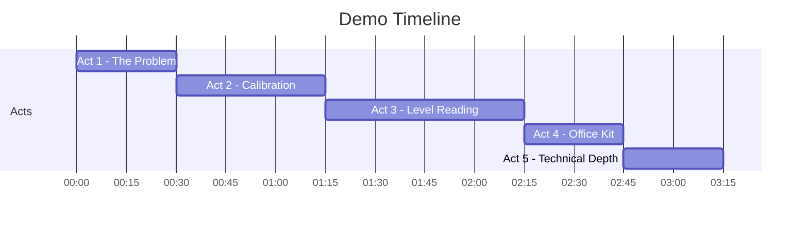
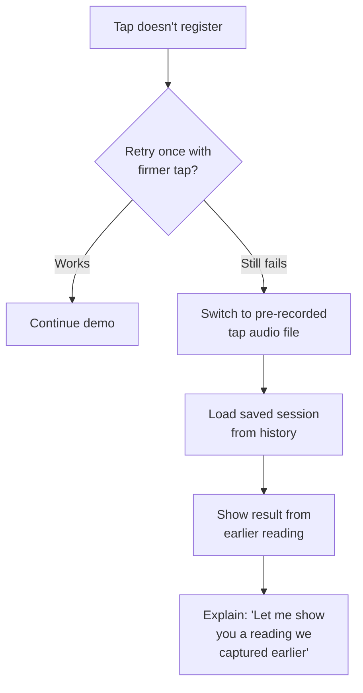
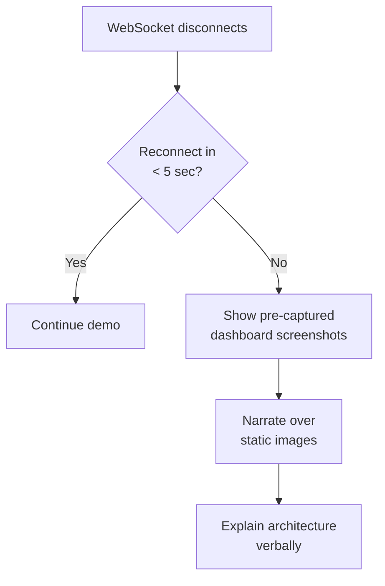
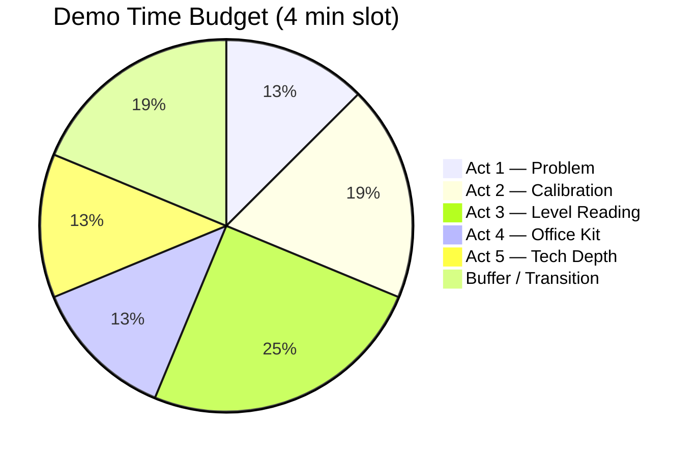
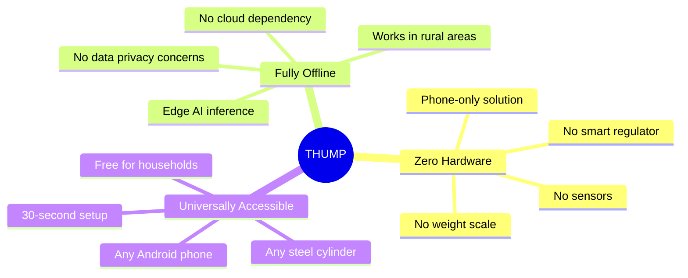
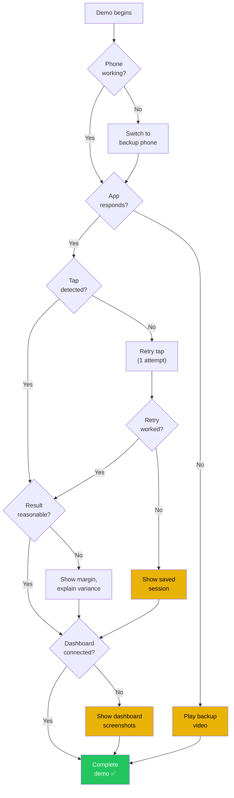

# 📋 THUMP — Demo Preparation & Execution Runbook

> **Track 05 · Smart Living — iQOO Hackathon**
> *Zero-Hardware Acoustic Level Gauge for Sealed LPG Cylinders*

> [!IMPORTANT]
> This is the **single source of truth** for demo day. Print a copy, keep it on the table, and assign one team member as the "runbook owner" who tracks every checkbox.

---

## Table of Contents

1. [Pre-Demo Checklist](#1-pre-demo-checklist)
2. [Demo Script (Step-by-Step)](#2-demo-script-step-by-step)
3. [Backup Plans](#3-backup-plans)
4. [Venue Setup](#4-venue-setup)
5. [Timing Guide](#5-timing-guide)
6. [Emergency Contacts & Links](#6-emergency-contacts--links)
7. [Post-Demo — Judge Q&A](#7-post-demo--judge-qa)

---

## 1. Pre-Demo Checklist

Complete **all items at least 60 minutes before** your demo slot.

### 🔋 Device Readiness

| # | Item | Owner | ✅ |
|---|------|-------|----|
| 1 | Primary phone charged to **100 %** | — | ☐ |
| 2 | Backup phone charged to **100 %** (if available) | — | ☐ |
| 3 | App installed from **latest release APK** | — | ☐ |
| 4 | App opens without crash — cold start verified | — | ☐ |
| 5 | Battery Saver **OFF** | — | ☐ |
| 6 | Do Not Disturb **ON** (prevent notifications during demo) | — | ☐ |
| 7 | Auto-brightness **OFF**, brightness at **80 %** | — | ☐ |
| 8 | Screen timeout set to **10 minutes** (never sleep during demo) | — | ☐ |
| 9 | Developer options → **Stay Awake** enabled | — | ☐ |

### 🔊 Audio & TTS

| # | Item | Owner | ✅ |
|---|------|-------|----|
| 10 | TTS engine installed and language pack downloaded (offline) | — | ☐ |
| 11 | TTS volume adjusted — audible at **2 m distance** | — | ☐ |
| 12 | Ambient noise test at venue completed | — | ☐ |
| 13 | External Bluetooth speaker paired (if presenting to audience) | — | ☐ |
| 14 | Microphone permission granted to THUMP | — | ☐ |
| 15 | Test tap recorded and plays back clearly | — | ☐ |

### 🧪 Demo Cylinder

| # | Item | Owner | ✅ |
|---|------|-------|----|
| 16 | Demo cylinder prepared — **partially filled with water** (~40-50 %) | — | ☐ |
| 17 | Cylinder is **dry on the outside**, no condensation | — | ☐ |
| 18 | Cylinder label is **visible and scannable** by camera | — | ☐ |
| 19 | Calibration completed on demo cylinder | — | ☐ |
| 20 | Consistent level reading verified (**3 consecutive taps** within ±5 %) | — | ☐ |
| 21 | Small mallet / hard object available for consistent tapping | — | ☐ |

### 💻 Dashboard & Connectivity

| # | Item | Owner | ✅ |
|---|------|-------|----|
| 22 | Laptop charged to **100 %** + charger plugged in | — | ☐ |
| 23 | Dashboard server running (`localhost:3000` or configured port) | — | ☐ |
| 24 | WebSocket connection verified — phone ↔ laptop | — | ☐ |
| 25 | Both devices on **same Wi-Fi network / hotspot** | — | ☐ |
| 26 | Backup: laptop hotspot configured (no dependency on venue Wi-Fi) | — | ☐ |
| 27 | Dashboard shows live spectrogram updating | — | ☐ |
| 28 | Reorder sheet generation tested | — | ☐ |

### 🎥 Screen Mirroring & Backup Media

| # | Item | Owner | ✅ |
|---|------|-------|----|
| 29 | Phone screen mirroring set up — **scrcpy** or built-in cast | — | ☐ |
| 30 | Mirroring latency < 200 ms verified | — | ☐ |
| 31 | HDMI / USB-C adapter tested with venue projector | — | ☐ |
| 32 | Backup demo video recorded (**1080p, 3 min**) and on laptop | — | ☐ |
| 33 | Backup demo video plays without issues | — | ☐ |
| 34 | Architecture diagram image on laptop desktop for quick access | — | ☐ |
| 35 | Spectrogram comparison screenshots saved as fallback | — | ☐ |

> [!TIP]
> Run through the **entire demo script once** at the venue before your slot. This is your dress rehearsal — catch problems here, not in front of judges.

---

## 2. Demo Script (Step-by-Step)

**Total time: 3 min 15 sec** (leaves 45 sec buffer in a 4-min slot)



---

### 🎬 Act 1 — The Problem *(0:00 → 0:30)*

| Time | Action | Visual | Script |
|------|--------|--------|--------|
| 0:00 | Hold up the opaque demo cylinder | Cylinder in hand, audience POV | *"This is a standard LPG cylinder. 280 million Indian households use one."* |
| 0:08 | Pause — let audience look | — | *"Quick question — how much gas is left inside?"* |
| 0:14 | Demonstrate the manual hot-water / shake method | Pour a bit of warm water on side *(or mime it)* | *"Traditionally, you pour hot water and feel for a cold line. Messy, imprecise, and you burn your hand."* |
| 0:22 | Put cylinder down, pick up phone | Phone screen visible via mirroring | *"What if your phone's microphone could tell you — just by listening to a tap?"* |
| 0:28 | **Transition cue →** open THUMP app | App splash → dashboard | *"Meet THUMP."* |

> [!NOTE]
> **Presenter tip:** Make eye contact when asking the question. Let the silence sit for 2 seconds — it creates engagement.

---

### 🎬 Act 2 — Calibration *(0:30 → 1:15)*

| Time | Action | Visual | Script |
|------|--------|--------|--------|
| 0:30 | Show empty dashboard state | Dashboard screen — "No cylinders yet" | *"First time setup — no cylinders registered."* |
| 0:36 | Tap **"Add Cylinder"** button | Bottom sheet / new screen slides up | *"Let's add our cylinder."* |
| 0:40 | Camera opens → point at cylinder label | Camera viewfinder with label detection overlay | *"The camera reads the cylinder label — manufacturer, tare weight, capacity — all auto-filled."* |
| 0:48 | Label scanned → Cylinder info card populated | Info card with fields highlighted | *"No manual data entry."* |
| 0:52 | Tap **"Start Calibration"** | Calibration wizard — Step 1 of 2 | *"Now a quick two-tap calibration."* |
| 0:56 | **Tap bottom of cylinder** with mallet | Waveform capture animation — dense, low-frequency wave | *"Tap the bottom — where we know there's liquid. See that dense waveform."* |
| 1:04 | **Tap top of cylinder** with mallet | Waveform capture animation — sparse, higher-frequency wave | *"Now the top — empty space. Completely different acoustic signature."* |
| 1:10 | **"Calibrated!" badge** appears with ✅ | Success animation, badge on cylinder card | *"Done. The phone now knows what 'full' and 'empty' sound like for THIS specific cylinder."* |

> [!TIP]
> **Tap technique:** Use the same force for both taps. Consistency matters. Practice the wrist-flick 10 times before the demo.

---

### 🎬 Act 3 — Level Reading *(1:15 → 2:15)*

| Time | Action | Visual | Script |
|------|--------|--------|--------|
| 1:15 | Navigate to **"Measure"** screen | Measure UI with cylinder outline | *"Now let's find out how much is inside."* |
| 1:20 | **Tap cylinder at mid-height** | Waveform captured → processing spinner → result | *"One tap at the middle…"* |
| 1:28 | Result appears | Level indicator + percentage | *"Liquid detected. Let's narrow it down."* |
| 1:32 | **Tap at another height** (slightly higher) | Second waveform → boundary detection animation | *"Another tap higher up…"* |
| 1:40 | **Boundary detected** | Boundary line drawn on cylinder outline | *"There's the gas-liquid boundary."* |
| 1:44 | **3D cylinder visualization** fills with animated liquid | 3D view — liquid rises with smooth animation | *"And here's your cylinder, visualized in real-time."* |
| 1:52 | **Result summary** displayed | Large text: **"45 % remaining · ±8 % · 6 days left"** | *"45 percent remaining, plus-minus 8 percent margin, roughly 6 cooking days left."* |
| 2:00 | **TTS speaks the result** | Audio plays through speaker | *(Phone speaks):* **"Cylinder is at 45 percent. Approximately 6 days of cooking remaining."** |
| 2:08 | Brief pause — let it sink in | Hold phone up | *"No extra hardware. No sensors. No cloud. Just your phone and a tap."* |

> [!IMPORTANT]
> This is the **climax** of the demo. If the result is within expected range (40-50 % for the water-filled demo cylinder), maintain confidence. If it's off, see [Backup Plans §3.1](#31-if-tap-detection-fails).

---

### 🎬 Act 4 — Office Kit *(2:15 → 2:45)*

| Time | Action | Visual | Script |
|------|--------|--------|--------|
| 2:15 | **Switch to laptop screen** | Dashboard in browser | *"But THUMP isn't just for one cylinder at home."* |
| 2:20 | Show **live spectrogram** updating | Spectrogram visualization — real-time | *"Here's the live spectrogram from the tap we just did — pushed over WebSocket."* |
| 2:28 | Show **cylinder fleet dashboard** | Multiple cylinder cards with status bars | *"Imagine a restaurant managing 20 cylinders. Every status, at a glance."* |
| 2:34 | Click **"Generate Reorder Sheet"** | PDF / table with reorder recommendations | *"One click — your reorder sheet. Fleet management for your kitchen."* |
| 2:42 | **Transition cue** | — | *"Let me show you why this works."* |

---

### 🎬 Act 5 — Technical Depth *(2:45 → 3:15)*

| Time | Action | Visual | Script |
|------|--------|--------|--------|
| 2:45 | Show **spectrogram comparison** | Side-by-side: liquid tap vs gas tap | *"Here's the core insight — liquid and gas produce fundamentally different acoustic responses. Liquid damps the vibration — lower frequency, faster decay."* |
| 2:55 | Flash **architecture diagram** | System architecture — 3 sec | *"Everything runs on-device. Audio capture, FFT analysis, ML classification — all in Kotlin, all on the iQOO hardware."* |
| 3:05 | Return to phone — show app | App on dashboard screen | *"No internet required. No cloud dependency. Works in a village kitchen with zero connectivity."* |
| 3:12 | **Closing** | Smile, put phone down | *"THUMP — tap to know. Thank you."* |

---

## 3. Backup Plans

> [!WARNING]
> Murphy's Law is undefeated at hackathons. **Practice each backup transition** so it looks deliberate, not panicked.

### 3.1 If Tap Detection Fails



**Recovery script:**
> *"The venue acoustics are a bit noisy — let me show you a reading we captured in a controlled environment earlier."*

**Pre-staged assets:**
- `demo_tap_liquid.wav` — pre-recorded tap on liquid section
- `demo_tap_gas.wav` — pre-recorded tap on gas section
- Saved session with complete level reading in app history

---

### 3.2 If WebSocket / Dashboard Fails



**Recovery script:**
> *"The live dashboard syncs over WebSocket on the local network — let me show you what it looks like with the data we captured during setup."*

**Pre-staged assets:**
- `dashboard_screenshot_fleet.png` — fleet view with multiple cylinders
- `dashboard_screenshot_spectrogram.png` — spectrogram detail
- `dashboard_screenshot_reorder.png` — reorder sheet

---

### 3.3 If Phone Crashes or App Freezes

| Priority | Action | Time Cost |
|----------|--------|-----------|
| 1st | Force-close and reopen app (saved state should restore) | ~10 sec |
| 2nd | Switch to **backup phone** with app pre-installed | ~15 sec |
| 3rd | Play **pre-recorded demo video** on laptop | ~5 sec |

**Recovery script:**
> *"While that restarts — let me walk you through the full flow on video. This was recorded on the same iQOO device 30 minutes ago."*

> [!CAUTION]
> **Always have the backup video cued up and paused at 0:00** on the laptop media player. One click to play. Test this.

---

### 3.4 If Results Look Wrong / Out of Range

**Do NOT panic. Do NOT apologize excessively.**

**Recovery script:**
> *"You'll notice we display the confidence margin right alongside the result — ±8 percent. That's by design. Every cylinder has slightly different wall thickness, paint coating, and dent patterns. This is exactly why THUMP calibrates per-cylinder, and why we show transparency in the uncertainty."*

**Key talking points:**
- Error margin is a **feature**, not a bug — it communicates honesty
- Per-cylinder calibration accounts for manufacturing variance
- Multiple taps at different heights improves accuracy (binary-search approach)
- Real-world deployment would include more calibration data points

---

### 3.5 Quick Reference — Backup Asset Locations

| Asset | Location | Format |
|-------|----------|--------|
| Demo video (full run) | `C:\IQOO\demo\backup_demo_video.mp4` | MP4 1080p |
| Dashboard screenshots | `C:\IQOO\demo\screenshots\` | PNG |
| Pre-recorded tap audio | `C:\IQOO\demo\audio\` | WAV |
| Architecture diagram | `C:\IQOO\docs\assets\architecture.png` | PNG |
| Spectrogram comparison | `C:\IQOO\docs\assets\spectrogram_compare.png` | PNG |
| APK (latest build) | `C:\IQOO\app\build\outputs\apk\release\` | APK |

---

## 4. Venue Setup

### 4.1 Table Layout

```
┌──────────────────────────────────────────────────────────┐
│                    JUDGES / AUDIENCE                      │
│                     (facing you)                          │
└──────────────────────────────────────────────────────────┘
                          ▲
                          │ 1.5m
                          │
┌──────────────────────────────────────────────────────────┐
│                                                          │
│   ┌─────────┐    ┌──────────┐    ┌─────────────────┐    │
│   │ CYLINDER │    │  PHONE   │    │     LAPTOP      │    │
│   │ (left)   │    │ (center) │    │    (right)      │    │
│   │          │    │ on stand │    │ lid open, angle │    │
│   └─────────┘    └──────────┘    │ toward judges   │    │
│                                   └─────────────────┘    │
│                                                          │
│   ┌─────────┐    ┌──────────────────────────────────┐   │
│   │ MALLET  │    │  CABLES / CHARGERS (hidden)      │   │
│   │ (near   │    │  behind laptop                    │   │
│   │ cylinder)│    └──────────────────────────────────┘   │
│   └─────────┘                                           │
│                        ┌──────────┐                      │
│                        │ SPEAKER  │                      │
│                        │(optional)│                      │
│                        └──────────┘                      │
│                                                          │
│                    PRESENTER STANDS HERE                  │
└──────────────────────────────────────────────────────────┘
```

### 4.2 Setup Instructions

| Item | Setup Notes |
|------|-------------|
| **Cylinder** | Place on left side. Stable surface — use a rubber mat to prevent rolling. Label facing judges. |
| **Phone** | Center of table on a **phone stand** (portrait mode). Angled 15° toward judges. Connected to scrcpy via USB. |
| **Laptop** | Right side. Screen angled toward judges (~120°). Dashboard loaded. Charger connected. |
| **Mallet** | Next to cylinder. Accessible without reaching across the table. |
| **Speaker** | Behind or beside laptop. Volume pre-tested. Connected via Bluetooth. |
| **Cables** | All cables routed **behind** the laptop. Use cable clips or tape. No tripping hazards. |

### 4.3 Screen Mirroring Setup

#### Option A: scrcpy (Recommended — lowest latency)

```powershell
# Install via winget
winget install Genymobile.scrcpy

# Connect phone via USB, enable USB debugging
scrcpy --window-title "THUMP Demo" --max-size 1080 --turn-screen-off
```

#### Option B: Built-in Wireless Cast

1. Phone → Settings → Connected Devices → Cast
2. Laptop → Connect app (Windows) or AirServer
3. **Latency warning:** 300-500 ms — noticeable during taps

#### Option C: HDMI Capture Card

- USB HDMI capture card + OBS Studio
- Zero latency but requires extra hardware
- Use `Window Capture` in OBS for the scrcpy window

### 4.4 Lighting Considerations

| Scenario | Action |
|----------|--------|
| Bright overhead lights | Increase phone brightness to max, reduce laptop brightness |
| Dim room | Default settings work fine |
| Direct sunlight on table | Reposition or request shade; phone screen is unreadable in direct sunlight |
| Projector in use | Reduce room lights; ensure phone screen and projector are both visible |

---

## 5. Timing Guide

### 5.1 Total Demo Budget



| Segment | Duration | Cumulative | Transition Cue |
|---------|----------|------------|----------------|
| **Act 1** — The Problem | 0:30 | 0:30 | *"Meet THUMP."* → Open app |
| **Act 2** — Calibration | 0:45 | 1:15 | *"Done. Now let's find the level."* |
| **Act 3** — Level Reading | 1:00 | 2:15 | *"But THUMP isn't just for one cylinder."* |
| **Act 4** — Office Kit | 0:30 | 2:45 | *"Let me show you why this works."* |
| **Act 5** — Tech Depth | 0:30 | 3:15 | *"THUMP — tap to know. Thank you."* |
| **Buffer** | 0:45 | 4:00 | — |

### 5.2 Pacing Rules

> [!TIP]
> - If you're **ahead of schedule** → slow down Act 3, add an extra tap, show more of the 3D visualization.
> - If you're **behind schedule** → compress Act 4 to 15 sec (skip reorder sheet), compress Act 5 to 15 sec (skip architecture diagram).
> - **Never rush Act 3.** It's the money shot.

### 5.3 Practice Schedule

| When | Activity | Duration |
|------|----------|----------|
| **T-24 hours** | Full run-through with all equipment | 30 min |
| **T-12 hours** | Run-through with backup scenarios | 20 min |
| **T-2 hours** | Venue setup + dress rehearsal | 45 min |
| **T-30 min** | Final checklist pass + one silent run | 15 min |
| **T-5 min** | Deep breath. Water. Smile. | — |

---

## 6. Emergency Contacts & Links

### 6.1 Project Links

| Resource | URL / Path |
|----------|------------|
| **GitHub Repository** | `https://github.com/<org>/thump` *(update before demo)* |
| **APK Download** | `https://github.com/<org>/thump/releases/latest` |
| **Dashboard URL (local)** | `http://localhost:3000` |
| **Dashboard URL (LAN)** | `http://192.168.x.x:3000` *(update at venue)* |
| **Backup Video** | `C:\IQOO\demo\backup_demo_video.mp4` |
| **This Runbook** | `C:\IQOO\docs\10-DEMO-RUNBOOK.md` |

### 6.2 Team Contacts

| Role | Name | Phone | Responsibilities |
|------|------|-------|------------------|
| **Presenter** | *(TBD)* | *(TBD)* | Runs the demo, speaks to audience |
| **Tech Backup** | *(TBD)* | *(TBD)* | Manages laptop, dashboard, scrcpy |
| **Runner** | *(TBD)* | *(TBD)* | Handles cylinder, mallet, backup devices |

### 6.3 Venue Contacts

| Role | Name | Phone |
|------|------|-------|
| Event Coordinator | *(TBD)* | *(TBD)* |
| Tech Support (A/V) | *(TBD)* | *(TBD)* |
| Wi-Fi Admin | *(TBD)* | *(TBD)* |

> [!NOTE]
> Fill in all placeholder contacts **the night before** the demo. Print a hard copy.

---

## 7. Post-Demo — Judge Q&A

### 7.1 Anticipated Questions & Answers

#### Technical Questions

| Question | Answer | Supporting Evidence |
|----------|--------|---------------------|
| *"How accurate is this?"* | "Our current prototype achieves ±8% accuracy on standard 14.2 kg cylinders. Accuracy improves with per-cylinder calibration and multiple taps using our binary-search approach." | Show confidence score in app |
| *"What ML model do you use?"* | "We use a lightweight 1D CNN trained on spectrogram features, running entirely on-device via TensorFlow Lite. Model size is under 2 MB." | Flash model architecture if asked |
| *"Does it work on all cylinders?"* | "It works on standard steel LPG cylinders. Composite cylinders require separate calibration profiles due to different acoustic properties." | Explain calibration wizard |
| *"How does it handle ambient noise?"* | "We apply a bandpass filter (200 Hz – 8 kHz) to isolate tap frequencies and use a noise gate to reject non-tap audio events." | Show spectrogram filtering |
| *"Why not use weight?"* | "Weight-based methods require the cylinder to be lifted or placed on a scale — impractical for wall-mounted, chained, or in-use cylinders. THUMP works in-situ." | — |
| *"What about rust / paint / dents?"* | "Per-cylinder calibration captures the unique acoustic profile of each cylinder, including its physical condition. Re-calibration handles changes over time." | — |

#### Business / Impact Questions

| Question | Answer |
|----------|--------|
| *"What's the market size?"* | "India has 310M+ active LPG connections (PPAC 2025). Add restaurants, hospitals, and industrial users — TAM is massive. Even 1% penetration = 3M users." |
| *"How do you monetize?"* | "Freemium model: free for single-cylinder households. Paid 'Office Kit' subscription for fleet management (restaurants, hostels, hospitals). ₹99/month per location." |
| *"Why would someone use this over a smart regulator?"* | "Smart regulators cost ₹2,000-5,000, require installation, and only work with specific brands. THUMP is free, works with any cylinder, and installs in 30 seconds." |
| *"What's your competitive advantage?"* | "Zero hardware cost. Works offline. Per-cylinder calibration. No existing app does acoustic level gauging on mobile." |

#### iQOO-Specific Questions

| Question | Answer |
|----------|--------|
| *"How does this leverage iQOO hardware?"* | "iQOO's high-fidelity microphone enables the acoustic capture quality we need. The Snapdragon chipset handles real-time FFT and ML inference with minimal latency. The large display makes the 3D cylinder visualization immersive." |
| *"Does it work on other phones?"* | "The core algorithm is phone-agnostic, but iQOO's superior audio hardware gives us better signal-to-noise ratio, which directly improves accuracy." |

### 7.2 Key Metrics to Highlight

Weave these into your answers naturally:

| Metric | Value | Context |
|--------|-------|---------|
| **Accuracy** | ±8 % | On standard 14.2 kg cylinders |
| **Calibration time** | < 30 sec | Two taps only |
| **Measurement time** | < 5 sec | Single tap to result |
| **Model size** | < 2 MB | Runs on any Android 8+ device |
| **Offline capable** | 100 % | No internet required |
| **APK size** | < 15 MB | Minimal storage footprint |
| **Hardware cost** | ₹0 | Zero additional hardware |
| **Target users** | 310 M+ | Active LPG connections in India |

### 7.3 Talking Points to Reinforce

> [!IMPORTANT]
> No matter what the question is, try to circle back to **one of these three pillars:**



### 7.4 Questions to AVOID Answering in Detail

| Topic | Deflection |
|-------|------------|
| Exact ML training data sources | *"We're building our training dataset — happy to discuss methodology offline."* |
| Revenue projections | *"We're focused on validating accuracy first. Monetization follows product-market fit."* |
| Patent status | *"We're exploring IP protection options."* |
| Specific partnership discussions | *"We're open to conversations — let's connect after the event."* |

---

## Appendix A — Demo Day Emergency Procedures



---

## Appendix B — Last-Minute Sanity Commands

```powershell
# Verify ADB connection
adb devices

# Install latest APK
adb install -r .\app\build\outputs\apk\release\thump-release.apk

# Start scrcpy with optimal settings
scrcpy --window-title "THUMP" --max-size 1080 --bit-rate 8M

# Check phone battery
adb shell dumpsys battery | Select-String "level"

# Enable Stay Awake via ADB
adb shell settings put global stay_on_while_plugged_in 3

# Disable notifications
adb shell settings put global heads_up_notifications_enabled 0

# Start dashboard server
cd C:\IQOO\dashboard
npm start

# Get laptop's LAN IP (for dashboard URL)
(Get-NetIPAddress -AddressFamily IPv4 | Where-Object { $_.InterfaceAlias -notlike "*Loopback*" }).IPAddress
```

---

> [!NOTE]
> **Cross-references:**
> - Architecture details → `C:\IQOO\docs\02-ARCHITECTURE.md`
> - Signal processing deep-dive → `C:\IQOO\docs\04-SIGNAL-PROCESSING.md`
> - Pitch deck talking points → `C:\IQOO\docs\09-PITCH-DECK.md`
> - ML model details → `C:\IQOO\docs\05-ML-PIPELINE.md`

---

*Last updated: 2026-09-08 · THUMP v1.0 · iQOO Track 05: Smart Living*
